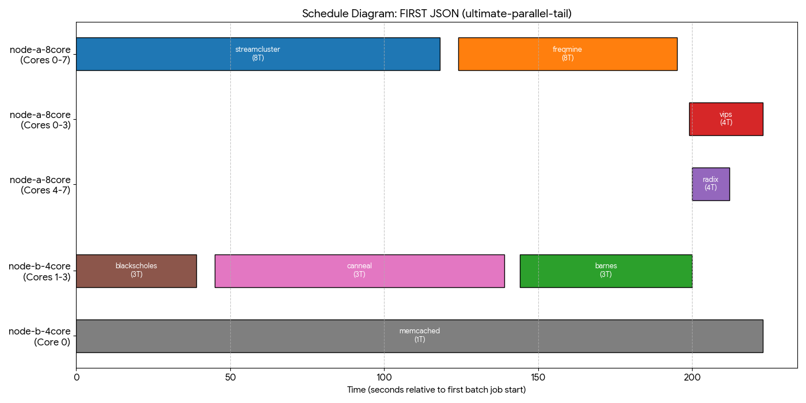
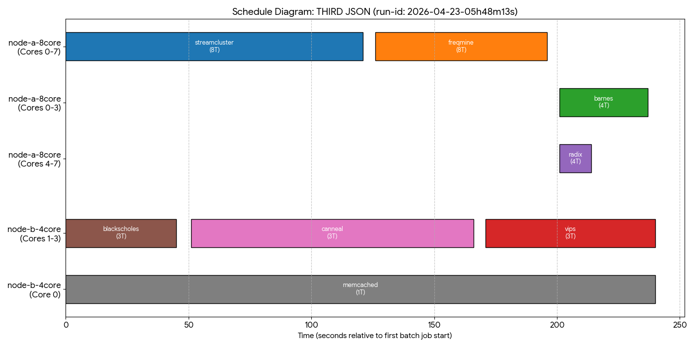

```yaml
policy_name: "ultimate-5-3-split"
memcached:
  node: "node-b-4core"
  cores: "0"
  threads: 1
jobs:
  streamcluster:
    node: "node-a-8core"
    cores: "0-7"
    threads: 8
    after: "start"
  blackscholes:
    node: "node-b-4core"
    cores: "1-3"
    threads: 3
    after: "start"
    
  freqmine:
    node: "node-a-8core"
    cores: "0-7"
    threads: 8
    after: "streamcluster"
  canneal:
    node: "node-b-4core"
    cores: "1-3"
    threads: 3
    after: "blackscholes"
    
  vips:
    node: "node-a-8core"
    cores: "0-5"
    threads: 6
    after: "freqmine"
  radix:
    node: "node-a-8core"
    cores: "6-7"
    threads: 2
    after: "freqmine"
    
  barnes:
    node: "node-b-4core"
    cores: "1-3"
    threads: 3
    after: "canneal"
```



```yaml
policy_name: "parallel-tail-simple"
memcached:
  node: "node-b-4core"
  cores: "0"
  threads: 1
jobs:
  streamcluster:
    node: "node-a-8core"
    cores: "0-7"
    threads: 8
    after: "start"
  blackscholes:
    node: "node-b-4core"
    cores: "1-3"
    threads: 3
    after: "start"
    
  freqmine:
    node: "node-a-8core"
    cores: "0-7"
    threads: 8
    after: "streamcluster"
  canneal:
    node: "node-b-4core"
    cores: "1-3"
    threads: 3
    after: "blackscholes"
    
  barnes:
    node: "node-a-8core"
    cores: "0-3"
    threads: 4
    after: "freqmine"
  radix:
    node: "node-a-8core"
    cores: "4-7"
    threads: 4
    after: "freqmine"
    
  vips:
    node: "node-b-4core"
    cores: "1-3"
    threads: 3
    after: "canneal"
```
