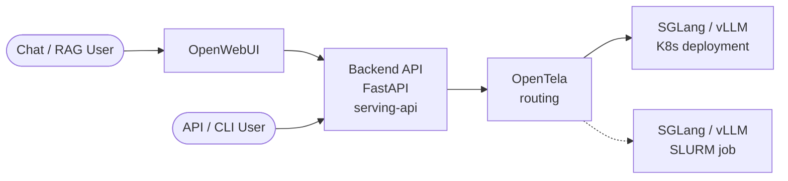

Project Path: model-launch-main

Source Tree:

```txt
model-launch-main
├── docs
│   ├── architecture.md
│   ├── benchmarking.md
│   ├── ci-cd.md
│   ├── development.md
│   ├── faq.md
│   ├── getting-started.md
│   ├── glossary.md
│   ├── index.md
│   ├── initialization.md
│   ├── mcp.md
│   ├── sizing.md
│   ├── usage-advanced.md
│   └── usage-sml.md
├── examples
│   ├── beverin
│   │   ├── cli
│   │   │   └── swiss-ai
│   │   │       ├── Apertus-70B-Instruct-2509-sglang-rocm.sh
│   │   │       ├── Apertus-70B-Instruct-2509-vllm-rocm.sh
│   │   │       ├── Apertus-8B-Instruct-2509-vllm-rocm.sh
│   │   │       └── experiment-rocm-memory
│   │   │           └── rocm-memory-experiment.sh
│   │   └── python
│   │       ├── launch_apertus_8b_sglang_rocm.py
│   │       └── launch_apertus_8b_vllm_rocm.py
│   ├── bristen
│   │   └── cli
│   │       └── swiss-ai
│   │           └── Apertus-8B-Instruct-2509-sglang.sh
│   └── clariden
│       ├── cli
│       │   ├── arcee-ai
│       │   │   ├── Trinity-Mini-vllm.sh
│       │   │   └── Trinity-Nano-Preview-vllm.sh
│       │   ├── deepseek-ai
│       │   │   ├── DeepSeek-V3.1-sglang-router.sh
│       │   │   └── DeepSeek-V3.1-sglang.sh
│       │   ├── huggingface
│       │   │   └── SmolLM3-3B-sglang.sh
│       │   ├── mistralai
│       │   │   ├── Ministral-3-14B-Instruct-2512-vllm.sh
│       │   │   ├── Ministral-3-3B-Instruct-2512-vllm.sh
│       │   │   ├── Ministral-3-8B-Instruct-2512-vllm.sh
│       │   │   ├── Mistral-7B-Instruct-v0.1-sglang.sh
│       │   │   ├── Mistral-Large-3-675B-Instruct-2512-vllm.sh
│       │   │   ├── Mistral-Small-24B-Instruct-2501-sglang.sh
│       │   │   └── Mixtral-8x22B-Instruct-v0.1-sglang.sh
│       │   ├── moonshotai
│       │   │   ├── Kimi-K2-Instruct-sglang.sh
│       │   │   ├── Kimi-K2-Thinking-sglang.sh
│       │   │   └── Kimi-K2.5-sglang.sh
│       │   ├── qwen
│       │   │   ├── Qwen3-235B-A22B-Instruct-2507-sglang.sh
│       │   │   ├── Qwen3-235B-A22B-Instruct-2507-vllm.sh
│       │   │   ├── Qwen3-32B-sglang.sh
│       │   │   ├── Qwen3-8B-sglang.sh
│       │   │   ├── Qwen3-ASR-1.7B-vllm.sh
│       │   │   ├── Qwen3-Next-80B-A3B-Instruct-sglang.sh
│       │   │   ├── Qwen3-Omni-30B-A3B-Captioner-vllm.sh
│       │   │   ├── Qwen3.5-397B-A17B-sglang.sh
│       │   │   ├── Qwen3.5-397B-A17B-vllm.sh
│       │   │   └── Qwen3.6-27B-vllm.sh
│       │   ├── rednote-hilab
│       │   │   └── dots.mocr-sglang.sh
│       │   ├── snowflake
│       │   │   └── snowflake-arctic-embed-l-v2.0-vllm.sh
│       │   ├── swiss-ai
│       │   │   ├── 1p5-experiments
│       │   │   │   ├── Apertus-1.5-8B-Instruct-vllm.sh
│       │   │   │   ├── Apertus-1.5-8B-gbs512-mbs1-steps8030-vllm.sh
│       │   │   │   ├── Apertus-1.5-8B-lr-1e-5-2026-04-23_19-38-55-vllm.sh
│       │   │   │   └── Apertus-1.5-8B-lr-8e-5-2026-04-23_19-08-56-vllm.sh
│       │   │   └── Apertus-8B-Instruct-2509-sglang.sh
│       │   ├── utter-project
│       │   │   ├── EuroLLM-1.7B-Instruct-sglang.sh
│       │   │   ├── EuroLLM-22B-Instruct-2512-sglang.sh
│       │   │   └── EuroLLM-9B-Instruct-2512-sglang.sh
│       │   └── zai-org
│       │       ├── GLM-4.6-sglang-router.sh
│       │       ├── GLM-4.6-sglang.sh
│       │       ├── GLM-5-FP8-sglang.sh
│       │       ├── GLM-5-sglang.sh
│       │       ├── GLM-5.1-FP8-sglang.sh
│       │       └── GLM-5.1-sglang.sh
│       └── python
│           ├── launch_apertus_8b.py
│           └── launch_multiple.py
├── src
│   └── swiss_ai_model_launch
│       ├── __init__.py
│       ├── assets
│       │   ├── __init__.py
│       │   ├── envs
│       │   │   ├── __init__.py
│       │   │   ├── sglang.toml
│       │   │   ├── sglang_bristen.toml
│       │   │   ├── sglang_kimi.toml
│       │   │   ├── sglang_rocm.toml
│       │   │   ├── vllm.toml
│       │   │   ├── vllm_apertus_1.5.toml
│       │   │   ├── vllm_qwen3_omni.toml
│       │   │   └── vllm_rocm.toml
│       │   ├── models.json
│       │   └── template.jinja
│       ├── cli
│       │   ├── __init__.py
│       │   ├── configuration
│       │   │   ├── __init__.py
│       │   │   ├── init_wizard.py
│       │   │   └── models.py
│       │   ├── display
│       │   │   ├── __init__.py
│       │   │   ├── live.py
│       │   │   └── state.py
│       │   ├── healthcheck
│       │   │   ├── __init__.py
│       │   │   ├── checker.py
│       │   │   └── model_health.py
│       │   └── main.py
│       ├── launchers
│       │   ├── __init__.py
│       │   ├── firecrest_launcher.py
│       │   ├── launch_args.py
│       │   ├── launch_request.py
│       │   ├── launcher.py
│       │   ├── model_catalog_entry.py
│       │   ├── slurm_launcher.py
│       │   └── utils.py
│       ├── mcp
│       │   ├── __init__.py
│       │   └── server.py
│       └── telemetry
│           └── __init__.py
├── tapes
│   └── launch-apertus.tape
└── tests
    ├── __init__.py
    ├── integration
    │   ├── __init__.py
    │   ├── conftest.py
    │   ├── test_cli_examples.py
    │   ├── test_firecrest_launcher.py
    │   └── utils.py
    └── unit
        ├── __init__.py
        └── test_stub.py

```

`docs/architecture.md`:

```md
# Architecture

SML is a thin orchestrator. It doesn't serve models itself — it submits SLURM jobs that bring up an inference framework (sglang or vLLM) on cluster nodes, optionally fronted by a router for load balancing.

## Request flow at a glance

A user request reaches a model the same way whether the model lives on Kubernetes or in a SLURM job. OpenTela picks whichever backend has the model registered.



**K8s** = always-on deployment, managed separately. **SLURM** = what SML provisions, time-limited. From the API's and user's perspective, the two are interchangeable — that's what OpenTela buys you.

## Components

```text
┌──────────┐    ┌──────────────┐    ┌─────────────────────┐
│  user    │ ─► │  sml CLI     │ ─► │  FirecREST / SLURM  │
│  / MCP   │    │  (this repo) │    │  job submission     │
└──────────┘    └──────────────┘    └──────────┬──────────┘
                                               │
                                  ┌────────────▼─────────────┐
                                  │   SLURM job (per launch) │
                                  │  ┌──────────────────────┐│
                                  │  │ router (optional)    ││
                                  │  └─────────┬────────────┘│
                                  │  ┌─────────▼────────────┐│
                                  │  │ N replicas           ││
                                  │  │  ┌──────────┐         ││
                                  │  │  │ sglang / │         ││
                                  │  │  │ vLLM     │         ││
                                  │  │  └────┬─────┘         ││
                                  │  └───────┼───────────────┘│
                                  │  ┌───────┼───────────────┐│
                                  │  │ DCGM + vmagent        ││
                                  │  └────┬──┼───────────────┘│
                                  └───────┼──┼────────────────┘
                                          │  │
                                          │  └──► OpenTela p2p mesh ◄── serving-api
                                          │                              (public gateway)
                                          │
                                          └──► telemetry endpoint ──► Grafana
```

Two independent planes leave the job:

- **Request plane** (right): each replica registers itself on the **OpenTela p2p mesh** at startup. The serving-api gateway resolves model names through OpenTela and forwards requests to a registered peer. Skip the registration with `--disable-ocf` (see below).
- **Metrics plane** (bottom): DCGM and vmagent scrape per-GPU and per-process metrics and push them to the telemetry endpoint, which Grafana reads from. Separate system; not OpenTela.

## Repos in the serving stack

SML is one piece of a larger system. The siblings:

- **[swiss-ai/model-launch](https://github.com/swiss-ai/model-launch)** — this repo. The CLI and MCP server.
- **[swiss-ai/serving-api](https://github.com/swiss-ai/serving-api)** — the public-facing inference gateway at [serving.swissai.svc.cscs.ch](https://serving.swissai.svc.cscs.ch/). Resolves model names against OpenTela and forwards requests to a registered peer.
- **[swiss-ai/opentela](https://github.com/swiss-ai/opentela)** — the **p2p service mesh** that connects models regardless of where they live (SLURM job, Kubernetes pod, any network or location). Each replica registers itself on the mesh at startup, under the served model name. By default OpenTela does **random assignment among peers** registered under the same name — that's the load-balancing primitive. OpenTela is what makes a model launched here on Clariden interchangeable, from the gateway's perspective, with the same model running in a k8s deployment elsewhere.

## Request path (typical SML deployment)

1. User runs `sml advanced ...` (or interactive `sml`).
2. SML serializes launch args, builds an `sbatch` script, submits via FirecREST or directly via SLURM.
3. SLURM allocates nodes; the job script starts the inference framework on each replica.
4. Each replica registers itself on the OpenTela p2p mesh under the served model name (unless `--disable-ocf` was passed).
5. (Optional) `--use-router` puts a framework router (e.g. sglang-router) in front of the replicas inside the job. This is orthogonal to OpenTela — the router shapes traffic *within* the job; OpenTela picks *which* job/peer a request lands on.
6. DCGM exporter and vmagent start in sidecar fashion on each replica node, pushing metrics to the telemetry endpoint.
7. A user request hits serving-api → serving-api uses OpenTela to look up the model name and pick a registered peer → the request flows through the OpenTela mesh to that peer, where the peer's local OpenTela layer hands it off to the framework process.

## Disabling OpenTela registration: `--disable-ocf`

By default each replica joins the OpenTela mesh at startup. Pass `--disable-ocf` to skip the registration. The framework still runs and serves on its replica port inside the cluster, but it never joins the mesh — so:

- It is **not reachable through [serving-api](https://github.com/swiss-ai/serving-api)** at [serving.swissai.svc.cscs.ch](https://serving.swissai.svc.cscs.ch/).
- It is only reachable directly via host:port from another job on the same cluster.

Use `--disable-ocf` for private models, raw-throughput benchmarks (no OpenTela hop), or when you've stood up your own routing in front of the replicas. See [usage-advanced.md](usage-advanced.md#when-to-disable-ocf).

> The flag is named `--disable-ocf` for historical reasons — `OCF` is the on-disk binary name from the OpenTela project. Treat the two as one thing.

## Where SML's responsibility ends

SML's job is "get the framework process running on the right nodes with the right args, and stream you the logs until it's healthy." It does not:

- Persist the deployment past the SLURM time limit (use k8s for that — see [FAQ](faq.md#i-want-to-keep-a-model-running-247-can-sml-do-that)).
- Route public traffic (that's serving-api + OpenTela).

This separation keeps SML small enough that a single user can read the whole codebase in an afternoon.

## Next

- [How to size a model](sizing.md) — picking the layout the architecture above will materialize
- [MCP](mcp.md) — driving the same orchestrator from an LLM client

```

`docs/benchmarking.md`:

```md
# Benchmarking & Performance

This page is a living reference for measuring SML deployments. Contributions of methodology, scripts, or write-ups are welcome — see [Contributing a benchmark](#contributing-a-benchmark) at the bottom.

## What to measure

Always report at least:

| Metric                         | Why it matters                                  |
| ------------------------------ | ----------------------------------------------- |
| **TTFT** (time-to-first-token) | User-visible latency; dominated by prefill.     |
| **Tokens / sec / replica**     | Throughput ceiling per replica.                 |
| **Tokens / sec / GPU**         | Hardware efficiency; lets you compare layouts.  |
| **P50 / P95 / P99 latency**    | Tail behavior under load.                       |
| **Concurrent requests**        | What input rate were these numbers measured at? |

A throughput number without the concurrency it was measured at is meaningless — always pair them.

## Best practices

- **Warm up first.** Discard the first ~30 seconds of measurements: weights cache, NCCL channels, and the KV cache all need to settle.
- **Use a realistic workload.** Synthetic 100-token-in / 100-token-out benchmarks rarely match production. Capture or replay a real prompt distribution.
- **Vary one thing at a time.** Replicas × precision × batch size × context length is a 4D space; sweep one axis with the others fixed.
- **Pin the framework version.** Both sglang and vLLM iterate fast — record exact image tag / git SHA in your write-up.
- **Match the partition's nodes.** Performance on `normal` vs. a debug partition can differ; benchmarks should target the partition users will use.
- **Disable OpenTela for raw numbers.** Pass `--disable-ocf` to skip the OpenTela mesh registration on each replica (the flag name is historical — `OCF` and `OpenTela` are the same thing). You then drive load directly to the framework's host:port, which gives you the framework's true throughput. Leave it on for end-to-end numbers that include the mesh + gateway hop. See [When to disable OCF](usage-advanced.md#when-to-disable-ocf).

## Observability

- **Grafana** — aggregated dashboards for SML jobs (and Kubernetes) are available on the [metrics page](https://metrics.swissai.svc.cscs.ch/). Note you need to be on VPN or internal network to view the metrics dashboard.
  - **Framework** - vllm has metrics enabled by default, sglang must be enabled with `--enable-metrics` passed as framework arg.
  - **DCGM exporter** — per-GPU metrics (SM utilization, memory bandwidth, NVLink, power). DCGM runs alongside the inference framework on each replica node; metrics are scraped to the same Grafana stack. Disable via `--disable-dcgm-exporter` if needed.

## Pre-canned methodology

> _More methodologies welcome — open a PR adding a section here._

(Placeholder — add a "How we measured X" subsection per benchmark you publish, with the exact `sml advanced` invocation, the load generator, and the resulting numbers.)

## Contributing a benchmark

If you've run a serious benchmark and want it preserved here:

1. Open a PR adding a new `## ...` section to this file (or, for big write-ups, a sibling file like `docs/benchmarks/<topic>.md` linked from here).
2. Include: model, framework version, GPU layout, exact `sml` invocation, load generator + workload, raw numbers, brief discussion.
3. If a chart helps, drop the source PNG / SVG under `docs/assets/` and link it.

The goal is a small, browseable library of "we tried X, got Y" so the next person doesn't redo the same experiment.

## Next

- [How to size a model](sizing.md) — pick the layout you're benchmarking
- [Architecture](architecture.md) — what's actually in the request path

```

`docs/ci-cd.md`:

```md
# CI/CD

This repository has several CI/CD workflows to ensure consistency and reliability of the services. The pipeline runs in three sequential stages:

> Static Checks → Docker Image Builds → Integration Tests

Each stage starts only after the previous one passes successfully.

## Static Checks

**Trigger**: Called by the CI workflow on every push to `main` or pull request targeting `main`, or manual dispatch.

The codebase is screened for common issues and style inconsistencies via static analysis tools. All checks run in parallel:

1. Python Lint and Format (using `ruff`)
2. Python Type Checking (using `mypy`)
3. Shell Scripts Lint (using `shellcheck`)
4. Docker Linting (using `hadolint`)
5. Markdown Linting (using `markdownlint`)
6. TOML Format (using `taplo`)
7. JSON & YAML Format (using `prettier`)

```

`docs/development.md`:

```md
# Development

This page is for people working on SML itself. If you just want to use SML, see [Getting Started](getting-started.md).

## Setting up the dev environment

```bash
git clone https://github.com/swiss-ai/model-launch.git
cd model-launch
make install-dev
source .venv/bin/activate
```

`make install-dev` creates a virtualenv at `.venv/`, installs SML in editable mode, and sets up pre-commit hooks.

A handful of lint tools live outside the venv and need a one-time install:

| Tool | Why | Install (macOS) |
| --- | --- | --- |
| [`taplo`](https://taplo.tamasfe.dev/) | TOML formatter, used by `make format` / `make tomlfmt` and the pre-commit hook | `brew install taplo` |
| `npx` (Node) | Runs `prettier` and `markdownlint-cli2` on demand | `brew install node` |

Pin: CI installs `taplo` v0.9.3 — match it locally if you hit format-drift between your machine and CI.

## Test environment

Integration tests need real cluster credentials. Create `.test.sh` at the repo root:

```bash
export SML_CSCS_API_KEY=<your-api-key>
export SML_FIRECREST_CLIENT_ID=<your-client-id>
export SML_FIRECREST_CLIENT_SECRET=<your-client-secret>
export SML_FIRECREST_SYSTEM=clariden
export SML_FIRECREST_TOKEN_URI=<your-token-uri>
export SML_FIRECREST_URL=<your-firecrest-url>
export SML_PARTITION=normal
export SML_RESERVATION=<your-reservation>
```

`.test.sh` is gitignored; the test targets source it automatically.

## Common make targets

| Target                    | What it does                                  |
| ------------------------- | --------------------------------------------- |
| `make format`             | Format Python (`ruff`)                        |
| `make shellcheck`         | Lint shell scripts                            |
| `make markdownlint`       | Lint Markdown                                 |
| `make test-lightweight`   | Auto-CI subset of integration tests           |
| `make test-comprehensive` | Full integration test suite                   |
| `make clean-cache`        | Remove cache files                            |
| `make clean-dev`          | Remove the venv and cache                     |

## Debugging

Set `SML_DEBUG=1` to include local variables in crash tracebacks:

```bash
export SML_DEBUG=1
```

> **Warning:** `SML_DEBUG=1` may expose secrets (CSCS API key, FirecREST credentials) in crash output. Don't share terminal output captured with this flag.

By default, locals are stripped from crash reports.

## Adding a new model recipe

The lowest-friction contribution. Drop a shell script under `examples/<system>/cli/<vendor>/`. Use the [adding-new-model-to-sml issue template](https://github.com/swiss-ai/model-launch/blob/main/.github/ISSUE_TEMPLATE/adding-new-model-to-sml.md) as a checklist; existing scripts (e.g. `examples/clariden/cli/swiss-ai/Apertus-8B-Instruct-2509-sglang.sh`) are good templates.

For models that should appear in the `sml` interactive catalog (not just `sml advanced`), the recipe also needs an entry in the model catalog — see existing entries under `src/swiss_ai_model_launch/assets/models.json`.

### Try it yourself first

The SML team can't take a "please add my model" request for every checkpoint that lands on Hugging Face. Before filing an issue, work the checklist:

1. **Find the closest existing example** under `examples/<system>/cli/<vendor>/` — same framework (sglang/vllm), similar size class, same architecture if possible. Copy it.
2. **Swap in your model path** via `--framework-args "--model-path /capstor/store/.../<your-model>"` (and `--served-model-name <something-unique>`).
3. **Try it with [`sml advanced`](usage-advanced.md).** If it serves, you're done — the script *is* the recipe; PR it.
4. **If it doesn't serve, narrow the failure** before opening an issue:
    - Does the same model work with the framework directly (no SML)? If not, it's a framework issue, not an SML issue — report upstream.
    - Does it OOM? See [Sizing](sizing.md) — you may need bigger TP, more nodes, or quantization.
    - Does it fail to load? Architecture not supported by the framework version in the [environment toml](https://github.com/swiss-ai/model-launch/tree/main/src/swiss_ai_model_launch/assets/envs/) — try the other framework, or a newer image.
5. **Only if you've gotten through 1-4 and are still stuck**, file an issue with the failing command, the trailing 50 lines of logs, and what you've already ruled out.

## CI / CD

See [CI/CD](ci-cd.md) for the pipeline structure. PRs run static checks → image build → integration tests; each stage gates the next.

## Filing issues / PRs

- Bugs: use the [bug report template](https://github.com/swiss-ai/model-launch/blob/main/.github/ISSUE_TEMPLATE/bug-report.md). Include the failing command and the trailing chunk of TUI logs.
- New models: use the [adding-new-model template](https://github.com/swiss-ai/model-launch/blob/main/.github/ISSUE_TEMPLATE/adding-new-model-to-sml.md).
- PRs: keep them focused; pre-commit hooks must pass; integration tests must pass on at least one partition.

```

`docs/faq.md`:

```md
# FAQ

## I want to keep a model running 24/7 — can SML do that?

No. SML submits SLURM jobs, which are bounded by the partition's time limit. For an always-on serving deployment, the right home is Kubernetes — get in touch with the SwissAI infrastructure team to be onboarded.

If your need is "running for several hours unattended", that's fine — pick the time limit accordingly with `--time` (interactive `sml`) or `--slurm-time` (`sml advanced`).
There is an [open issue](https://github.com/swiss-ai/model-launch/issues/63) to allow sml to keep starting a job continuously.

## Should I use FirecREST or SLURM?

See the [decision table in Initialization](initialization.md#firecrest-or-slurm). Short version: FirecREST if you're launching from your laptop, SLURM if you're already SSH'd into the cluster.

## How many replicas / nodes-per-replica should I pick?

See [How to size a model](sizing.md). The short answer is "enough VRAM to fit weights + KV cache + headroom" — `sizing.md` walks through the math.

## Does SML do load balancing?

Yes — by default OCF/OpenTela does random assignment among peers. There is a PR in progress which can change this to different assignment modes: <https://github.com/swiss-ai/OpenTela/pull/4>

In SML, you can pass `--use-router` to put a router in front of N replicas. Without it, you get N independent endpoints with no traffic shaping; this works both with and without OpenTela. OpenTela gives you external access via <https://serving.swissai.svc.cscs.ch> and the API. Without OpenTela (using `--disable-ocf`), the model will not appear there and must be accessed directly from the cluster.

## My job is stuck in `PENDING`

Almost always a SLURM scheduling issue, not an SML one. Common causes:

- Partition is full or reserved.
- Time limit exceeds the partition's max.
- Reservation name is wrong (the job will silently sit pending).

Check via `squeue` on the cluster, or use the MCP tool / TUI status panel.

## Can I bring my own model that isn't in the catalog?

Yes — use [`sml advanced`](usage-advanced.md) and pass the model's path on the cluster filesystem via `--framework-args "--model-path /capstor/store/.../my-model"`. Or use the HF <org>/<model-name> to make framework download it on start. If the model is gated you will need a key.

## How do I keep a model private (not publicly routable)?

Pass `--disable-ocf` to `sml advanced`. By default each replica registers itself on the OpenTela p2p mesh — that registration is what the public gateway at [serving.swissai.svc.cscs.ch](https://serving.swissai.svc.cscs.ch/) routes through. Disabling it means the replica never joins the mesh, so the model is only reachable from inside the cluster. See [When to disable OCF](usage-advanced.md#when-to-disable-ocf).

> "OCF" and "OpenTela" are the same thing — `OCF` is the on-disk binary name; `OpenTela` is the project. The flag is named `--disable-ocf` for historical reasons.

## How do I see metrics?

Aggregated metrics land in Grafana — see [Benchmarking](benchmarking.md) for dashboard pointers.
Additional metrics are available from several sources:

- Framework metrics from vLLM/SGLang can be gathered with `--enable-metrics`. This is enabled by default for vLLM; for SGLang, it must be enabled with the flag.
- We use an agent called vmagent to gather these metrics and send them to Prometheus, where they can be displayed in a Grafana dashboard.
- Hardware-counter metrics can also be collected with NVIDIA's DCGM.

## How do I contribute a new model recipe?

Add an entry under `examples/<system>/cli/<vendor>/`. See [Development](development.md) for the contribution flow and the [adding-new-model issue template](https://github.com/swiss-ai/model-launch/blob/main/.github/ISSUE_TEMPLATE/adding-new-model-to-sml.md).

## Where do I report bugs?

[GitHub Issues](https://github.com/swiss-ai/model-launch/issues). Use the bug-report template and include the failing command + the trailing chunk of the TUI logs.

## What's the difference between `sml` and `sml advanced`?

`sml` is the curated/interactive entry point — pick from a catalog of vetted model+framework combos. `sml advanced` is the all-flags entry point — point at any model, pass any framework args. The two share the same SLURM machinery underneath.

```

`docs/getting-started.md`:

```md
# Getting Started

This page is a router. Pick the goal that matches what you're trying to do — each row points at the page that explains the *how*.

## Install first

Requires Python 3.10 through 3.14.

```bash
pip install git+https://github.com/swiss-ai/model-launch.git
sml --version
```

Then pick your goal below. (Contributing to SML itself? Skip the install above and see [Development](development.md) for the editable-install flow.)

## What do you want to do?

| Goal | Where to go |
| --- | --- |
| **Try a model — vibe-check responses, see what it sounds like** | Run an [example script](https://github.com/swiss-ai/model-launch/tree/main/examples) for a 1-shot launch, or use [`sml`](usage-sml.md) for the interactive menu. Both give you a live model in one command. |
| **Run a model with low latency** (chat, interactive demos) | [Sizing → Latency tuning](sizing.md#latency-tuning). Short version: smaller model, FP8/INT4 if quality allows, batch-1, no router. |
| **Run a model at high throughput** (batch eval, dataset processing) | [Sizing → Throughput tuning](sizing.md#throughput-tuning) for the layout, [Benchmarking](benchmarking.md) for measuring it. |
| **Keep the model private — only I can reach it** | Pass `--disable-ocf` so the replica never registers with the public gateway. See [When to disable OCF](usage-advanced.md#when-to-disable-ocf). |
| **Run a model that isn't in the catalog** | Use [`sml advanced`](usage-advanced.md) and point at the model's path on the cluster filesystem. **Try this yourself first** — see [Adding a new model recipe](development.md#adding-a-new-model-recipe). The SML team can't take a custom request for every model. |
| **Keep a model running 24/7** | SML can't — SLURM jobs are time-limited. You want Kubernetes. See the [24/7 hosting answer](faq.md#i-want-to-keep-a-model-running-247-can-sml-do-that) for who to contact. |
| **Drive SML from Claude Desktop / Cursor** | [MCP Server](mcp.md) — wire up the JSON config snippet and you get launch/monitor/cancel as native tools. |
| **Set up credentials for the first time** | [Initialization](initialization.md). Pick FirecREST (laptop) or SLURM (already on the cluster). |

## Got a question, not a goal?

If you have a specific operational question — *"why is my job stuck pending?"*, *"where do metrics live?"*, *"what's the difference between `sml` and `sml advanced`?"* — start with the [FAQ](faq.md). Unfamiliar word? See the [Glossary](glossary.md).

```

`docs/glossary.md`:

```md
# Glossary

One-line definitions for terms that show up in SML and the surrounding serving stack. Pages elsewhere link directly to the anchors here (e.g. `glossary.md#opentela`).

## Beverin

A CSCS HPC system; one of the [systems](#system) SML can target. Not currently available via FirecREST.

## Bristen

A CSCS HPC system, GPU-equipped; one of the [systems](#system) SML can target.

## Clariden

A CSCS HPC system, primarily GPU; one of the [systems](#system) SML can target. Most examples in this repo target Clariden.

## CSCS

The [Swiss National Supercomputing Centre](https://www.cscs.ch/), which operates the HPC clusters SML launches jobs on.

## DCGM

NVIDIA's [Data Center GPU Manager](https://developer.nvidia.com/dcgm). The DCGM exporter runs on each replica node and surfaces per-GPU metrics (SM utilization, memory bandwidth, NVLink, power) to the metrics stack (see [vmagent](#vmagent)).

## FirecREST

A [REST API](https://eth-cscs.github.io/firecrest/) in front of SLURM, maintained by CSCS. Lets you submit and manage jobs without an interactive SSH session — SML uses it as one of two [launchers](#launcher).

## Framework

The inference engine that actually serves the model: [sglang](https://github.com/sgl-project/sglang) or [vLLM](https://github.com/vllm-project/vllm). Selected via `--serving-framework` in `sml advanced`. SML brings the framework up; the framework owns the request/response loop.

## Launcher

How SML submits jobs: `firecrest` (REST API, works from a laptop) or `slurm` (direct `sbatch`, works on a cluster login node). See [Initialization](initialization.md#firecrest-or-slurm).

## MCP

[Model Context Protocol](https://modelcontextprotocol.io/) — a standard for letting an LLM client (Claude Desktop, Cursor, …) call external tools. SML ships an MCP server so a client can list, launch, monitor, and cancel SML jobs as native tools. See [MCP Server](mcp.md).

## OCF (OpenTela)

The same thing — the [p2p service mesh](https://github.com/swiss-ai/opentela) that connects models regardless of where they live (SLURM job, k8s pod, anywhere). Each replica registers itself on the mesh at startup; the public gateway resolves model names through OpenTela and routes to a registered peer. Default load-balancing across peers is random assignment.

`OCF` is the on-disk binary name; `OpenTela` is the project. The CLI flag `--disable-ocf` is named for the binary for historical reasons — pass it to skip mesh registration so the model is reachable only inside the cluster. See [Architecture](architecture.md#disabling-opentela-registration-disable-ocf).

## Partition

A SLURM concept — a named subset of cluster nodes with its own queue, time limit, and access policy. Set via `--partition`. Common values on Clariden: `normal`, `debug`.

## Replica

One independent copy of the model (a [DP](sizing.md#parallelism-dp-tp-pp-ep-and-why-dp-is-replicas) unit). Set via `--slurm-replicas`. More replicas = more throughput. Distinct from `--slurm-nodes-per-replica`, which sets how many nodes one replica spans.

## Reservation

A SLURM concept — a slot of nodes pre-allocated to a user/group, bypassing the normal queue. Set via `--slurm-reservation` (advanced) or `--reservation` (interactive). Optional.

## Router

A framework-side load balancer (e.g. `sglang-router`) inserted in front of N replicas inside one SLURM job. Enabled via `--use-router`. Orthogonal to [OCF/OpenTela](#ocf-opentela): the router shapes traffic *within* the job; OpenTela picks *which* job/peer a request lands on.

## Served-model name

The name a client uses to request the model from the public gateway (e.g. `swiss-ai/Apertus-8B-Instruct-2509-myusername`). Set via `--served-model-name`. Auto-generated if omitted; the `-<user>` suffix avoids collisions with shared deployments.

## serving-api

[swiss-ai/serving-api](https://github.com/swiss-ai/serving-api) — the public-facing inference gateway at <https://serving.swissai.svc.cscs.ch/>. Resolves model names against [OpenTela](#ocf-opentela) and forwards requests to a registered peer.

## SLURM

The job scheduler used on most CSCS systems. SML serializes its launch into an `sbatch` script and submits it via either FirecREST or direct `sbatch`.

## sml

This CLI. Three subcommands: `init` (one-time credential setup), and two ways to launch — interactive (`sml`) or fully-flagged (`sml advanced`). See [Using SML](usage-sml.md).

## sml advanced

The all-flags entry point — point at any model, pass any framework args. Use for non-catalog models, custom framework config, or scripted CI launches. See [Advanced Usage](usage-advanced.md).

## System

The CSCS cluster a job targets — `clariden`, `beverin`, `bristen`, etc. Set via `--firecrest-system` or the `SML_FIRECREST_SYSTEM` env var.

## TUI

The terminal UI SML opens after job submission via `sml` — shows job state and live logs until the model is healthy. Not available on advanced unless you pass flag.

## vmagent

A [VictoriaMetrics agent](https://docs.victoriametrics.com/vmagent.html) that scrapes Prometheus-format metrics (from the [framework](#framework) and from [DCGM](#dcgm)) and pushes them to the prometheus metrics endpoint to view in Grafana metrics dashboard.

```

`docs/index.md`:

```md
# Swiss AI Model Launch

<p align="center"></p>

<p align="center"><strong>Make it easy to launch models 🚀</strong></p>

A CLI for launching LLMs on HPC clusters via SLURM or FirecREST. Public serving endpoint: <https://serving.swissai.svc.cscs.ch/>.

## Quickstart

```bash
pip install git+https://github.com/swiss-ai/model-launch.git
sml init
sml
```

That's it — the second command `sml init` sets up credentials, the third launches a model interactively.

<p align="center"></p>

## Where to start

- New here? → [Getting Started](getting-started.md)
- Setting up credentials? → [Initialization](initialization.md)
- Just want a script to run? → browse [`examples/`](https://github.com/swiss-ai/model-launch/tree/main/examples) on GitHub
- Sizing questions? → [How to size a model](sizing.md)
- Hooking up Claude Desktop? → [MCP Server](mcp.md)
- Always-on hosting / general questions? → [FAQ](faq.md)

## What SML is and isn't

SML is a thin orchestrator that submits SLURM jobs to bring up sglang or vLLM with the right model and arguments. It hands you back a live TUI of logs and job state until the model is healthy.

It is **not** a model server itself, **not** a long-running deployment manager (use Kubernetes for always-on serving — see [FAQ](faq.md#i-want-to-keep-a-model-running-247-can-sml-do-that)), and **not** a public traffic gateway (that's [serving-api](https://github.com/swiss-ai/serving-api)).

See [Architecture](architecture.md) for how the pieces fit together.

```

`docs/initialization.md`:

```md
# Initialization

Before using `sml`, run a one-time setup to provide credentials and choose how jobs are submitted to the cluster.

```bash
sml init
```

The wizard writes config to `~/.sml/config.yml` (override with `SML_CONFIG_DIR`). Re-running `sml init` overwrites the previous config.

You can skip the wizard by pre-filling answers via CLI flags or environment variables (table below).

## FirecREST or SLURM?

SML can submit jobs in two ways. Pick one — your choice only affects setup, not day-to-day usage.

| You are…                                                              | Use         | Why                                                                                  |
| --------------------------------------------------------------------- | ----------- | ------------------------------------------------------------------------------------ |
| On your laptop, want to launch jobs on a cluster                      | `firecrest` | FirecREST is a REST API in front of SLURM — no SSH session required.                 |
| Already SSH'd into the cluster (login node)                           | `slurm`     | Direct `sbatch` is simpler when you're already on the host.                          |
| Behind a corporate VPN that blocks the FirecREST endpoint             | `slurm`     | SSH usually still works.                                                             |
| Automating from CI / a long-running service                           | `firecrest` | No interactive SSH agent needed; client credentials work for headless flows.         |

If you're not sure, start with `firecrest` — it's what most users run.

## Initialization options

| CLI Argument            | Environment Variable          | Description                                                    |
| ----------------------- | ----------------------------- | -------------------------------------------------------------- |
| `--launcher`            |                               | Job submission method (`firecrest` or `slurm`)                 |
| `--firecrest-url`       |                               | FirecREST API URL (default: CSCS endpoint)                     |
| `--firecrest-token-uri` |                               | FirecREST token URI (default: CSCS auth endpoint)              |
|                         | `SML_FIRECREST_CLIENT_ID`     | FirecREST client ID                                            |
|                         | `SML_FIRECREST_CLIENT_SECRET` | FirecREST client secret                                        |
|                         | `SML_CSCS_API_KEY`            | CSCS API key (used for health checks against the served model) |
| `--telemetry-endpoint`  |                               | Endpoint for telemetry reports                                 |

The FirecREST fields are only required when `--launcher firecrest`. `SML_CSCS_API_KEY` is required regardless of launcher.

## Where credentials come from

- **FirecREST client ID / secret** — Acquire from the [CSCS Developer Portal](https://developer.svc.cscs.ch/devportal/apis). See the [FirecREST docs](https://docs.cscs.ch/services/devportal/#manage-your-applications) for the full walkthrough.
- **CSCS API key** — Log in at [serving.swissai.svc.cscs.ch](https://serving.swissai.svc.cscs.ch/) with your institutional account, then go to **View API Keys**.

## Config file shape

`~/.sml/config.yml` after a successful init looks roughly like:

```yaml
launcher: firecrest
firecrest_url: https://api.cscs.ch/...
firecrest_token_uri: https://auth.cscs.ch/...
firecrest_client_id: <secret>
firecrest_client_secret: <secret>
cscs_api_key: <secret>
telemetry_endpoint: https://...
```

Treat this file as a secret. Don't commit it.

## Next

- [Using SML](usage-sml.md) — interactive launch
- [Advanced Usage](usage-advanced.md) — full SLURM control

```

`docs/mcp.md`:

```md
# MCP Server

SML ships an [MCP](https://modelcontextprotocol.io/) server so that an LLM client (Claude Desktop, Cursor, …) can list, launch, monitor, and cancel SML jobs as native tools.

The server is built with [FastMCP](https://github.com/jlowin/fastmcp) and exposed at `swiss_ai_model_launch.mcp:mcp`.

## Available tools

When connected, the client sees tools roughly equivalent to:

- `list_systems()` — discover HPC targets
- `establish(system, partition, …)` — set a default system/partition for the session
- `list_preconfigured_models()` — browse the model catalog
- `launch_preconfigured_model(...)` — submit a job and stream its lifecycle
- `get_job_status(job_id)`
- `get_job_logs(job_id)`
- `cancel_job(job_id)`

The server reuses the same config (`~/.sml/config.yml`) and credentials as the CLI — run `sml init` first.

## Hooking it up to Claude Desktop

Add an entry to `claude_desktop_config.json` (typically `~/Library/Application Support/Claude/claude_desktop_config.json` on macOS):

```json
{
  "mcpServers": {
    "sml": {
      "command": "fastmcp",
      "args": ["run", "swiss_ai_model_launch.mcp:mcp"],
      "env": {
        "SML_FIRECREST_SYSTEM": "clariden",
        "SML_PARTITION": "normal"
      }
    }
  }
}
```

If `fastmcp` isn't on your `$PATH`, point at the binary in your virtualenv (e.g. `/path/to/.venv/bin/fastmcp`) or use `uv`:

```json
{
  "mcpServers": {
    "sml": {
      "command": "uv",
      "args": ["run", "fastmcp", "run", "swiss_ai_model_launch.mcp:mcp"],
      "cwd": "/absolute/path/to/model-launch"
    }
  }
}
```

Restart Claude Desktop. The `sml` tools should appear in the tool picker.

## Other MCP hosts

The same server works with any MCP-compatible client. Cursor, Continue, and others use a similarly-shaped JSON config — adapt the `command` / `args` block.

## Coming later

A Claude marketplace skill is the planned distribution. Until that lands, the JSON snippet above is the supported path.

```

`docs/sizing.md`:

```md
# How to Size a Model for a GPU / Node

Picking the right replica count and nodes-per-replica boils down to: **does the model fit in VRAM, and how much spare VRAM do I want for the KV cache?**

## Step 1 — VRAM the weights need

Rough formula:

```text
weights_bytes ≈ params × bytes_per_param
```

| Precision | Bytes / param | Example: 70B model |
| --------- | ------------- | ------------------ |
| FP32      | 4             | 280 GB             |
| BF16/FP16 | 2             | 140 GB             |
| FP8       | 1             | 70 GB              |
| INT4      | 0.5           | 35 GB              |

Add **~20% overhead** for activations, framework buffers, and CUDA workspaces.

## Step 2 — VRAM the KV cache needs

KV cache scales with concurrent sequences and context length. For a transformer:

```text
kv_bytes_per_token ≈ 2 × num_layers × hidden_dim × kv_heads/heads × bytes_per_param
```

Then:

```text
kv_total ≈ kv_bytes_per_token × max_concurrent_tokens
```

Where `max_concurrent_tokens` is roughly `max_batch × max_seq_len`. If you're not sure, start by reserving **30–50% of VRAM** for the KV cache — both sglang and vLLM size their cache to fill what's left after weights.

## Step 3 — pick a GPU layout

CSCS GH200 nodes have 4 GPUs at ~96 GB each (~384 GB per node).

| Model size (BF16) | Fits where                                | Layout                                                                        |
| ----------------- | ----------------------------------------- | ----------------------------------------------------------------------------- |
| ≤ 30 B            | 1 GPU                                     | `--slurm-replicas N --slurm-nodes-per-replica 1`, set framework `--tp-size 1` |
| 30–80 B           | 1 node (4-way TP)                         | 1 replica per node, framework `--tp-size 4`                                   |
| 80–250 B          | 1 node (4-way TP) at FP8, or 2 nodes BF16 | quantize, or `--slurm-nodes-per-replica 2` + matching TP                      |
| 250 B+            | Multiple nodes                            | `--slurm-nodes-per-replica 2+`, expect tensor + pipeline parallelism          |

## Parallelism: DP / TP / PP / EP — and why DP is replicas

Four flavors of parallelism show up when serving large models:

| Term                          | What it splits across GPUs                                        | Where SML expresses it                                                                                                            |
| ----------------------------- | ----------------------------------------------------------------- | --------------------------------------------------------------------------------------------------------------------------------- |
| **TP** (tensor parallelism)   | A single matmul, sharded across GPUs within a layer               | Framework flag (e.g. sglang/vLLM `--tp-size`) inside `--framework-args`. Stays inside one replica.                                |
| **PP** (pipeline parallelism) | Layers, sharded across GPUs (or nodes) end-to-end                 | Framework flag (e.g. `--pp-size`) inside `--framework-args`. Spans nodes within one replica when `--slurm-nodes-per-replica > 1`. |
| **EP** (expert parallelism)   | MoE experts, sharded across GPUs — only meaningful for MoE models | Framework flag (e.g. vLLM/sglang `--ep-size` or `--enable-expert-parallel`) inside `--framework-args`. Stays inside one replica.  |
| **DP** (data parallelism)     | Independent copies serving different requests in parallel         | **`--slurm-replicas N`** — N copies of the model, optionally fronted by `--use-router`.                                           |

In short: **a "replica" in SML is a DP unit.** TP, PP, and EP are framework-internal — they affect how one replica is laid out across its allocated GPUs/nodes. DP is just "how many replicas".

### A note on dense models in Kubernetes

For dense models (one weight matrix per layer, no MoE routing), DP isn't usually expressed inside the inference framework — you don't tell the framework "give me 4 data-parallel copies on these 4 GPUs". You just request a single GPU per replica and let the **autoscaler** add more replicas when load grows. The orchestrator (k8s, or here, SLURM + `--slurm-replicas`) provides DP naturally; the framework only handles TP (and PP when needed).

This shapes the rule below: bump `--slurm-replicas` for throughput, not the framework's DP flags.

### MoE models change the picture

For Mixture-of-Experts models (Mixtral, DeepSeek-V3, GLM-4.5/5, Qwen-MoE, …), the choice between TP and EP matters:

- **TP** shards each expert's weight matrices across GPUs. Communication is on the critical path of every token.
- **EP** keeps each expert whole on one GPU and routes tokens to the GPU that owns the expert they were assigned to. Communication is one all-to-all per MoE layer, but per-expert matmuls stay local.

Rule of thumb: for MoE models with many experts and modest expert size, **prefer EP over TP within a replica** — it's typically faster on multi-GPU nodes. Use TP for the dense (attention) parts and EP for the MoE feed-forward parts when the framework supports it (most modern serving stacks do).

DP across replicas still applies the same way for throughput: more concurrent requests → bump `--slurm-replicas`.

## Step 4 — replicas vs. nodes-per-replica

These two flags set very different things:

- **`--slurm-replicas N`** — N independent copies of the model. Use for **throughput**: more concurrent requests, optionally fronted by `--use-router` for load balancing.
- **`--slurm-nodes-per-replica K`** — each replica spans K nodes. Use when **one replica doesn't fit on a single node** (large models, long context, more KV cache).

Total nodes = `replicas × nodes-per-replica`.

Rule of thumb:

- Model fits on 1 node, want more throughput? → bump `--slurm-replicas`.
- Model doesn't fit on 1 node? → bump `--slurm-nodes-per-replica` first, then add replicas if you still need throughput.

## Step 5 — sanity-check before submitting

- Time limit (`--slurm-time`) covers warm-up + your workload + a margin. Cold start of a multi-node deployment can take sometimes up to 40 minutes (e.g. Kimi-k2.5 1T params).
- Partition matches the GPU layout you're asking for.
- KV cache leaves room for your max sequence length × max batch.

## Latency tuning

Use this when **a single user is waiting for a response** — chat, interactive demos, copilot-style autocomplete. The metric to optimize is TTFT and per-token latency at low concurrency.

| Knob | Recommended for low latency |
| --- | --- |
| Model size | The smallest model that meets your quality bar. A well-tuned 8B is faster than a clumsily-tuned 70B. |
| Precision | FP8 or INT4 if accuracy holds. Less VRAM read per token = faster. |
| Replicas | **1.** More replicas help throughput, not single-request latency. |
| Router | **Off** (`--use-router` not set). The router adds a hop. |
| Framework batching | Keep `--max-num-seqs` low (e.g. 8) so requests don't queue behind a giant batch. |
| Context length | Cap `--max-model-len` to what you actually need. Smaller KV cache = faster prefill. |
| TP | Just enough to fit the model. Past that, TP communication starts costing more than it saves. |
| OCF | If you're driving load directly from another job on the cluster, `--disable-ocf` removes the mesh hop. For end-user traffic via the public gateway, keep it on. |

Measure TTFT and P50/P99 at concurrency = 1 and concurrency = your realistic ceiling — they will tell different stories. See [Benchmarking](benchmarking.md).

## Throughput tuning

Use this when **you have a lot of work to push through** — batch eval, dataset processing, offline scoring. The metric to optimize is tokens/sec aggregated across all requests.

| Knob | Recommended for high throughput |
| --- | --- |
| Replicas | **More.** Bump `--slurm-replicas` until you hit a partition or budget cap. DP scales linearly. |
| Router | **On** (`--use-router`). Spreads load across replicas; without it you have to load-balance yourself. |
| Framework batching | Crank `--max-num-seqs` (e.g. 256+) so the framework can group requests into fat batches. |
| KV cache headroom | Leave more VRAM for the cache. Bigger cache = more concurrent sequences = more batching opportunity. |
| Precision | FP8 if quality allows — smaller weights leave more room for KV cache and increase batch size. |
| Context length | Cap `--max-model-len` to the longest request you'll actually send. Wasted KV cache = lost batch slots. |
| Concurrency at the client | Don't ramp slower than the server can absorb — keep ≥ `replicas × max-num-seqs` requests in flight. |

If you're benchmarking, **disable OCF** to take the mesh hop out of the measurement (see [When to disable OCF](usage-advanced.md#when-to-disable-ocf)).

## When in doubt

Start with one replica on one node at the lowest precision your accuracy budget tolerates. Measure (see [Benchmarking](benchmarking.md)). Scale from there.

## Next

- [Benchmarking](benchmarking.md) — measure before scaling
- [Advanced Usage](usage-advanced.md) — the flags above in context

```

`docs/usage-advanced.md`:

```md
# Advanced Usage

`sml advanced` bypasses the model catalog and the interactive menu. You specify every launch parameter on the command line. Use it when:

- The model you want isn't in the curated catalog.
- You need to pass framework-specific flags (custom `--tp-size`, attention backend, quant config, …).
- You're scripting from CI and want a fully declarative invocation.

For the guided flow with a curated catalog, use [`sml`](usage-sml.md).

## Arguments

| Argument                    | Environment Variable    | Description                                                       |
| --------------------------- | ----------------------- | ----------------------------------------------------------------- |
| `--firecrest-system`        | `SML_FIRECREST_SYSTEM`  | Target HPC system                                                 |
| `--partition`               | `SML_PARTITION`         | SLURM partition                                                   |
| `--slurm-reservation`       | `SML_RESERVATION`       | SLURM reservation (optional)                                      |
| `--serving-framework`       |                         | Inference framework (`sglang`, `vllm`) — **required**             |
| `--slurm-environment`       |                         | Local path to the environment `.toml` file — **required**         |
| `--framework-args`          |                         | Arguments forwarded to the inference framework                    |
| `--slurm-nodes`             |                         | Total nodes (default: `replicas × nodes-per-replica`)             |
| `--slurm-replicas`          |                         | Number of replicas (default: `1`)                                 |
| `--slurm-nodes-per-replica` |                         | Nodes per replica (default: `1`)                                  |
| `--slurm-time`              |                         | Job time limit `HH:MM:SS` (default: `00:05:00`)                   |
| `--served-model-name`       |                         | Name under which the model is served (auto-generated if omitted)  |
| `--replica-port`            |                         | Port used by replicas (default: `5000`)                           |
| `--use-router`              |                         | Enable router to load-balance across replicas                     |
| `--router-args`             |                         | Arguments forwarded to the router                                 |
| `--disable-ocf`             |                         | Disable OCF wrapper                                               |
| `--pre-launch-cmds`         |                         | Shell commands to run before the framework starts                 |

## Example: Apertus 8B on Clariden with sglang

```bash
sml advanced \
  --firecrest-system clariden \
  --partition normal \
  --slurm-replicas 1 \
  --slurm-nodes-per-replica 1 \
  --serving-framework sglang \
  --slurm-environment src/swiss_ai_model_launch/assets/envs/sglang.toml \
  --framework-args "--model-path /capstor/store/cscs/swissai/infra01/hf_models/models/swiss-ai/Apertus-8B-Instruct-2509 \
    --served-model-name swiss-ai/Apertus-8B-Instruct-2509-$(whoami) \
    --host 0.0.0.0 \
    --port 8080"
```

> **Note:** A model named `swiss-ai/Apertus-8B-Instruct-2509` is usually already running. The `--served-model-name` suffix avoids name collisions with shared deployments.

For more ready-to-run scripts per cluster and vendor, see [`examples/`](https://github.com/swiss-ai/model-launch/tree/main/examples).

## When to disable OCF

> "OCF" and "OpenTela" refer to the same thing — `OCF` is the on-disk binary name from the [OpenTela project](https://github.com/swiss-ai/opentela). The flag is `--disable-ocf` for historical reasons.

By default, every replica joins the OpenTela p2p mesh at startup. That registration is what makes the model resolvable through the public gateway at [serving.swissai.svc.cscs.ch](https://serving.swissai.svc.cscs.ch/). See [Architecture](architecture.md#disabling-opentela-registration-disable-ocf) for the longer story.

Pass `--disable-ocf` when:

- **You're benchmarking max throughput.** OpenTela adds a hop on the request path; disabling it gives you the framework's raw numbers. See [Benchmarking](benchmarking.md).
- **You want the model kept private.** With OpenTela disabled, the replica never registers with the mesh — so serving-api can't find it and it isn't reachable from outside the cluster. Useful for private fine-tunes or in-flight experiments.
- **You're running at scale and the mesh is in the way.** If you've stood up your own routing in front of N replicas (or you're driving load directly from another cluster job), OpenTela registration is just overhead.

If you disable it, you're responsible for reaching the model yourself — usually directly via its host:port from another job on the same cluster.

## Notes on flag style

- `sml advanced` takes system and partition as **arguments**, not env vars. This keeps each script reproducible without depending on shell state. (The interactive `sml` flow is different — see the [env-var tip](usage-sml.md#tip-env-vars-for-things-that-rarely-change) there.)
- `--framework-args` is a single quoted string forwarded verbatim to the framework. Keep it explicit; SML doesn't massage it.

## Next

- [How to size a model](sizing.md) — picking the right replica/node layout
- [Benchmarking](benchmarking.md) — throughput and latency measurement
- [Architecture](architecture.md) — how `sml advanced` fits with the serving stack

```

`docs/usage-sml.md`:

```md
# Using SML

`sml` launches a model interactively from a curated catalog. You answer a few prompts and SML submits the SLURM job, opens a TUI, and streams logs.

If you need full control over SLURM args, framework flags, or a model that isn't in the catalog, see [Advanced Usage](usage-advanced.md) instead.

## Quickstart

After [initialization](initialization.md):

```bash
sml
```

You'll be prompted for: target system, partition, model, framework, replica count, time limit. SML submits the job and the TUI takes over.

## Skipping the prompts

You can pre-fill any prompt with a CLI flag or environment variable. Whatever you don't supply, SML asks for.

| Argument             | Environment Variable     | Description                                            |
| -------------------- | ------------------------ | ------------------------------------------------------ |
| `--firecrest-system` | `SML_FIRECREST_SYSTEM`   | Target system (required if launcher is `firecrest`)    |
| `--partition`        | `SML_PARTITION`          | SLURM partition                                        |
| `--reservation`      | `SML_RESERVATION`        | SLURM reservation (optional)                           |
| `--model`            |                          | Model to launch (`<vendor>/<model>`)                   |
| `--framework`        |                          | Inference framework                                    |
| `--replicas`         |                          | Number of replicas                                     |
| `--use-router`       |                          | Load-balance across replicas (`yes` / `no`)            |
| `--time`             |                          | Job time limit (`HH:MM:SS`)                            |

CLI flags take precedence over environment variables.

### Tip: env vars for things that rarely change

System and partition are usually constant for a given user — putting them in your shell rc file means you never type them again:

```bash
export SML_FIRECREST_SYSTEM=clariden
export SML_PARTITION=normal
```

(This advice applies only to `sml`. For [Advanced Usage](usage-advanced.md), system and partition are passed as CLI args alongside everything else.)

## Example

```bash
export SML_FIRECREST_SYSTEM=clariden
export SML_PARTITION=normal

sml \
  --model swiss-ai/Apertus-8B-Instruct-2509 \
  --framework sglang \
  --replicas 1 \
  --time 02:00:00
```

After submission, the TUI shows job state and live logs. When the model is healthy, it's reachable at the served-model URL.

## What if my model isn't in the catalog?

Use [`sml advanced`](usage-advanced.md) to point at any model path on the cluster filesystem (or huggingface handle).

## Next

- [Advanced Usage](usage-advanced.md) — for non-catalog models or fine SLURM control
- [How to size a model](sizing.md) — picking replica count, nodes-per-replica, GPU type
- [Benchmarking](benchmarking.md) — measuring throughput once the model is up

```

`examples/beverin/cli/swiss-ai/Apertus-70B-Instruct-2509-sglang-rocm.sh`:

```sh
#!/bin/bash

sml advanced \
  --firecrest-system beverin \
  --slurm-nodes 1 \
  --serving-framework sglang \
  --slurm-environment src/swiss_ai_model_launch/assets/envs/sglang_rocm.toml \
  --slurm-time "12:00:00" \
  --partition mi300 \
  --framework-args "--model /capstor/store/cscs/swissai/infra01/hf_models/models/swiss-ai/Apertus-70B-Instruct-2509 \
    --served-model-name swiss-ai/Apertus-70B-Instruct-2509-rocm-sglang \
    --host 0.0.0.0 \
    --port 8080 \
    --tp-size 4 \
    --mem-fraction-static 0.5 \
    --enable-metrics"

```

`examples/beverin/cli/swiss-ai/Apertus-70B-Instruct-2509-vllm-rocm.sh`:

```sh
#!/bin/bash

sml advanced \
  --firecrest-system beverin \
  --slurm-nodes 1 \
  --serving-framework vllm \
  --slurm-environment src/swiss_ai_model_launch/assets/envs/vllm_rocm.toml \
  --slurm-time "12:00:00" \
  --partition mi300 \
  --framework-args "--model /capstor/store/cscs/swissai/infra01/hf_models/models/swiss-ai/Apertus-70B-Instruct-2509 \
    --served-model-name swiss-ai/Apertus-70B-Instruct-2509-rocm \
    --host 0.0.0.0 \
    --port 8080 --tensor-parallel-size 4 --gpu-memory-utilization 0.85"

```

`examples/beverin/cli/swiss-ai/Apertus-8B-Instruct-2509-vllm-rocm.sh`:

```sh
#!/bin/bash
# Note: a model named swiss-ai/Apertus-8B-Instruct-2509 is usually already running.
# The --served-model-name flag avoids name collisions.
sml advanced \
  --firecrest-system beverin \
  --slurm-nodes 1 \
  --serving-framework vllm \
  --slurm-environment src/swiss_ai_model_launch/assets/envs/vllm_rocm.toml \
  --slurm-time "05:00:00" \
  --partition mi300 \
  --framework-args "--model /capstor/store/cscs/swissai/infra01/hf_models/models/swiss-ai/Apertus-8B-Instruct-2509 \
    --served-model-name swiss-ai/Apertus-8B-Instruct-2509-rocm \
    --host 0.0.0.0 \
    --port 8080 \
    --gpu-memory-utilization 0.5"

```

`examples/beverin/cli/swiss-ai/experiment-rocm-memory/rocm-memory-experiment.sh`:

```sh
#!/bin/bash
# Launch all Apertus 70B ROCm memory optimization experiments.
set -euo pipefail

MODEL="/capstor/store/cscs/swissai/infra01/hf_models/models/swiss-ai/Apertus-70B-Instruct-2509"
ENV="src/swiss_ai_model_launch/assets/envs/sglang_rocm.toml"
TIME="12:00:00"

# baseline: mem-fraction 0.5
sml advanced \
  --firecrest-system beverin \
  --partition mi300 \
  --slurm-nodes 1 \
  --slurm-time "$TIME" \
  --serving-framework sglang \
  --slurm-environment "$ENV" \
  --framework-args "--model $MODEL \
    --served-model-name swiss-ai/Apertus-70B-Instruct-2509-rocm-sglang-mem-fraction-05 \
    --host 0.0.0.0 --port 8080 --tp-size 4 \
    --mem-fraction-static 0.5"

# delete checkpoint after loading
sml advanced \
  --firecrest-system beverin \
  --partition mi300 \
  --slurm-nodes 1 \
  --slurm-time "$TIME" \
  --serving-framework sglang \
  --slurm-environment "$ENV" \
  --framework-args "--model $MODEL \
    --served-model-name swiss-ai/Apertus-70B-Instruct-2509-rocm-sglang-delete-ckpt \
    --host 0.0.0.0 --port 8080 --tp-size 4 \
    --delete-ckpt-after-loading"

# disable mmap
sml advanced \
  --firecrest-system beverin \
  --partition mi300 \
  --slurm-nodes 1 \
  --slurm-time "$TIME" \
  --serving-framework sglang \
  --slurm-environment "$ENV" \
  --framework-args "--model $MODEL \
    --served-model-name swiss-ai/Apertus-70B-Instruct-2509-rocm-sglang-disable-mmap \
    --host 0.0.0.0 --port 8080 --tp-size 4 \
    --weight-loader-disable-mmap"

# disable mmap + mem-fraction 0.5
sml advanced \
  --firecrest-system beverin \
  --partition mi300 \
  --slurm-nodes 1 \
  --slurm-time "$TIME" \
  --serving-framework sglang \
  --slurm-environment "$ENV" \
  --framework-args "--model $MODEL \
    --served-model-name swiss-ai/Apertus-70B-Instruct-2509-rocm-sglang-disable-mmap-mem-fraction-05 \
    --host 0.0.0.0 --port 8080 --tp-size 4 \
    --weight-loader-disable-mmap \
    --mem-fraction-static 0.5"

# disable mmap + mem-fraction 0.7
sml advanced \
  --firecrest-system beverin \
  --partition mi300 \
  --slurm-nodes 1 \
  --slurm-time "$TIME" \
  --serving-framework sglang \
  --slurm-environment "$ENV" \
  --framework-args "--model $MODEL \
    --served-model-name swiss-ai/Apertus-70B-Instruct-2509-rocm-sglang-disable-mmap-mem-fraction \
    --host 0.0.0.0 --port 8080 --tp-size 4 \
    --weight-loader-disable-mmap \
    --mem-fraction-static 0.7"

# disable mmap + delete ckpt + mem-fraction 0.7
sml advanced \
  --firecrest-system beverin \
  --partition mi300 \
  --slurm-nodes 1 \
  --slurm-time "$TIME" \
  --serving-framework sglang \
  --slurm-environment "$ENV" \
  --framework-args "--model $MODEL \
    --served-model-name swiss-ai/Apertus-70B-Instruct-2509-rocm-sglang-disable-mmap-delete-ckpt-mem-fraction \
    --host 0.0.0.0 --port 8080 --tp-size 4 \
    --weight-loader-disable-mmap \
    --delete-ckpt-after-loading \
    --mem-fraction-static 0.7"

# memory saver
sml advanced \
  --firecrest-system beverin \
  --partition mi300 \
  --slurm-nodes 1 \
  --slurm-time "$TIME" \
  --serving-framework sglang \
  --slurm-environment "$ENV" \
  --pre-launch-cmds "pip install torch-memory-saver" \
  --framework-args "--model $MODEL \
    --served-model-name swiss-ai/Apertus-70B-Instruct-2509-rocm-sglang-mem-saver \
    --host 0.0.0.0 --port 8080 --tp-size 4 \
    --enable-memory-saver"

# all memory opts combined
sml advanced \
  --firecrest-system beverin \
  --partition mi300 \
  --slurm-nodes 1 \
  --slurm-time "$TIME" \
  --serving-framework sglang \
  --slurm-environment "$ENV" \
  --pre-launch-cmds "pip install torch-memory-saver" \
  --framework-args "--model $MODEL \
    --served-model-name swiss-ai/Apertus-70B-Instruct-2509-rocm-sglang-all-mem-opts \
    --host 0.0.0.0 --port 8080 --tp-size 4 \
    --enable-memory-saver \
    --delete-ckpt-after-loading \
    --weight-loader-disable-mmap"

# 2 nodes, tp-size 8
sml advanced \
  --firecrest-system beverin \
  --partition mi300 \
  --slurm-nodes 2 \
  --slurm-time "$TIME" \
  --serving-framework sglang \
  --slurm-environment "$ENV" \
  --framework-args "--model $MODEL \
    --served-model-name swiss-ai/Apertus-70B-Instruct-2509-rocm-sglang-2nodes \
    --host 0.0.0.0 --port 8080 --tp-size 8 \
    --mem-fraction-static 0.5"

```

`examples/beverin/python/launch_apertus_8b_sglang_rocm.py`:

```py
#!/usr/bin/env python3
"""Launch Apertus-8B on beverin (ROCm/MI300) using the SML Python API."""

import asyncio
import getpass
import grp
import os

from swiss_ai_model_launch import LaunchArgs, SlurmLauncher


async def main() -> None:
    username = getpass.getuser()
    account = grp.getgrgid(os.getgid()).gr_name

    launcher = SlurmLauncher(
        system_name="local",
        username=username,
        account=account,
        partition="mi300",
    )

    args = LaunchArgs(
        job_name=f"sml_apertus_8b_rocm_{username}",
        served_model_name=f"swiss-ai/Apertus-8B-Instruct-2509-sglang-rocm-{username}",
        account=account,
        partition="mi300",
        environment="src/swiss_ai_model_launch/assets/envs/sglang_rocm.toml",
        framework="sglang",
        framework_args=(
            "--model /capstor/store/cscs/swissai/infra01/hf_models/models/swiss-ai/Apertus-8B-Instruct-2509 "
            f"--served-model-name swiss-ai/Apertus-8B-Instruct-2509-sglang-rocm-{username} "
            "--host 0.0.0.0 "
            "--port 8080 "
            "--tp-size 4 "
            "--mem-fraction-static 0.15 "
            "--enable-metrics"
        ),
        time="05:00:00",
        worker_port=8080,
    )

    job_id, served = await launcher.launch_with_args(args)
    print(f"Job submitted: {job_id}")
    print(f"Served model name: {served}")


if __name__ == "__main__":
    asyncio.run(main())

```

`examples/beverin/python/launch_apertus_8b_vllm_rocm.py`:

```py
#!/usr/bin/env python3
"""Launch Apertus-8B on beverin (ROCm/MI300) with vLLM using the SML Python API."""

import asyncio
import getpass
import grp
import os

from swiss_ai_model_launch import LaunchArgs, SlurmLauncher


async def main() -> None:
    username = getpass.getuser()
    account = grp.getgrgid(os.getgid()).gr_name

    launcher = SlurmLauncher(
        system_name="local",
        username=username,
        account=account,
        partition="mi300",
    )

    args = LaunchArgs(
        job_name=f"sml_apertus_8b_vllm_rocm_{username}",
        served_model_name=f"swiss-ai/Apertus-8B-Instruct-2509-vllm-rocm-{username}",
        account=account,
        partition="mi300",
        environment="src/swiss_ai_model_launch/assets/envs/vllm_rocm.toml",
        framework="vllm",
        framework_args=(
            "--model /capstor/store/cscs/swissai/infra01/hf_models/models/swiss-ai/Apertus-8B-Instruct-2509 "
            f"--served-model-name swiss-ai/Apertus-8B-Instruct-2509-vllm-rocm-{username} "
            "--host 0.0.0.0 "
            "--port 8080 "
            "--tensor-parallel-size 4 "
            "--gpu-memory-utilization 0.5"
        ),
        time="05:00:00",
        worker_port=8080,
    )

    job_id, served = await launcher.launch_with_args(args)
    print(f"Job submitted: {job_id}")
    print(f"Served model name: {served}")


if __name__ == "__main__":
    asyncio.run(main())

```

`examples/bristen/cli/swiss-ai/Apertus-8B-Instruct-2509-sglang.sh`:

```sh
#!/bin/bash
sml advanced \
  --firecrest-system bristen \
  --partition normal \
  --slurm-nodes 1 \
  --serving-framework sglang \
  --slurm-environment src/swiss_ai_model_launch/assets/envs/sglang_bristen.toml \
  --framework-args "--model-path /capstor/store/cscs/swissai/infra01/hf_models/models/swiss-ai/Apertus-8B-Instruct-2509 \
    --served-model-name swiss-ai/Apertus-8B-Instruct-2509-$(whoami) \
    --host 0.0.0.0 \
    --port 8080 \
    --enable-metrics"

```

`examples/clariden/cli/arcee-ai/Trinity-Mini-vllm.sh`:

```sh
#!/bin/bash
sml advanced \
  --firecrest-system clariden \
  --partition normal \
  --slurm-nodes 1 \
  --serving-framework vllm \
  --slurm-environment src/swiss_ai_model_launch/assets/envs/vllm.toml \
  --framework-args "--model /capstor/store/cscs/swissai/infra01/hf_models/models/arcee-ai/Trinity-Mini \
    --served-model-name arcee-ai/Trinity-Mini-$(whoami) \
    --host 0.0.0.0 \
    --port 8080 \
    --enable-auto-tool-choice \
    --reasoning-parser deepseek_r1 \
    --tool-call-parser hermes"

```

`examples/clariden/cli/arcee-ai/Trinity-Nano-Preview-vllm.sh`:

```sh
#!/bin/bash
sml advanced \
  --firecrest-system clariden \
  --partition normal \
  --slurm-nodes 1 \
  --serving-framework vllm \
  --slurm-environment src/swiss_ai_model_launch/assets/envs/vllm.toml \
  --framework-args "--model /capstor/store/cscs/swissai/infra01/hf_models/models/arcee-ai/Trinity-Nano-Preview \
    --served-model-name arcee-ai/Trinity-Nano-Preview-$(whoami) \
    --host 0.0.0.0 \
    --port 8080"

```

`examples/clariden/cli/deepseek-ai/DeepSeek-V3.1-sglang-router.sh`:

```sh
#!/bin/bash
# 2 workers x 4 nodes each for increased throughput. Experimental.
sml advanced \
  --firecrest-system clariden \
  --partition normal \
  --slurm-nodes 8 \
  --slurm-workers 2 \
  --slurm-nodes-per-worker 4 \
  --use-router \
  --serving-framework sglang \
  --slurm-environment src/swiss_ai_model_launch/assets/envs/sglang.toml \
  --framework-args "--model-path /capstor/store/cscs/swissai/infra01/hf_models/models/deepseek-ai/DeepSeek-V3.1 \
    --served-model-name deepseek-ai/DeepSeek-V3.1-$(whoami) \
    --tp-size 16 \
    --host 0.0.0.0 \
    --port 8080 \
    --enable-metrics"

```

`examples/clariden/cli/deepseek-ai/DeepSeek-V3.1-sglang.sh`:

```sh
#!/bin/bash
sml advanced \
  --firecrest-system clariden \
  --partition normal \
  --slurm-nodes 4 \
  --serving-framework sglang \
  --slurm-environment src/swiss_ai_model_launch/assets/envs/sglang.toml \
  --framework-args "--model-path /capstor/store/cscs/swissai/infra01/hf_models/models/deepseek-ai/DeepSeek-V3.1 \
    --served-model-name deepseek-ai/DeepSeek-V3.1-$(whoami) \
    --tp-size 16 \
    --host 0.0.0.0 \
    --port 8080 \
    --enable-metrics"

```

`examples/clariden/cli/huggingface/SmolLM3-3B-sglang.sh`:

```sh
#!/bin/bash
sml advanced \
  --firecrest-system clariden \
  --partition normal \
  --slurm-nodes 1 \
  --serving-framework sglang \
  --slurm-environment src/swiss_ai_model_launch/assets/envs/sglang.toml \
  --framework-args "--model /capstor/store/cscs/swissai/infra01/hf_models/models/HuggingFaceTB/SmolLM3-3B \
    --served-model-name HuggingFaceTB/SmolLM3-3B-$(whoami) \
    --dp-size 4 \
    --host 0.0.0.0 \
    --port 8080 \
    --enable-metrics"

```

`examples/clariden/cli/mistralai/Ministral-3-14B-Instruct-2512-vllm.sh`:

```sh
#!/bin/bash
sml advanced \
  --firecrest-system clariden \
  --partition normal \
  --slurm-nodes 1 \
  --serving-framework vllm \
  --slurm-environment src/swiss_ai_model_launch/assets/envs/vllm.toml \
  --framework-args "--model /capstor/store/cscs/swissai/infra01/hf_models/models/mistralai/Ministral-3-14B-Instruct-2512 \
    --served-model-name mistralai/Ministral-3-14B-Instruct-2512-$(whoami) \
    --host 0.0.0.0 \
    --port 8080 \
    --data-parallel-size 4 \
    --tokenizer_mode mistral \
    --load_format mistral \
    --config_format mistral \
    --tool-call-parser mistral \
    --enable-auto-tool-choice"

```

`examples/clariden/cli/mistralai/Ministral-3-3B-Instruct-2512-vllm.sh`:

```sh
#!/bin/bash
sml advanced \
  --firecrest-system clariden \
  --partition normal \
  --slurm-nodes 1 \
  --serving-framework vllm \
  --slurm-environment src/swiss_ai_model_launch/assets/envs/vllm.toml \
  --framework-args "--model /capstor/store/cscs/swissai/infra01/hf_models/models/mistralai/Ministral-3-3B-Instruct-2512 \
    --served-model-name mistralai/Ministral-3-3B-Instruct-2512-$(whoami) \
    --host 0.0.0.0 \
    --port 8080 \
    --data-parallel-size 4 \
    --tokenizer_mode mistral \
    --load_format mistral \
    --config_format mistral \
    --tool-call-parser mistral \
    --enable-auto-tool-choice"

```

`examples/clariden/cli/mistralai/Ministral-3-8B-Instruct-2512-vllm.sh`:

```sh
#!/bin/bash
sml advanced \
  --firecrest-system clariden \
  --partition normal \
  --slurm-nodes 1 \
  --serving-framework vllm \
  --slurm-environment src/swiss_ai_model_launch/assets/envs/vllm.toml \
  --framework-args "--model /capstor/store/cscs/swissai/infra01/hf_models/models/mistralai/Ministral-3-8B-Instruct-2512 \
    --served-model-name mistralai/Ministral-3-8B-Instruct-2512-$(whoami) \
    --host 0.0.0.0 \
    --port 8080 \
    --data-parallel-size 4 \
    --tokenizer_mode mistral \
    --load_format mistral \
    --config_format mistral \
    --tool-call-parser mistral \
    --enable-auto-tool-choice"

```

`examples/clariden/cli/mistralai/Mistral-7B-Instruct-v0.1-sglang.sh`:

```sh
#!/bin/bash
sml advanced \
  --firecrest-system clariden \
  --partition normal \
  --slurm-nodes 1 \
  --serving-framework sglang \
  --slurm-environment src/swiss_ai_model_launch/assets/envs/sglang.toml \
  --framework-args "--model-path /capstor/store/cscs/swissai/infra01/hf_models/models/mistralai/Mistral-7B-Instruct-v0.1 \
    --served-model-name mistralai/Mistral-7B-Instruct-v0.1-$(whoami) \
    --host 0.0.0.0 \
    --port 8080 \
    --enable-metrics"

```

`examples/clariden/cli/mistralai/Mistral-Large-3-675B-Instruct-2512-vllm.sh`:

```sh
#!/bin/bash
sml advanced \
  --firecrest-system clariden \
  --partition normal \
  --slurm-nodes 4 \
  --serving-framework vllm \
  --worker-port 8080 \
  --slurm-environment src/swiss_ai_model_launch/assets/envs/vllm.toml \
  --framework-args "--model /capstor/store/cscs/swissai/infra01/hf_models/models/mistralai/Mistral-Large-3-675B-Instruct-2512 \
    --host 0.0.0.0 \
    --port 8080 \
    --served-model-name mistralai/Mistral-Large-3-675B-Instruct-2512-$(whoami) \
    --tensor-parallel-size 16"

```

`examples/clariden/cli/mistralai/Mistral-Small-24B-Instruct-2501-sglang.sh`:

```sh
#!/bin/bash
sml advanced \
  --firecrest-system clariden \
  --partition normal \
  --slurm-nodes 1 \
  --serving-framework sglang \
  --worker-port 8080 \
  --slurm-environment src/swiss_ai_model_launch/assets/envs/sglang.toml \
  --framework-args "--model-path /capstor/store/cscs/swissai/infra01/hf_models/models/mistralai/Mistral-Small-24B-Instruct-2501 \
    --host 0.0.0.0 \
    --port 8080 \
    --served-model-name mistralai/Mistral-Small-24B-Instruct-2501-$(whoami) \
    --dp-size 4 \
    --enable-metrics"

```

`examples/clariden/cli/mistralai/Mixtral-8x22B-Instruct-v0.1-sglang.sh`:

```sh
#!/bin/bash
sml advanced \
  --firecrest-system clariden \
  --partition normal \
  --slurm-nodes 2 \
  --serving-framework sglang \
  --worker-port 8080 \
  --slurm-environment src/swiss_ai_model_launch/assets/envs/sglang.toml \
  --framework-args "--model /capstor/store/cscs/swissai/infra01/hf_models/models/mistralai/Mixtral-8x22B-Instruct-v0.1 \
    --host 0.0.0.0 \
    --port 8080 \
    --tp-size 8 \
    --served-model-name mistralai/Mixtral-8x22B-Instruct-v0.1-$(whoami) \
    --enable-metrics"

```

`examples/clariden/cli/moonshotai/Kimi-K2-Instruct-sglang.sh`:

```sh
#!/bin/bash
# Runs with 4 nodes, TP16. Requires blobfile. Requires some time to start.
sml advanced \
  --firecrest-system clariden \
  --partition normal \
  --slurm-nodes 4 \
  --slurm-time 6:00:00 \
  --serving-framework sglang \
  --slurm-environment src/swiss_ai_model_launch/assets/envs/sglang_kimi.toml \
  --pre-launch-cmds "pip install blobfile" \
  --framework-args "--model-path /capstor/store/cscs/swissai/infra01/hf_models/models/moonshotai/Kimi-K2-Instruct \
    --served-model-name moonshotai/Kimi-K2-Instruct-$(whoami) \
    --tp-size 16 \
    --host 0.0.0.0 \
    --port 8080 \
    --trust-remote-code \
    --tool-call-parser kimi_k2 \
    --enable-metrics"

```

`examples/clariden/cli/moonshotai/Kimi-K2-Thinking-sglang.sh`:

```sh
#!/bin/bash
# Runs with 4 nodes, TP16. Requires some time to start. Must include --reasoning-parser.
sml advanced \
  --firecrest-system clariden \
  --partition normal \
  --slurm-nodes 4 \
  --slurm-time 6:00:00 \
  --serving-framework sglang \
  --slurm-environment src/swiss_ai_model_launch/assets/envs/sglang_kimi.toml \
  --pre-launch-cmds "pip install blobfile" \
  --framework-args "--model-path /capstor/store/cscs/swissai/infra01/hf_models/models/moonshotai/Kimi-K2-Thinking \
    --served-model-name moonshotai/Kimi-K2-Thinking-$(whoami) \
    --tp-size 16 \
    --host 0.0.0.0 \
    --port 8080 \
    --trust-remote-code \
    --tool-call-parser kimi_k2 \
    --reasoning-parser kimi_k2 \
    --enable-metrics"

```

`examples/clariden/cli/moonshotai/Kimi-K2.5-sglang.sh`:

```sh
#!/bin/bash
sml advanced \
  --firecrest-system clariden \
  --partition normal \
  --slurm-nodes 4 \
  --slurm-time 6:00:00 \
  --serving-framework sglang \
  --slurm-environment src/swiss_ai_model_launch/assets/envs/sglang_kimi.toml \
  --framework-args "--model-path /capstor/store/cscs/swissai/infra01/hf_models/models/moonshotai/Kimi-K2.5 \
    --served-model-name moonshotai/Kimi-K2.5-$(whoami) \
    --tp-size 16 \
    --host 0.0.0.0 \
    --port 8080 \
    --trust-remote-code \
    --tool-call-parser kimi_k2 \
    --reasoning-parser kimi_k2 \
    --enable-metrics"

```

`examples/clariden/cli/qwen/Qwen3-235B-A22B-Instruct-2507-sglang.sh`:

```sh
#!/bin/bash
sml advanced \
  --firecrest-system clariden \
  --partition normal \
  --slurm-nodes 2 \
  --serving-framework sglang \
  --worker-port 8080 \
  --slurm-environment src/swiss_ai_model_launch/assets/envs/sglang.toml \
  --framework-args "--model-path /capstor/store/cscs/swissai/infra01/hf_models/models/Qwen/Qwen3-235B-A22B-Instruct-2507 \
    --host 0.0.0.0 \
    --port 8080 \
    --served-model-name Qwen/Qwen3-235B-A22B-Instruct-2507-$(whoami) \
    --tp-size 8 \
    --enable-metrics"

```

`examples/clariden/cli/qwen/Qwen3-235B-A22B-Instruct-2507-vllm.sh`:

```sh
#!/bin/bash
sml advanced \
  --firecrest-system clariden \
  --partition normal \
  --slurm-nodes 2 \
  --serving-framework vllm \
  --worker-port 8080 \
  --slurm-environment src/swiss_ai_model_launch/assets/envs/vllm.toml \
  --framework-args "--model /capstor/store/cscs/swissai/infra01/hf_models/models/Qwen/Qwen3-235B-A22B-Instruct-2507 \
    --host 0.0.0.0 \
    --port 8080 \
    --served-model-name Qwen/Qwen3-235B-A22B-Instruct-2507-$(whoami) \
    --tensor-parallel-size 8"

```

`examples/clariden/cli/qwen/Qwen3-32B-sglang.sh`:

```sh
#!/bin/bash
sml advanced \
  --firecrest-system clariden \
  --partition normal \
  --slurm-nodes 1 \
  --serving-framework sglang \
  --worker-port 8080 \
  --slurm-environment src/swiss_ai_model_launch/assets/envs/sglang.toml \
  --framework-args "--model-path /capstor/store/cscs/swissai/infra01/hf_models/models/Qwen/Qwen3-32B \
    --host 0.0.0.0 \
    --port 8080 \
    --served-model-name Qwen/Qwen3-32B-$(whoami) \
    --dp-size 4 \
    --enable-metrics"

```

`examples/clariden/cli/qwen/Qwen3-8B-sglang.sh`:

```sh
#!/bin/bash
sml advanced \
  --firecrest-system clariden \
  --partition normal \
  --slurm-nodes 1 \
  --serving-framework sglang \
  --worker-port 8080 \
  --slurm-environment src/swiss_ai_model_launch/assets/envs/sglang.toml \
  --framework-args "--model-path /capstor/store/cscs/swissai/infra01/hf_models/models/Qwen/Qwen3-8B \
    --host 0.0.0.0 \
    --port 8080 \
    --served-model-name Qwen/Qwen3-8B-$(whoami) \
    --dp-size 4 \
    --enable-metrics"

```

`examples/clariden/cli/qwen/Qwen3-ASR-1.7B-vllm.sh`:

```sh
#!/bin/bash
# Launch Qwen/Qwen3-ASR-1.7B (1.7B multilingual ASR, 52 langs incl.
# 22 Chinese dialects, built on Qwen3-Omni foundation) on one Clariden
# GH200 node with vLLM, DP=4 TP=1 (4 independent replicas, one per GPU).
# Suitable for high-throughput batch / streaming ASR over many audio clips.
#
# Qwen3-ASR uses the Qwen3ASRForConditionalGeneration architecture, which
# is registered in stock vLLM 0.19+ (no vllm-omni needed). The generic
# `vllm.toml` env points at the ci/vllm_cuda13 image (vLLM 0.19.1rc1,
# transformers 5.5.4, torchaudio 2.11) which has the full audio arch set
# and the newer Qwen3ASRConfig schema (with thinker_config). The image
# is missing librosa/audioread (vLLM's audio file loader), so we install
# them at launch via --pre-launch-cmds.
#
# Model weights (downloaded separately):
#   /capstor/store/cscs/swissai/infra01/MLLM/audio_asr/Qwen3-ASR-1.7B/
#
sml advanced \
  --firecrest-system clariden \
  --partition normal \
  --slurm-nodes 1 \
  --slurm-time 6:00:00 \
  --serving-framework vllm \
  --worker-port 8080 \
  --slurm-environment src/swiss_ai_model_launch/assets/envs/vllm.toml \
  --pre-launch-cmds "pip install librosa audioread" \
  --framework-args "--model /capstor/store/cscs/swissai/infra01/MLLM/audio_asr/Qwen3-ASR-1.7B \
    --served-model-name Qwen/Qwen3-ASR-1.7B-$(whoami) \
    --data-parallel-size 4 \
    --tensor-parallel-size 1 \
    --host 0.0.0.0 \
    --port 8080 \
    --dtype bfloat16 \
    --max-model-len 32768 \
    --trust-remote-code"

```

`examples/clariden/cli/qwen/Qwen3-Next-80B-A3B-Instruct-sglang.sh`:

```sh
#!/bin/bash
sml advanced \
  --firecrest-system clariden \
  --partition normal \
  --slurm-nodes 1 \
  --serving-framework sglang \
  --slurm-environment src/swiss_ai_model_launch/assets/envs/sglang.toml \
  --framework-args "--model-path /capstor/store/cscs/swissai/infra01/hf_models/models/Qwen/Qwen3-Next-80B-A3B-Instruct \
    --served-model-name Qwen/Qwen3-Next-80B-A3B-Instruct-$(whoami) \
    --host 0.0.0.0 \
    --port 8080 \
    --tp-size 4 \
    --enable-metrics"

```

`examples/clariden/cli/qwen/Qwen3-Omni-30B-A3B-Captioner-vllm.sh`:

```sh
#!/bin/bash
sml advanced \
  --firecrest-system clariden \
  --partition normal \
   --slurm-nodes 1 \
   --slurm-time 6:00:00 \
   --serving-framework vllm \
   --slurm-environment src/swiss_ai_model_launch/assets/envs/vllm_qwen3_omni.toml \
   --framework-args "--model /capstor/store/cscs/swissai/infra01/hf_models/models/swiss-ai/Qwen/Qwen3-Omni-30B-A3B-Captioner \
    --served-model-name Qwen/Qwen3-Omni-30B-A3B-Captioner-$(whoami) \
    --tensor-parallel-size 4 \
    --host 0.0.0.0 \
    --port 8080 \
    --dtype bfloat16 --max-model-len 32768 --trust-remote-code"
```

`examples/clariden/cli/qwen/Qwen3.5-397B-A17B-sglang.sh`:

```sh
#!/bin/bash
sml advanced \
  --firecrest-system clariden \
  --partition normal \
  --slurm-nodes 4 \
  --slurm-time 04:00:00 \
  --serving-framework sglang \
  --slurm-environment src/swiss_ai_model_launch/assets/envs/sglang.toml \
  --framework-args "--model /capstor/store/cscs/swissai/infra01/hf_models/models/Qwen/Qwen3.5-397B-A17B \
    --host 0.0.0.0 \
    --port 8080 \
    --tp-size 16 \
    --mem-fraction-static 0.8 \
    --context-length 262144 \
    --reasoning-parser qwen3 \
    --tool-call-parser qwen3_coder \
    --served-model-name Qwen/Qwen3.5-397B-A17B-$(whoami) \
    --enable-metrics" \
  --pre-launch-cmds "pip install nvidia-cudnn-cu12==9.16.0.29"


```

`examples/clariden/cli/qwen/Qwen3.5-397B-A17B-vllm.sh`:

```sh
#!/bin/bash
sml advanced \
  --firecrest-system clariden \
  --partition normal \
  --slurm-nodes 4 \
  --serving-framework vllm \
  --worker-port 8080 \
  --slurm-environment src/swiss_ai_model_launch/assets/envs/vllm.toml \
  --framework-args "--model /capstor/store/cscs/swissai/infra01/hf_models/models/Qwen/Qwen3.5-397B-A17B \
    --host 0.0.0.0 \
    --port 8080 \
    --tensor-parallel-size 16 \
    --served-model-name Qwen/Qwen3.5-397B-A17B-$(whoami)"

```

`examples/clariden/cli/qwen/Qwen3.6-27B-vllm.sh`:

```sh
#!/bin/bash
sml advanced \
  --firecrest-system clariden \
  --partition normal \
  --slurm-nodes 1 \
  --serving-framework vllm \
  --worker-port 8080 \
  --slurm-environment src/swiss_ai_model_launch/assets/envs/vllm.toml \
  --framework-args "--model /capstor/store/cscs/swissai/infra01/hf_models/models/Qwen/Qwen3.6-27B \
    --host 0.0.0.0 \
    --port 8080 \
    --served-model-name Qwen/Qwen3.6-27B-$(whoami) \
    --data-parallel-size 2 \
    --tensor-parallel-size 2 \
    --max-model-len 65536 \
    --reasoning-parser qwen3"

```

`examples/clariden/cli/rednote-hilab/dots.mocr-sglang.sh`:

```sh
#!/bin/bash
# Launch rednote-hilab/dots.mocr (1.5B multilingual document-OCR VLM) on
# one Clariden GH200 node with SGLang, DP=4 TP=1 (4 independent replicas,
# one per GPU). Suitable for high-throughput batch OCR over many images.
#
# dots.mocr requires --trust-remote-code (custom DotsOCRForCausalLM
# architecture). SGLang ≥ 0.5.x has the model class registered.
#
# Model weights (downloaded separately):
#   /capstor/store/cscs/swissai/infra01/MLLM/OCR/rednote-hilab_dots.mocr/
#
sml advanced \
  --firecrest-system clariden \
  --partition normal \
  --slurm-nodes 1 \
  --slurm-time 6:00:00 \
  --serving-framework sglang \
  --worker-port 8080 \
  --slurm-environment src/swiss_ai_model_launch/assets/envs/sglang.toml \
  --framework-args "--model-path /capstor/store/cscs/swissai/infra01/MLLM/OCR/rednote-hilab_dots.mocr \
    --host 0.0.0.0 \
    --port 8080 \
    --served-model-name dots_mocr-$(whoami) \
    --dp-size 4 \
    --tp-size 1 \
    --trust-remote-code \
    --context-length 16384 \
    --mem-fraction-static 0.85 \
    --enable-metrics"

```

`examples/clariden/cli/snowflake/snowflake-arctic-embed-l-v2.0-vllm.sh`:

```sh
#!/bin/bash
sml advanced \
  --firecrest-system clariden \
  --partition normal \
  --slurm-nodes 1 \
  --serving-framework vllm \
  --slurm-environment src/swiss_ai_model_launch/assets/envs/vllm.toml \
  --framework-args "--model /capstor/store/cscs/swissai/infra01/hf_models/models/Snowflake/snowflake-arctic-embed-l-v2.0 \
    --served-model-name Snowflake/snowflake-arctic-embed-l-v2.0-$(whoami) \
    --host 0.0.0.0 \
    --port 8080 \
    --task embedding"

```

`examples/clariden/cli/swiss-ai/1p5-experiments/Apertus-1.5-8B-Instruct-vllm.sh`:

```sh
#!/bin/bash
sml advanced \
  --firecrest-system clariden \
  --partition normal \
  --slurm-nodes 1 \
  --slurm-reservation SD-69241-apertus-1-5 \
  --slurm-time 12:00:00 \
  --serving-framework vllm \
  --slurm-environment src/swiss_ai_model_launch/assets/envs/vllm_apertus_1.5.toml \
  --framework-args "--model /capstor/store/cscs/swissai/infra01/models/apertus-8b-sft-1.5--lr8e-5-MaxMin_4096-Filtered-dpo-lr1e-06-beta25.0-lenNormTrue-ebs128-ep1 \
    --served-model-name swiss-ai/Apertus-1.5-8B-Instruct \
    --tokenizer /capstor/store/cscs/swissai/infra01/MLLM/tokenizer/apertus_emu3.5_instruct \
    --tensor-parallel-size 4 \
    --host 0.0.0.0 \
    --port 8080 \
    --trust-remote-code \
    --trust-request-chat-template \
    --max-model-len 8192 \
    --gpu-memory-utilization 0.6"

```

`examples/clariden/cli/swiss-ai/1p5-experiments/Apertus-1.5-8B-gbs512-mbs1-steps8030-vllm.sh`:

```sh
#!/bin/bash
sml advanced \
  --firecrest-system clariden \
  --partition normal \
  --slurm-nodes 1 \
  --slurm-reservation SD-69241-apertus-1-5 \
  --slurm-time 12:00:00 \
  --serving-framework vllm \
  --slurm-environment src/swiss_ai_model_launch/assets/envs/vllm_apertus_1.5.toml \
  --framework-args "--model /capstor/store/cscs/swissai/infra01/MLLM/ablations/apertus-8b-img-SFT-32nodes-gbs512-mbs1-steps8030-img-text-seqlen8192-s2onlytxtloss/HF \
    --served-model-name swiss-ai/apertus-8b-1.5-gbs512-mbs1-steps8030 \
    --tokenizer /capstor/store/cscs/swissai/infra01/MLLM/tokenizer/apertus_emu3.5_instruct \
    --tensor-parallel-size 4 \
    --host 0.0.0.0 \
    --port 8080 \
    --trust-remote-code \
    --trust-request-chat-template \
    --max-model-len 8192 \
    --gpu-memory-utilization 0.6"


```

`examples/clariden/cli/swiss-ai/1p5-experiments/Apertus-1.5-8B-lr-1e-5-2026-04-23_19-38-55-vllm.sh`:

```sh
#!/bin/bash
sml advanced \
  --firecrest-system clariden \
  --partition normal \
  --slurm-nodes 1 \
  --slurm-reservation SD-69241-apertus-1-5 \
  --slurm-time 12:00:00 \
  --serving-framework vllm \
  --slurm-environment src/swiss_ai_model_launch/assets/envs/vllm_apertus_1.5.toml \
  --framework-args "--model /iopsstor/scratch/cscs/hyukhymenko/apertus-sft-runs/ap-1p5-cooldown-sft-21-04-lr-1e-5/2026-04-23_19-38-55/global_step_9688/huggingface \
    --served-model-name swiss-ai/apertus1p5-lr-1e-5-2026-04-23_19-38-55 \
    --tokenizer /capstor/store/cscs/swissai/infra01/MLLM/tokenizer/apertus_emu3.5_instruct \
    --tensor-parallel-size 4 \
    --host 0.0.0.0 \
    --port 8080 \
    --trust-remote-code \
    --trust-request-chat-template \
    --max-model-len 8192 \
    --gpu-memory-utilization 0.6"

```

`examples/clariden/cli/swiss-ai/1p5-experiments/Apertus-1.5-8B-lr-8e-5-2026-04-23_19-08-56-vllm.sh`:

```sh
#!/bin/bash
sml advanced \
  --firecrest-system clariden \
  --partition normal \
  --slurm-nodes 1 \
  --slurm-reservation SD-69241-apertus-1-5 \
  --slurm-time 12:00:00 \
  --serving-framework vllm \
  --slurm-environment src/swiss_ai_model_launch/assets/envs/vllm_apertus_1.5.toml \
  --framework-args "--model /iopsstor/scratch/cscs/hyukhymenko/apertus-sft-runs/ap-1p5-cooldown-sft-21-04-lr-8e-5/2026-04-23_19-08-56/global_step_9688/huggingface \
    --served-model-name swiss-ai/apertus1p5-lr-8e-5-2026-04-23_19-08-56 \
    --tokenizer /capstor/store/cscs/swissai/infra01/MLLM/tokenizer/apertus_emu3.5_instruct \
    --tensor-parallel-size 4 \
    --host 0.0.0.0 \
    --port 8080 \
    --trust-remote-code \
    --trust-request-chat-template \
    --max-model-len 8192 \
    --gpu-memory-utilization 0.6"

```

`examples/clariden/cli/swiss-ai/Apertus-8B-Instruct-2509-sglang.sh`:

```sh
#!/bin/bash
# Note: a model named swiss-ai/Apertus-8B-Instruct-2509 is usually already running.
# The --served-model-name flag avoids name collisions.
sml advanced \
  --firecrest-system clariden \
  --partition normal \
  --slurm-nodes 1 \
  --serving-framework sglang \
  --slurm-environment src/swiss_ai_model_launch/assets/envs/sglang.toml \
  --framework-args "--model-path /capstor/store/cscs/swissai/infra01/hf_models/models/swiss-ai/Apertus-8B-Instruct-2509 \
    --served-model-name swiss-ai/Apertus-8B-Instruct-2509-$(whoami) \
    --host 0.0.0.0 \
    --port 8080 \
    --enable-metrics"

```

`examples/clariden/cli/utter-project/EuroLLM-1.7B-Instruct-sglang.sh`:

```sh
#!/bin/bash
sml advanced \
  --firecrest-system clariden \
  --partition normal \
  --slurm-nodes 1 \
  --serving-framework sglang \
  --slurm-environment src/swiss_ai_model_launch/assets/envs/sglang.toml \
  --framework-args "--model /capstor/store/cscs/swissai/infra01/hf_models/models/utter-project/EuroLLM-1.7B-Instruct \
    --served-model-name utter-project/EuroLLM-1.7B-Instruct-$(whoami) \
    --dp-size 4 \
    --host 0.0.0.0 \
    --port 8080 \
    --enable-metrics"

```

`examples/clariden/cli/utter-project/EuroLLM-22B-Instruct-2512-sglang.sh`:

```sh
#!/bin/bash
sml advanced \
  --firecrest-system clariden \
  --partition normal \
  --slurm-nodes 1 \
  --serving-framework sglang \
  --slurm-environment src/swiss_ai_model_launch/assets/envs/sglang.toml \
  --framework-args "--model /capstor/store/cscs/swissai/infra01/hf_models/models/utter-project/EuroLLM-22B-Instruct-2512 \
    --served-model-name utter-project/EuroLLM-22B-Instruct-2512-$(whoami) \
    --dp-size 4 \
    --host 0.0.0.0 \
    --port 8080 \
    --enable-metrics"

```

`examples/clariden/cli/utter-project/EuroLLM-9B-Instruct-2512-sglang.sh`:

```sh
#!/bin/bash
sml advanced \
  --firecrest-system clariden \
  --partition normal \
  --slurm-nodes 1 \
  --serving-framework sglang \
  --slurm-environment src/swiss_ai_model_launch/assets/envs/sglang.toml \
  --framework-args "--model /capstor/store/cscs/swissai/infra01/hf_models/models/utter-project/EuroLLM-9B-Instruct-2512 \
    --served-model-name utter-project/EuroLLM-9B-Instruct-2512-$(whoami) \
    --dp-size 4 \
    --host 0.0.0.0 \
    --port 8080 \
    --enable-metrics"

```

`examples/clariden/cli/zai-org/GLM-4.6-sglang-router.sh`:

```sh
#!/bin/bash
# 2 workers x 4 nodes each. Requires latest sglang env. Experimental.
# No bundled env available — provide your own
sml advanced \
  --firecrest-system clariden \
  --partition normal \
  --slurm-nodes 8 \
  --slurm-workers 2 \
  --slurm-nodes-per-worker 4 \
  --use-router \
  --slurm-time 6:00:00 \
  --serving-framework sglang \
  --slurm-environment src/swiss_ai_model_launch/assets/envs/sglang.toml \
  --pre-launch-cmds "pip install blobfile" \
  --framework-args "--model-path /capstor/store/cscs/swissai/infra01/hf_models/models/zai-org/GLM-4.6 \
    --tp-size 16 \
    --host 0.0.0.0 \
    --port 8080 \
    --served-model-name zai-org/GLM-4.6-$(whoami) \
    --trust-remote-code \
    --tool-call-parser glm45 \
    --reasoning-parser glm45 \
    --enable-metrics"

```

`examples/clariden/cli/zai-org/GLM-4.6-sglang.sh`:

```sh
#!/bin/bash
# Runs with 4 nodes, TP16. Uses custom glm45 reasoning and tool-call parsers.
sml advanced \
  --firecrest-system clariden \
  --partition normal \
  --slurm-nodes 4 \
  --slurm-time 6:00:00 \
  --serving-framework sglang \
  --slurm-environment src/swiss_ai_model_launch/assets/envs/sglang.toml \
  --pre-launch-cmds "pip install blobfile" \
  --framework-args "--model-path /capstor/store/cscs/swissai/infra01/hf_models/models/zai-org/GLM-4.6 \
    --tp-size 16 \
    --host 0.0.0.0 \
    --port 8080 \
    --served-model-name zai-org/GLM-4.6-$(whoami) \
    --trust-remote-code \
    --tool-call-parser glm45 \
    --reasoning-parser glm45 \
    --enable-metrics"

```

`examples/clariden/cli/zai-org/GLM-5-FP8-sglang.sh`:

```sh
#!/bin/bash
sml advanced \
  --firecrest-system clariden \
  --partition normal \
  --slurm-nodes 4 \
  --slurm-time 6:00:00 \
  --serving-framework sglang \
  --slurm-environment src/swiss_ai_model_launch/assets/envs/sglang.toml \
  --framework-args "--model-path /capstor/store/cscs/swissai/infra01/hf_models/models/zai-org/GLM-5-FP8 \
    --served-model-name zai-org/GLM-5-FP8-$(whoami) \
    --tp-size 16 \
    --host 0.0.0.0 \
    --port 8080 \
    --tool-call-parser glm47 \
    --reasoning-parser glm45 \
    --speculative-algorithm EAGLE \
    --speculative-num-steps 3 \
    --speculative-eagle-topk 1 \
    --speculative-num-draft-tokens 4 \
    --mem-fraction-static 0.85 \
    --enable-metrics"

```

`examples/clariden/cli/zai-org/GLM-5-sglang.sh`:

```sh
#!/bin/bash
sml advanced \
  --firecrest-system clariden \
  --partition normal \
  --slurm-nodes 8 \
  --slurm-time 6:00:00 \
  --serving-framework sglang \
  --slurm-environment src/swiss_ai_model_launch/assets/envs/sglang.toml \
  --framework-args "--model-path /capstor/store/cscs/swissai/infra01/hf_models/models/zai-org/GLM-5 \
    --served-model-name zai-org/GLM-5-$(whoami) \
    --tp-size 32 \
    --host 0.0.0.0 \
    --port 8080 \
    --tool-call-parser glm47 \
    --reasoning-parser glm45 \
    --speculative-algorithm EAGLE \
    --speculative-num-steps 3 \
    --speculative-eagle-topk 1 \
    --speculative-num-draft-tokens 4 \
    --mem-fraction-static 0.85 \
    --enable-metrics"

```

`examples/clariden/cli/zai-org/GLM-5.1-FP8-sglang.sh`:

```sh
#!/bin/bash
sml advanced \
  --firecrest-system clariden \
  --partition normal \
  --slurm-nodes 4 \
  --slurm-time 6:00:00 \
  --serving-framework sglang \
  --slurm-environment src/swiss_ai_model_launch/assets/envs/sglang.toml \
  --framework-args "--model-path /capstor/store/cscs/swissai/infra01/hf_models/models/zai-org/GLM-5.1-FP8 \
    --served-model-name zai-org/GLM-5.1-FP8-$(whoami) \
    --tp-size 16 \
    --host 0.0.0.0 \
    --port 8080 \
    --reasoning-parser glm45 \
    --tool-call-parser glm47 \
    --speculative-algorithm EAGLE \
    --speculative-num-steps 3 \
    --speculative-eagle-topk 1 \
    --speculative-num-draft-tokens 4 \
    --mem-fraction-static 0.85 \
    --enable-metrics"

```

`examples/clariden/cli/zai-org/GLM-5.1-sglang.sh`:

```sh
#!/bin/bash
sml advanced \
  --firecrest-system clariden \
  --partition normal \
  --slurm-nodes 8 \
  --slurm-time 6:00:00 \
  --serving-framework sglang \
  --slurm-environment src/swiss_ai_model_launch/assets/envs/sglang.toml \
  --framework-args "--model-path /capstor/store/cscs/swissai/infra01/hf_models/models/zai-org/GLM-5.1 \
    --served-model-name zai-org/GLM-5.1-$(whoami) \
    --tp-size 32 \
    --host 0.0.0.0 \
    --port 8080 \
    --reasoning-parser glm45 \
    --tool-call-parser glm47 \
    --speculative-algorithm EAGLE \
    --speculative-num-steps 3 \
    --speculative-eagle-topk 1 \
    --speculative-num-draft-tokens 4 \
    --mem-fraction-static 0.85 \
    --enable-metrics"

```

`examples/clariden/python/launch_apertus_8b.py`:

```py
#!/usr/bin/env python3
"""Launch Apertus-8B using the SML Python API.

Equivalent to examples/swiss-ai/Apertus-8B-Instruct-2509-sglang.sh
"""

import asyncio
import getpass
import grp
import os

from swiss_ai_model_launch import LaunchArgs, SlurmLauncher


async def main() -> None:
    username = getpass.getuser()
    account = grp.getgrgid(os.getgid()).gr_name

    launcher = SlurmLauncher(
        system_name="local",
        username=username,
        account=account,
        partition="normal",
    )

    args = LaunchArgs(
        job_name=f"sml_apertus_8b_{username}",
        served_model_name=f"swiss-ai/Apertus-8B-Instruct-2509-{username}",
        account=account,
        partition="normal",
        environment="src/swiss_ai_model_launch/assets/envs/sglang.toml",
        framework="sglang",
        framework_args=(
            "--model-path /capstor/store/cscs/swissai/infra01/hf_models/models/swiss-ai/Apertus-8B-Instruct-2509 "
            f"--served-model-name swiss-ai/Apertus-8B-Instruct-2509-{username} "
            "--host 0.0.0.0 "
            "--port 8080 "
            "--enable-metrics"
        ),
        time="02:00:00",
        worker_port=8080,
    )

    job_id, served = await launcher.launch_with_args(args)
    print(f"Job submitted: {job_id}")
    print(f"Served model name: {served}")


if __name__ == "__main__":
    asyncio.run(main())

```

`examples/clariden/python/launch_multiple.py`:

```py
#!/usr/bin/env python3
"""Launch multiple models concurrently using the SML Python API.

This is the use case where shell scripts fall short — you can launch
a batch of models in one shot without interactive prompts or TUI.
"""

import asyncio
import getpass
import grp
import os

from swiss_ai_model_launch import LaunchArgs, SlurmLauncher

MODELS = [
    {
        "name": "Apertus-8B-Instruct-2509",
        "vendor": "swiss-ai",
        "framework_args": "--dp-size 1",
    },
    {
        "name": "Apertus-70B-Instruct-2509",
        "vendor": "swiss-ai",
        "framework_args": "--dp-size 4",
        "nodes": 4,
    },
]


async def launch_model(launcher: SlurmLauncher, model: dict[str, str | int]) -> tuple[str, int]:
    username = launcher.username
    vendor = model["vendor"]
    name = model["name"]
    served = f"{vendor}/{name}-{username}"

    args = LaunchArgs(
        job_name=f"sml_{name}_{username}",
        served_model_name=served,
        account=launcher.account,
        partition=launcher.partition,
        environment="src/swiss_ai_model_launch/assets/envs/sglang.toml",
        framework="sglang",
        framework_args=(
            f"--model-path /capstor/store/cscs/swissai/infra01/hf_models/models/{vendor}/{name} "
            f"--served-model-name {served} "
            "--host 0.0.0.0 "
            "--port 8080 "
            "--enable-metrics " + str(model.get("framework_args", ""))
        ),
        nodes=model.get("nodes", 1),
        time="02:00:00",
        worker_port=8080,
    )

    job_id, served_name = await launcher.launch_with_args(args)
    return served_name, job_id


async def main() -> None:
    username = getpass.getuser()
    account = grp.getgrgid(os.getgid()).gr_name

    launcher = SlurmLauncher(
        system_name="local",
        username=username,
        account=account,
        partition="normal",
    )

    results = await asyncio.gather(*(launch_model(launcher, m) for m in MODELS))  # type: ignore[arg-type]

    for served_name, job_id in results:
        print(f"  {served_name} -> job {job_id}")


if __name__ == "__main__":
    asyncio.run(main())

```

`src/swiss_ai_model_launch/__init__.py`:

```py
from .main import main

__all__ = ["main"]

```

`src/swiss_ai_model_launch/assets/envs/sglang.toml`:

```toml
image = "/capstor/store/cscs/swissai/infra01/container-images/ci/sglang_cuda13.sqsh"

mounts = [
  "/capstor/store/cscs/swissai/infra01/ocf-share:/ocfbin",
  "/capstor",
  "/iopsstor",
  "/usr/lib64/libhwloc.so.15:/usr/lib/libhwloc.so.15",
  "/usr/lib64/libpciaccess.so.0:/usr/lib/libpciaccess.so.0",
  "/usr/lib64/libxml2.so.2:/usr/lib/libxml2.so.2",
  "/usr/lib64/libnuma.so.1:/usr/lib/libnuma.so.1",
]

workdir = "/opt"

[env]
# NCCL_DEBUG = "INFO"  # uncomment for debugging
# NCCL_DEBUG_SUBSYS = "INIT,NET"  # uncomment for debugging
NCCL_NET = "AWS Libfabric"
NCCL_CROSS_NIC = "1"
NCCL_NET_GDR_LEVEL = "PHB"
NCCL_SOCKET_IFNAME = "hsn"
NCCL_PROTO = "^LL128"
FI_CXI_COMPAT = "0"
FI_MR_CACHE_MONITOR = "userfaultfd"
FI_CXI_RX_MATCH_MODE = "software"
FI_CXI_DEFAULT_CQ_SIZE = "131072"
FI_CXI_DEFAULT_TX_SIZE = "32768"
FI_CXI_DISABLE_HOST_REGISTER = "1"
OFI_NCCL_DISABLE_DMABUF = "1"
SGL_ENABLE_JIT_DEEPGEMM = "0"
VLLM_ALLREDUCE_USE_SYMM_MEM = "0"

[annotations]
com.hooks.aws_ofi_nccl.enabled = "true"
com.hooks.aws_ofi_nccl.variant = "cuda13"
com.hooks.cxi.enabled = "true"

```

`src/swiss_ai_model_launch/assets/envs/sglang_bristen.toml`:

```toml
image = "lmsysorg/sglang:v0.5.10"

mounts = [
  "/capstor/store/cscs/swissai/infra01/ocf-share:/ocfbin",
  "/capstor",
  "/iopsstor",
]

workdir = "/opt"

# NOTE THIS IS MISSING SLINGSHOT AND NETWORK CONFIG. WILL BE SLOW FOR >1 NODE!

[env]
# NCCL_DEBUG = "INFO"  # uncomment for debugging
# NCCL_DEBUG_SUBSYS = "INIT,NET"  # uncomment for debugging

[annotations]
com.hooks.aws_ofi_nccl.enabled = "true"
com.hooks.aws_ofi_nccl.variant = "cuda12"

```

`src/swiss_ai_model_launch/assets/envs/sglang_kimi.toml`:

```toml
image = "/capstor/store/cscs/swissai/infra01/container-images/sglang_kimi_k2.5_cuda13.sqsh"

# "src_path:trg_path" mounts the src_path on the host inside the container at the trg_path.
mounts = [
  "/capstor/store/cscs/swissai/infra01/ocf-share:/ocfbin",
  "/capstor",
  "/iopsstor",
  "/usr/lib64/libhwloc.so.15:/usr/lib/libhwloc.so.15",
  "/usr/lib64/libpciaccess.so.0:/usr/lib/libpciaccess.so.0",
  "/usr/lib64/libxml2.so.2:/usr/lib/libxml2.so.2",
  "/usr/lib64/libnuma.so.1:/usr/lib/libnuma.so.1",
]

workdir = "/opt"

[env]
# NCCL_DEBUG = "INFO"  # uncomment for debugging
# NCCL_DEBUG_SUBSYS = "INIT,NET"  # uncomment for debugging
NCCL_NET = "AWS Libfabric"
NCCL_CROSS_NIC = "1"
NCCL_NET_GDR_LEVEL = "PHB"
NCCL_SOCKET_IFNAME = "hsn"
NCCL_PROTO = "^LL128"
FI_CXI_COMPAT = "0"
FI_MR_CACHE_MONITOR = "userfaultfd"
FI_CXI_RX_MATCH_MODE = "software"
FI_CXI_DEFAULT_CQ_SIZE = "131072"
FI_CXI_DEFAULT_TX_SIZE = "32768"
FI_CXI_DISABLE_HOST_REGISTER = "1"
OFI_NCCL_DISABLE_DMABUF = "1"
SGL_ENABLE_JIT_DEEPGEMM = "0"

[annotations]
com.hooks.aws_ofi_nccl.enabled = "true"
com.hooks.aws_ofi_nccl.variant = "cuda13"
com.hooks.cxi.enabled = "true"

```

`src/swiss_ai_model_launch/assets/envs/sglang_rocm.toml`:

```toml
image = "/capstor/store/cscs/swissai/infra01/container-images/ci/sglang_0.5.10_rocm.sqsh"

mounts = [
  "/capstor/store/cscs/swissai/infra01/ocf-share:/ocfbin",
  "/capstor",
  "/iopsstor",
]

workdir = "/opt"

[env]
# NCCL_DEBUG = "INFO"  # uncomment for debugging
# NCCL_DEBUG_SUBSYS = "INIT,NET"  # uncomment for debugging

```

`src/swiss_ai_model_launch/assets/envs/vllm.toml`:

```toml
image = "/capstor/store/cscs/swissai/infra01/container-images/ci/vllm_cuda13.sqsh"

mounts = [
  "/capstor/store/cscs/swissai/infra01/ocf-share:/ocfbin",
  "/capstor",
  "/iopsstor",
  "/usr/lib64/libhwloc.so.15:/usr/lib/libhwloc.so.15",
  "/usr/lib64/libpciaccess.so.0:/usr/lib/libpciaccess.so.0",
  "/usr/lib64/libxml2.so.2:/usr/lib/libxml2.so.2",
  "/usr/lib64/libnuma.so.1:/usr/lib/libnuma.so.1",
]

workdir = "/opt"

[env]
# NCCL_DEBUG = "INFO"  # uncomment for debugging
# NCCL_DEBUG_SUBSYS = "INIT,NET"  # uncomment for debugging
NCCL_NET = "AWS Libfabric"
NCCL_CROSS_NIC = "1"
NCCL_NET_GDR_LEVEL = "PHB"
NCCL_SOCKET_IFNAME = "hsn"
NCCL_PROTO = "^LL128"
FI_CXI_COMPAT = "0"
FI_MR_CACHE_MONITOR = "userfaultfd"
FI_CXI_RX_MATCH_MODE = "software"
FI_CXI_DEFAULT_CQ_SIZE = "131072"
FI_CXI_DEFAULT_TX_SIZE = "32768"
FI_CXI_DISABLE_HOST_REGISTER = "1"
OFI_NCCL_DISABLE_DMABUF = "1"
VLLM_ALLREDUCE_USE_SYMM_MEM = "0"

[annotations]
com.hooks.aws_ofi_nccl.enabled = "true"
com.hooks.aws_ofi_nccl.variant = "cuda13"
com.hooks.cxi.enabled = "true"

```

`src/swiss_ai_model_launch/assets/envs/vllm_apertus_1.5.toml`:

```toml
image = "/capstor/store/cscs/swissai/infra01/container-images/apertus-vllm-13.0-prod.sqsh"

mounts = [
  "/capstor/store/cscs/swissai/infra01/ocf-share:/ocfbin",
  "/capstor",
  "/iopsstor",
  "/usr/lib64/libhwloc.so.15:/usr/lib/libhwloc.so.15",
  "/usr/lib64/libpciaccess.so.0:/usr/lib/libpciaccess.so.0",
  "/usr/lib64/libxml2.so.2:/usr/lib/libxml2.so.2",
  "/usr/lib64/libnuma.so.1:/usr/lib/libnuma.so.1",
]

workdir = "/workspace/"

[env]
# NCCL_DEBUG = "INFO"  # uncomment for debugging
# NCCL_DEBUG_SUBSYS = "INIT,NET"  # uncomment for debugging
NCCL_NET = "AWS Libfabric"
NCCL_CROSS_NIC = "1"
NCCL_NET_GDR_LEVEL = "PHB"
NCCL_SOCKET_IFNAME = "hsn"
NCCL_PROTO = "^LL128"
FI_CXI_COMPAT = "0"
FI_MR_CACHE_MONITOR = "userfaultfd"
FI_CXI_RX_MATCH_MODE = "software"
FI_CXI_DEFAULT_CQ_SIZE = "131072"
FI_CXI_DEFAULT_TX_SIZE = "32768"
FI_CXI_DISABLE_HOST_REGISTER = "1"
OFI_NCCL_DISABLE_DMABUF = "1"
VLLM_ALLREDUCE_USE_SYMM_MEM = "0"

[annotations]
com.hooks.aws_ofi_nccl.enabled = "true"
com.hooks.aws_ofi_nccl.variant = "cuda13"
com.hooks.cxi.enabled = "true"

```

`src/swiss_ai_model_launch/assets/envs/vllm_qwen3_omni.toml`:

```toml
image = "/capstor/store/cscs/swissai/infra01/container-images/vllm-qwen-omni-13.0.sqsh"

mounts = [
  "/capstor/store/cscs/swissai/infra01/ocf-share:/ocfbin",
  "/capstor",
  "/iopsstor",
  "/usr/lib64/libhwloc.so.15:/usr/lib/libhwloc.so.15",
  "/usr/lib64/libpciaccess.so.0:/usr/lib/libpciaccess.so.0",
  "/usr/lib64/libxml2.so.2:/usr/lib/libxml2.so.2",
  "/usr/lib64/libnuma.so.1:/usr/lib/libnuma.so.1",
]

workdir = "/opt"

[env]
# NCCL_DEBUG = "INFO"  # uncomment for debugging
# NCCL_DEBUG_SUBSYS = "INIT,NET"  # uncomment for debugging
NCCL_NET = "AWS Libfabric"
NCCL_CROSS_NIC = "1"
NCCL_NET_GDR_LEVEL = "PHB"
NCCL_SOCKET_IFNAME = "hsn"
NCCL_PROTO = "^LL128"
FI_CXI_COMPAT = "0"
FI_MR_CACHE_MONITOR = "userfaultfd"
FI_CXI_RX_MATCH_MODE = "software"
FI_CXI_DEFAULT_CQ_SIZE = "131072"
FI_CXI_DEFAULT_TX_SIZE = "32768"
FI_CXI_DISABLE_HOST_REGISTER = "1"
OFI_NCCL_DISABLE_DMABUF = "1"
VLLM_ALLREDUCE_USE_SYMM_MEM = "0"

[annotations]
com.hooks.aws_ofi_nccl.enabled = "true"
com.hooks.aws_ofi_nccl.variant = "cuda13"
com.hooks.cxi.enabled = "true"

```

`src/swiss_ai_model_launch/assets/envs/vllm_rocm.toml`:

```toml
image = "rocm/vllm:v0.14.0_amd_dev"

mounts = [
  "/capstor/store/cscs/swissai/infra01/ocf-share:/ocfbin",
  "/capstor",
  "/iopsstor",
]

workdir = "/opt"

[env]
# NCCL_DEBUG = "INFO"  # uncomment for debugging
# NCCL_DEBUG_SUBSYS = "INIT,NET"  # uncomment for debugging

```

`src/swiss_ai_model_launch/assets/models.json`:

```json
[
  {
    "model": "google/gemma-4-26B-A4B-it",
    "framework": "vllm",
    "environment": null,
    "nodes_per_worker": 1,
    "framework_args": "--tensor-parallel-size 4"
  },
  {
    "model": "google/gemma-4-31B-it",
    "framework": "vllm",
    "environment": null,
    "nodes_per_worker": 1,
    "framework_args": "--tensor-parallel-size 4"
  },
  {
    "model": "MiniMaxAI/MiniMax-M2",
    "framework": "sglang",
    "environment": null,
    "nodes_per_worker": 2,
    "framework_args": "--tp-size 8 --ep-size 8 --tool-call-parser minimax-m2 --reasoning-parser minimax-append-think --trust-remote-code --mem-fraction-static 0.85 --enable-metrics"
  },
  {
    "model": "MiniMaxAI/MiniMax-M2.5",
    "framework": "sglang",
    "environment": null,
    "nodes_per_worker": 2,
    "framework_args": "--tp-size 8 --ep-size 8 --tool-call-parser minimax-m2 --reasoning-parser minimax-append-think --trust-remote-code --mem-fraction-static 0.85 --enable-metrics"
  },
  {
    "model": "moonshotai/Kimi-K2.5",
    "framework": "sglang",
    "environment": "src/swiss_ai_model_launch/assets/envs/sglang_kimi.toml",
    "nodes_per_worker": 4,
    "framework_args": "--tp-size 16 --trust-remote-code --tool-call-parser kimi_k2 --reasoning-parser kimi_k2 --enable-metrics"
  },
  {
    "model": "openai/gpt-oss-120b",
    "framework": "sglang",
    "environment": null,
    "nodes_per_worker": 1,
    "framework_args": "--enable-metrics"
  },
  {
    "model": "Qwen/Qwen3-235B-A22B-Instruct-2507",
    "framework": "sglang",
    "environment": null,
    "nodes_per_worker": 2,
    "framework_args": "--tp-size 8 --enable-metrics"
  },
  {
    "model": "Qwen/Qwen3.5-397B-A17B",
    "framework": "sglang",
    "environment": null,
    "nodes_per_worker": 4,
    "framework_args": "--tp-size 16 --mem-fraction-static 0.8 --context-length 262144 --reasoning-parser qwen3 --tool-call-parser qwen3_coder --enable-metrics",
    "pre_launch_cmds": "pip install nvidia-cudnn-cu12==9.16.0.29"
  },
  {
    "model": "swiss-ai/Apertus-70B-Instruct-2509",
    "framework": "sglang",
    "environment": null,
    "nodes_per_worker": 2,
    "framework_args": "--tp-size 8 --enable-metrics"
  },
  {
    "model": "swiss-ai/Apertus-8B-Instruct-2509",
    "framework": "sglang",
    "environment": null,
    "nodes_per_worker": 1,
    "framework_args": "--enable-metrics",
    "_include_in_lightweight_ci": true
  },
  {
    "model": "swiss-ai/Apertus-8B-Instruct-2509",
    "framework": "vllm",
    "environment": null,
    "nodes_per_worker": 1,
    "framework_args": "",
    "_include_in_lightweight_ci": true
  },
  {
    "model": "swiss-ai/Apertus-1.5-8B-gbs512-mbs1-steps8030",
    "framework": "vllm",
    "environment": "src/swiss_ai_model_launch/assets/envs/vllm_apertus_1.5.toml",
    "nodes_per_worker": 1,
    "framework_args": "--tokenizer /capstor/store/cscs/swissai/infra01/MLLM/tokenizer/apertus_emu3.5_instruct --tensor-parallel-size 4 --trust-remote-code --trust-request-chat-template --max-model-len 8192 --gpu-memory-utilization 0.6",
    "model_path": "/capstor/store/cscs/swissai/infra01/MLLM/ablations/apertus-8b-img-SFT-32nodes-gbs512-mbs1-steps8030-img-text-seqlen8192-s2onlytxtloss/HF"
  },
  {
    "model": "swiss-ai/Apertus-1.5-8B-Instruct",
    "framework": "vllm",
    "environment": "src/swiss_ai_model_launch/assets/envs/vllm_apertus_1.5.toml",
    "nodes_per_worker": 1,
    "framework_args": "--tokenizer /capstor/store/cscs/swissai/infra01/MLLM/tokenizer/apertus_emu3.5_instruct --tensor-parallel-size 4 --trust-remote-code --trust-request-chat-template --max-model-len 8192 --gpu-memory-utilization 0.6",
    "model_path": "/capstor/store/cscs/swissai/infra01/models/apertus-8b-sft-1.5--lr8e-5-MaxMin_4096-Filtered-dpo-lr1e-06-beta25.0-lenNormTrue-ebs128-ep1"
  },
  {
    "model": "swiss-ai/Apertus-1.5-8B-cooldown-lr-1e-5-step9688",
    "framework": "vllm",
    "environment": "src/swiss_ai_model_launch/assets/envs/vllm_apertus_1.5.toml",
    "nodes_per_worker": 1,
    "framework_args": "--tokenizer /capstor/store/cscs/swissai/infra01/MLLM/tokenizer/apertus_emu3.5_instruct --tensor-parallel-size 4 --trust-remote-code --trust-request-chat-template --max-model-len 8192 --gpu-memory-utilization 0.6",
    "model_path": "/iopsstor/scratch/cscs/hyukhymenko/apertus-sft-runs/ap-1p5-cooldown-sft-21-04-lr-1e-5/2026-04-23_19-38-55/global_step_9688/huggingface"
  },
  {
    "model": "swiss-ai/Apertus-1.5-8B-cooldown-lr-8e-5-step9688",
    "framework": "vllm",
    "environment": "src/swiss_ai_model_launch/assets/envs/vllm_apertus_1.5.toml",
    "nodes_per_worker": 1,
    "framework_args": "--tokenizer /capstor/store/cscs/swissai/infra01/MLLM/tokenizer/apertus_emu3.5_instruct --tensor-parallel-size 4 --trust-remote-code --trust-request-chat-template --max-model-len 8192 --gpu-memory-utilization 0.6",
    "model_path": "/iopsstor/scratch/cscs/hyukhymenko/apertus-sft-runs/ap-1p5-cooldown-sft-21-04-lr-8e-5/2026-04-23_19-08-56/global_step_9688/huggingface"
  },
  {
    "model": "zai-org/GLM-5",
    "framework": "sglang",
    "environment": null,
    "nodes_per_worker": 8,
    "framework_args": "--tp-size 32 --tool-call-parser glm47 --reasoning-parser glm45 --speculative-algorithm EAGLE --speculative-num-steps 3 --speculative-eagle-topk 1 --speculative-num-draft-tokens 4 --mem-fraction-static 0.85 --enable-metrics"
  },
  {
    "model": "zai-org/GLM-5-FP8",
    "framework": "sglang",
    "environment": null,
    "nodes_per_worker": 4,
    "framework_args": "--tp-size 16 --tool-call-parser glm47 --reasoning-parser glm45 --speculative-algorithm EAGLE --speculative-num-steps 3 --speculative-eagle-topk 1 --speculative-num-draft-tokens 4 --mem-fraction-static 0.85 --enable-metrics"
  },
  {
    "model": "zai-org/GLM-5.1",
    "framework": "sglang",
    "environment": null,
    "nodes_per_worker": 8,
    "framework_args": "--tp-size 32 --reasoning-parser glm45 --tool-call-parser glm47 --speculative-algorithm EAGLE --speculative-num-steps 3 --speculative-eagle-topk 1 --speculative-num-draft-tokens 4 --mem-fraction-static 0.85 --enable-metrics"
  },
  {
    "model": "zai-org/GLM-5.1-FP8",
    "framework": "sglang",
    "environment": null,
    "nodes_per_worker": 4,
    "framework_args": "--tp-size 16 --reasoning-parser glm45 --tool-call-parser glm47 --speculative-algorithm EAGLE --speculative-num-steps 3 --speculative-eagle-topk 1 --speculative-num-draft-tokens 4 --mem-fraction-static 0.85 --enable-metrics"
  },
  {
    "model": "rednote-hilab/dots.mocr",
    "framework": "sglang",
    "environment": null,
    "nodes_per_worker": 1,
    "framework_args": "--dp-size 4 --tp-size 1 --trust-remote-code --context-length 16384 --mem-fraction-static 0.85 --enable-metrics"
  },
  {
    "model": "Qwen/Qwen3-ASR-1.7B",
    "framework": "vllm",
    "environment": null,
    "nodes_per_worker": 1,
    "framework_args": "--data-parallel-size 4 --tensor-parallel-size 1 --dtype bfloat16 --max-model-len 32768 --trust-remote-code",
    "pre_launch_cmds": "pip install librosa audioread"
  },
  {
    "model": "Qwen/Qwen3.6-27B",
    "framework": "vllm",
    "environment": null,
    "nodes_per_worker": 1,
    "framework_args": "--data-parallel-size 2 --tensor-parallel-size 2 --max-model-len 65536 --reasoning-parser qwen3"
  }
]

```

`src/swiss_ai_model_launch/assets/template.jinja`:

```jinja
#!/bin/bash
#SBATCH --job-name={{ job_name }}
#SBATCH --account={{ account }}
#SBATCH --time={{ time }}
#SBATCH --exclusive
#SBATCH --nodes={{ nodes }}
#SBATCH --partition={{ partition }}
#SBATCH --reservation={{ reservation }}
#SBATCH --output=logs/%j/log.out
#SBATCH --error=logs/%j/log.out

FRAMEWORK="{{ framework }}"
ENVIRONMENT="{{ environment }}"
FRAMEWORK_ARGS="{{ framework_args }}"
PRE_LAUNCH_CMDS="{{ pre_launch_cmds }}"
WORKERS={{ workers }}
NODES_PER_WORKER={{ nodes_per_worker }}
WORKER_PORT={{ worker_port }}
USE_ROUTER={{ "true" if use_router else "false" }}
ROUTER_ENVIRONMENT="{{ environment }}"
ROUTER_PORT=30000
ROUTER_ARGS="{{ router_args }}"
USE_OCF={{ "false" if disable_ocf else "true" }}
OCF_SERVICE_NAME="llm"
OCF_SERVICE_PORT=8080
OCF_BOOTSTRAP_ADDR="/ip4/148.187.108.178/tcp/43905/p2p/QmbUKJkCfotDzbFE5uoTsXD4GRyPHjzZC1f2yAGLoeBMn9"
SERVED_MODEL_NAME="{{ served_model_name }}"
METRICS_REMOTE_WRITE_URL="{{ metrics_remote_write_url or '' }}"
METRICS_AGENT_BIN="{{ metrics_agent_binary }}"
DCGM_EXPORTER_BIN="{{ dcgm_exporter_binary }}"
USE_DCGM_EXPORTER={{ "false" if disable_dcgm_exporter else "true" }}
USE_METRICS={{ "false" if disable_metrics else "true" }}



curl -sf -X POST "{{ telemetry_endpoint }}" \
    -H "Content-Type: application/json" \
    -d '{"user": "'"${USER}"'", "job_id": "'"${SLURM_JOB_ID}"'", "slurm_nodes": {{ nodes }}, "slurm_job_name": "{{ job_name }}", "slurm_partition": "{{ partition }}", "slurm_time": "{{ time }}", "slurm_account": "{{ account }}", "slurm_environment": "{{ environment }}", "interactive": false, "serving_framework": "{{ framework }}", "framework_args": "{{ framework_args }}", "pre_launch_cmds": "{{ pre_launch_cmds }}", "model_name": "{{ served_model_name }}", "workers": {{ workers }}, "nodes_per_worker": {{ nodes_per_worker }}, "worker_port": {{ worker_port }}, "use_router": {{ "true" if use_router else "false" }}, "router_environment": "{{ environment }}", "router_port": 30000, "router_args": "{{ router_args }}", "ocf_enabled": {{ "false" if disable_ocf else "true" }}, "ocf_bootstrap_addr": "'"${OCF_BOOTSTRAP_ADDR}"'", "ocf_service_name": "llm", "ocf_service_port": 8080}' || true



unset SLURM_CPU_BIND SLURM_CPU_BIND_TYPE SLURM_CPU_BIND_LIST SLURM_CPU_BIND_VERBOSE
# Clear any inherited pyxis environment from the submitting shell so each
# srun's explicit --environment isn't seen as a duplicate.
unset $(env | awk -F= '/^SLURM_SPANK__SLURM_SPANK_OPTION_pyxis_/ {print $1}') 2>/dev/null || true
unset SBATCH_ENVIRONMENT SRUN_ENVIRONMENT

# Architecture detection
ARCH=$(uname -m)
if [[ "$ARCH" == "aarch64" ]]; then
    echo "Running on ARM64 (aarch64)"
    export SP_NCCL_SO_PATH=/usr/lib/aarch64-linux-gnu/
    export OCF_BIN=/ocfbin/ocf-arm
    METRICS_AGENT_BIN="${METRICS_AGENT_BIN}-arm64"
    DCGM_EXPORTER_BIN="${DCGM_EXPORTER_BIN}-arm64"
elif [[ "$ARCH" == "x86_64" ]]; then
    echo "Running on x86_64"
    export SP_NCCL_SO_PATH=/usr/lib/x86_64-linux-gnu/
    export OCF_BIN=/ocfbin/ocf-amd64
    METRICS_AGENT_BIN="${METRICS_AGENT_BIN}-amd64"
    DCGM_EXPORTER_BIN="${DCGM_EXPORTER_BIN}-amd64"
else
    echo "Unknown architecture: $ARCH"
    exit 1
fi

# Node setup
nodes=($(scontrol show hostnames $SLURM_NODELIST))
TOTAL_NODES=${#nodes[@]}

echo "Total nodes allocated: $TOTAL_NODES"
for i in "${!nodes[@]}"; do
    echo "Node $i: ${nodes[$i]}"
done

# Build the launch command based on framework
case "$FRAMEWORK" in
    sglang)
        FRAMEWORK_ENV_SETUP="export no_proxy=\"0.0.0.0,\$no_proxy\"; export NO_PROXY=\"0.0.0.0,\$NO_PROXY\"; export SGL_ENABLE_JIT_DEEPGEMM=\"false\""
        FRAMEWORK_LAUNCH="python3 -m sglang.launch_server"
        ;;
    vllm)
        FRAMEWORK_ENV_SETUP="export RAY_CGRAPH_get_timeout=1800; export no_proxy=\"0.0.0.0,\$no_proxy\"; export NO_PROXY=\"0.0.0.0,\$NO_PROXY\""
        FRAMEWORK_LAUNCH="python3 -m vllm.entrypoints.openai.api_server"
        ;;
esac

# Router always uses sglang_router (works with any OpenAI-compatible backend)
ROUTER_LAUNCH="python3 -m sglang_router.launch_router"

# Validate configuration
EXPECTED_NODES=$((WORKERS * NODES_PER_WORKER))
if [ $TOTAL_NODES -ne $EXPECTED_NODES ]; then
    echo "Warning: Total nodes ($TOTAL_NODES) doesn't match WORKERS($WORKERS) * NODES_PER_WORKER($NODES_PER_WORKER) = $EXPECTED_NODES"
    echo "Adjusting to use all available nodes with WORKERS workers"
    NODES_PER_WORKER=$((TOTAL_NODES / WORKERS))
fi

# Collect worker head IPs
worker_head_ips=()
worker_urls=()

for worker_id in $(seq 0 $((WORKERS - 1))); do
    start_node=$((worker_id * NODES_PER_WORKER))
    worker_host_node=${nodes[$start_node]}
    worker_host_ip=$(srun --nodes=1 --ntasks=1 -w ${worker_host_node} hostname -i)

    if [ -z "$worker_host_ip" ]; then
        echo "Error: Could not retrieve IP address for worker $worker_id host ${worker_host_node}"
        exit 1
    fi

    echo "Worker $worker_id host IP: $worker_host_ip"
    worker_head_ips+=("$worker_host_ip")
    worker_urls+=("http://${worker_host_ip}:${WORKER_PORT}")
done

echo "All worker URLs: ${worker_urls[@]}"

# Launch workers
for worker_id in $(seq 0 $((WORKERS - 1))); do
    echo "Launching worker $worker_id"
    start_node=$((worker_id * NODES_PER_WORKER))
    end_node=$((start_node + NODES_PER_WORKER - 1))

    worker_host_ip=${worker_head_ips[$worker_id]}

    for local_rank in $(seq 0 $((NODES_PER_WORKER - 1))); do
        global_node_idx=$((start_node + local_rank))
        node=${nodes[$global_node_idx]}

        # Build the framework command with expanded variables
        case "$FRAMEWORK" in
            sglang)
                if [ "$NODES_PER_WORKER" -gt 1 ]; then
                    FRAMEWORK_DIST_ARGS_EXPANDED="--dist-init-addr ${worker_host_ip}:5757 --nnodes ${NODES_PER_WORKER} --node-rank ${local_rank}"
                else
                    FRAMEWORK_DIST_ARGS_EXPANDED=""
                fi
                ;;
            vllm)
                if [ "$NODES_PER_WORKER" -gt 1 ]; then
                    FRAMEWORK_DIST_ARGS_EXPANDED="--nnodes ${NODES_PER_WORKER} --node-rank ${local_rank} --distributed-executor-backend mp --master-addr ${worker_host_ip} --master-port 5757"
                else
                    FRAMEWORK_DIST_ARGS_EXPANDED=""
                fi
                ;;
        esac

        # For vLLM multi-node with Ray: only the head node runs the API server,
        # follower nodes just run a Ray worker and sleep.
        if [ "$FRAMEWORK" = "vllm" ] && [ "$NODES_PER_WORKER" -gt 1 ]; then
            RAY_PORT=6379
            NUM_GPUS=4

            if [ $local_rank -eq 0 ]; then
                # Head node: start Ray head, wait for all workers, then launch vLLM
                FRAMEWORK_CMD_OVERRIDE="ray start --head --port=${RAY_PORT} --num-gpus=${NUM_GPUS} --block &
RAY_HEAD_PID=\$!

echo 'Waiting for all Ray worker nodes to connect...'
EXPECTED_GPUS=\$((${NODES_PER_WORKER} * ${NUM_GPUS}))
while true; do
    AVAILABLE_GPUS=\$(python3 -c 'import ray; ray.init(address=\"auto\"); print(int(ray.available_resources().get(\"GPU\", 0)))' 2>/dev/null || echo 0)
    echo \"Available GPUs: \${AVAILABLE_GPUS} / \${EXPECTED_GPUS}\"
    if [ \"\${AVAILABLE_GPUS}\" -ge \"\${EXPECTED_GPUS}\" ]; then
        echo 'All Ray workers connected!'
        break
    fi
    sleep 5
done

$FRAMEWORK_LAUNCH --distributed-executor-backend ray $FRAMEWORK_ARGS"
            else
                # Follower node: join Ray cluster and sleep forever
                FRAMEWORK_CMD_OVERRIDE="ray start --address=${worker_host_ip}:${RAY_PORT} --num-gpus=${NUM_GPUS} --block"
            fi
        fi

        # Use override if set (vLLM multi-node), otherwise build normally
        if [ -n "${FRAMEWORK_CMD_OVERRIDE:-}" ]; then
            FRAMEWORK_CMD="$FRAMEWORK_CMD_OVERRIDE"
        else
            FRAMEWORK_CMD="$FRAMEWORK_LAUNCH $FRAMEWORK_DIST_ARGS_EXPANDED $FRAMEWORK_ARGS"
        fi

        # Wrap with OCF if enabled (only on master node - rank 0)
        if [ "$USE_OCF" = "true" ] && [ $local_rank -eq 0 ]; then
            FRAMEWORK_CMD="\$OCF_BIN start --bootstrap.addr \"$OCF_BOOTSTRAP_ADDR\" --service.name $OCF_SERVICE_NAME --service.port $OCF_SERVICE_PORT --subprocess \"$FRAMEWORK_CMD\""
        fi

        srun --nodes=1 --ntasks=1 --nodelist=$node \
            --container-writable \
            --environment="$ENVIRONMENT" \
            bash --norc --noprofile -c "\
set -ex
$FRAMEWORK_ENV_SETUP
# Run pre-launch commands if provided
if [ -n \"$PRE_LAUNCH_CMDS\" ]; then
    echo \"Running pre-launch commands...\"
    eval \"$PRE_LAUNCH_CMDS\"
fi
$FRAMEWORK_CMD" &

        # Reset override for next iteration
        FRAMEWORK_CMD_OVERRIDE=""
    done
done

# Launch vmagent and DCGM on every node.
# The batch node (index 0) runs directly; worker nodes run via srun --overlap.
# The batch node scrapes framework metrics (8080) + DCGM (9400); workers scrape only DCGM (9400).
if [ -n "$METRICS_REMOTE_WRITE_URL" ] && [ -x "$METRICS_AGENT_BIN" ]; then
    VMAGENT_COMMON_ARGS="-remoteWrite.url=${METRICS_REMOTE_WRITE_URL} -remoteWrite.label=slurm_job_id=${SLURM_JOB_ID} -remoteWrite.label=model=${SERVED_MODEL_NAME} -remoteWrite.label=framework=${FRAMEWORK} -remoteWrite.label=user=${USER}"
    METRICS_CONFIG_DIR="/capstor/store/cscs/swissai/infra01/ocf-share"
    DCGM_COMMON_ARGS="--address 0.0.0.0:9400 -f $METRICS_CONFIG_DIR/default-counters.csv"
    DCGM_LOG="/tmp/dcgm-exporter-${SLURM_JOB_ID}.log"
    VMAGENT_LOG="/tmp/vmagent-${SLURM_JOB_ID}.log"
    VMAGENT_DATA="/tmp/vmagent-data-${SLURM_JOB_ID}"

    if [ "$USE_METRICS" != "true" ]; then
        echo "Metrics disabled, skipping vmagent initialization" >&2
    else
        for i in "${!nodes[@]}"; do
            node="${nodes[$i]}"
            if [ "$i" -eq 0 ]; then
                if [ "$USE_DCGM_EXPORTER" = "true" ]; then
                    echo "dcgm-exporter: /dev/nvidia0 exists=$([ -e /dev/nvidia0 ] && echo yes || echo no), binary=$DCGM_EXPORTER_BIN executable=$([ -x "$DCGM_EXPORTER_BIN" ] && echo yes || echo no)" >&2
                    if [ -e /dev/nvidia0 ] && [ -x "$DCGM_EXPORTER_BIN" ]; then
                        "$DCGM_EXPORTER_BIN" $DCGM_COMMON_ARGS > $DCGM_LOG 2>&1 &
                    else
                        echo "dcgm-exporter: no NVIDIA GPU or binary not found, skipping" >&2
                    fi
                    VMAGENT_SCRAPE_CONFIG="$METRICS_CONFIG_DIR/vmagent-scrape.yaml"
                else
                    echo "dcgm-exporter: disabled (USE_DCGM_EXPORTER != true), skipping" >&2
                    VMAGENT_SCRAPE_CONFIG="$METRICS_CONFIG_DIR/vmagent-scrape-no-dcgm.yaml"
                fi
                "$METRICS_AGENT_BIN" $VMAGENT_COMMON_ARGS \
                    -promscrape.config=$VMAGENT_SCRAPE_CONFIG \
                    -remoteWrite.label="node=$(hostname)" \
                    -remoteWrite.tmpDataPath=$VMAGENT_DATA \
                    > $VMAGENT_LOG 2>&1 &
            else
                srun --nodes=1 --ntasks=1 --nodelist=$node --overlap \
                    bash -c "
                        if [ \"$USE_DCGM_EXPORTER\" = 'true' ]; then
                            if [ -e /dev/nvidia0 ] && [ -x \"$DCGM_EXPORTER_BIN\" ]; then
                                \"$DCGM_EXPORTER_BIN\" $DCGM_COMMON_ARGS > $DCGM_LOG 2>&1 &
                            else
                                echo 'dcgm-exporter: no NVIDIA GPU or binary not found, skipping' >&2
                            fi
                            \"$METRICS_AGENT_BIN\" $VMAGENT_COMMON_ARGS \
                                -promscrape.config=$METRICS_CONFIG_DIR/vmagent-scrape-dcgm-only.yaml \
                                -remoteWrite.label=\"node=\$(hostname)\" \
                                -remoteWrite.tmpDataPath=$VMAGENT_DATA \
                                > $VMAGENT_LOG 2>&1 &
                        else
                            echo 'dcgm-exporter: disabled (USE_DCGM_EXPORTER != true), skipping vmagent on worker node' >&2
                        fi
                        wait
                    " &
            fi
        done
    fi
else
    echo "metrics: $METRICS_AGENT_BIN not found, skipping push" >&2
fi

# Optional router launch
if [ "$USE_ROUTER" = "true" ] && [ $WORKERS -gt 1 ]; then
    router_host_node=${nodes[0]}
    router_host_ip=${worker_head_ips[0]}

    # Build worker URLs string
    worker_urls_str="${worker_urls[@]}"

    echo "Starting router on ${router_host_node} (${router_host_ip}:${ROUTER_PORT})"
    echo "Router worker URLs: ${worker_urls_str}"

    srun --nodes=1 --ntasks=1 --nodelist=$router_host_node \
        --container-writable \
        --environment="$ROUTER_ENVIRONMENT" \
        --overlap \
        bash --norc --noprofile -c "\
set -ex
# 1. Unconditionally bypass the proxy for the Rust router
unset http_proxy https_proxy HTTP_PROXY HTTPS_PROXY all_proxy ALL_PROXY

echo \"Waiting for all workers to fully initialize the GPU engine before starting router...\"
for worker_url in ${worker_urls[*]}; do
    echo \"Checking worker at \$worker_url...\"
    while [ \"\$(curl --noproxy \"*\" -s -o /dev/null -w '%{http_code}' \${worker_url}/health)\" != \"200\" ]; do
        sleep 10
    done
    echo \"Worker \$worker_url is fully ready!\"
done
echo \"All workers are ready! Launching router...\"

# 3. Launch the router
$ROUTER_LAUNCH --host 0.0.0.0 --port ${ROUTER_PORT} --worker-urls ${worker_urls_str} $ROUTER_ARGS" &

    echo ""
    echo "Router URL: http://${router_host_ip}:${ROUTER_PORT}"
fi

echo ""
echo "To connect to the host node:"
echo "srun --jobid $SLURM_JOB_ID -w ${nodes[0]} --overlap --pty bash"

echo ""
echo "Make sure to cancel the job at the end:"
echo "scancel $SLURM_JOB_ID"

wait
echo "Script finished at $(date)"


```

`src/swiss_ai_model_launch/cli/__init__.py`:

```py
from .main import main

__all__ = ["main"]

```

`src/swiss_ai_model_launch/cli/configuration/__init__.py`:

```py
from .init_wizard import InitConfig

__all__ = ["InitConfig"]

```

`src/swiss_ai_model_launch/cli/configuration/init_wizard.py`:

```py
import os
from pathlib import Path
from typing import Any, cast

import yaml
from pydantic import Field

from swiss_ai_model_launch.cli.configuration.models import (
    BranchConfiguration,
    ChainConfiguration,
    Configuration,
    OptionsConfiguration,
    PasswordConfiguration,
    TextConfiguration,
)

_ENV_CONFIG_DIR = os.environ.get("SML_CONFIG_DIR")
_CONFIG_DIR = Path(_ENV_CONFIG_DIR) if _ENV_CONFIG_DIR else Path.home() / ".sml"
_CONFIG_FILE = _CONFIG_DIR / "config.yml"


class InitConfig(ChainConfiguration):
    name: str = "init_config"
    chain: list[Configuration] = Field(
        default_factory=lambda: cast(
            list[Configuration],
            [
                BranchConfiguration(
                    name="launcher_configuration",
                    head_configuration=OptionsConfiguration(
                        name="launcher",
                        prompt="How should jobs be submitted?",
                        options={
                            "firecrest": (
                                "FirecREST",
                                "If you have FirecREST credentials of the cluster.",
                            ),
                            "slurm": (
                                "SLURM Commands",
                                "If you are running the CLI on the cluster head node "
                                "and want to directly submit jobs using SLURM.",
                            ),
                        },
                    ),
                    branches={
                        "firecrest": ChainConfiguration(
                            name="firecrest_launcher_configuration",
                            chain=[
                                TextConfiguration(
                                    name="firecrest_url",
                                    prompt="What is your FirecREST URL?",
                                    default="https://api.cscs.ch/ml/firecrest/v2",
                                ),
                                TextConfiguration(
                                    name="firecrest_token_uri",
                                    prompt="What is your FirecREST token URI?",
                                    default="https://auth.cscs.ch/auth/realms/firecrest-clients/protocol/openid-connect/token",
                                ),
                                PasswordConfiguration(
                                    name="firecrest_client_id",
                                    prompt="What is your FirecREST client ID?",
                                    env_var="SML_FIRECREST_CLIENT_ID",
                                    expose_as_arg=False,
                                ),
                                PasswordConfiguration(
                                    name="firecrest_client_secret",
                                    prompt="What is your FirecREST client secret?",
                                    env_var="SML_FIRECREST_CLIENT_SECRET",
                                    expose_as_arg=False,
                                ),
                            ],
                        ),
                        "slurm": None,
                    },
                ),
                PasswordConfiguration(
                    name="cscs_api_key",
                    prompt="What is your CSCS API key? (https://serving.swissai.svc.cscs.ch)",
                    env_var="SML_CSCS_API_KEY",
                    expose_as_arg=False,
                ),
                TextConfiguration(
                    name="telemetry_endpoint",
                    prompt="Where to send telemetry reports?",
                    default="https://sml-dev.swissai.svc.cscs.ch/launches",
                ),
            ],
        )
    )

    @classmethod
    def exists(cls) -> bool:
        return _CONFIG_FILE.exists()

    @classmethod
    def load(cls) -> "InitConfig":
        with _CONFIG_FILE.open() as f:
            data: dict[str, Any] = yaml.safe_load(f)
        return cls.model_validate(data)

    def save(self) -> None:
        _CONFIG_DIR.mkdir(exist_ok=True)
        with _CONFIG_FILE.open("w") as f:
            yaml.dump(self.model_dump(mode="json"), f)

```

`src/swiss_ai_model_launch/cli/configuration/models.py`:

```py
import argparse
import inspect
import os
from collections.abc import Awaitable, Callable
from typing import Annotated, Any, Literal, cast

import keyring
import questionary
from pydantic import BaseModel, ConfigDict, Field, field_serializer, model_validator
from questionary import Question

GetValueFn = Callable[[str], str | None]
OptionsDict = dict[str, tuple[str, str]]
ValidatorFn = Callable[[str], bool]

_KEYRING_SERVICE = "swiss_ai_model_launch"
_KEYRING_PLACEHOLDER = "__keyring__"


class _Configuration(BaseModel):
    model_config = ConfigDict(extra="forbid", arbitrary_types_allowed=True)

    name: str

    def add_to_parser(self, parser: argparse.ArgumentParser) -> None:
        raise NotImplementedError  # pragma: no cover

    async def aconfigure(
        self,
        get_value: GetValueFn | None = None,
        args: argparse.Namespace | None = None,
        non_interactive: bool = False,
    ) -> None:
        raise NotImplementedError  # pragma: no cover

    def get_value(self, name: str) -> str | None:
        raise NotImplementedError  # pragma: no cover

    def get_non_none_value(self, name: str) -> str:
        value = self.get_value(name)
        if value is None:
            raise ValueError(f"Configuration '{name}' is not set.")
        return value

    def set_value(self, name: str, value: str) -> None:
        raise NotImplementedError  # pragma: no cover


class _ResolvableConfiguration(_Configuration):
    value: str | None = None
    prompt: str | None = Field(default=None, exclude=True)
    env_var: str | None = Field(default=None, exclude=True)
    expose_as_arg: bool = Field(default=True, exclude=True)

    def _get_question(self) -> Question:
        raise NotImplementedError  # pragma: no cover

    def _on_answer(self) -> None:
        pass

    def _try_resolve_without_prompt(self, args: argparse.Namespace | None) -> str | None:
        if self.expose_as_arg and args is not None:
            arg_value = getattr(args, self.name, None)
            if arg_value is not None:
                return str(arg_value)
        if self.env_var is not None:
            env_value = os.environ.get(self.env_var)
            if env_value is not None:
                return env_value
        return None

    def _missing_value_message(self) -> str:
        arg = f"--{self.name.replace('_', '-')}"
        if self.env_var:
            return f"Missing required value: pass {arg} or set {self.env_var} (non-interactive mode)"
        return f"Missing required argument {arg} (non-interactive mode)"

    async def aconfigure(
        self,
        get_value: GetValueFn | None = None,
        args: argparse.Namespace | None = None,
        non_interactive: bool = False,
    ) -> None:
        resolved = self._try_resolve_without_prompt(args)
        if resolved is not None:
            self.value = resolved
            self._on_answer()
            return
        if non_interactive:
            raise ValueError(self._missing_value_message())
        self.value = await self._get_question().ask_async()
        self._on_answer()

    def get_value(self, name: str) -> str | None:
        if self.name != name:
            raise KeyError(f"Configuration '{name}' not found.")
        return self.value

    def set_value(self, name: str, value: str) -> None:
        if self.name != name:
            raise KeyError(f"Configuration '{name}' not found.")
        self.value = value


class TextConfiguration(_ResolvableConfiguration):
    type: Literal["text"] = "text"
    default: str | None = None
    default_factory: Callable[[], Awaitable[str | None]] | Callable[[GetValueFn], Awaitable[str | None]] | None = Field(
        default=None, exclude=True
    )
    validator: ValidatorFn | Callable[[str, GetValueFn], bool] | None = Field(default=None, exclude=True)

    @model_validator(mode="after")
    def _check_default_source(self) -> "TextConfiguration":
        if self.default is not None and self.default_factory is not None:
            raise ValueError("Provide only one of `default` or `default_factory`.")
        return self

    async def _resolve_default(self, get_value: GetValueFn | None) -> str | None:
        if self.default_factory is None:
            return self.default
        if bool(inspect.signature(self.default_factory).parameters):
            if get_value is None:
                raise RuntimeError(
                    f"TextConfiguration '{self.name}': `default_factory` requires "
                    "context but no get_value was provided."
                )
            return await cast(Callable[[GetValueFn], Awaitable[str | None]], self.default_factory)(get_value)
        return await cast(Callable[[], Awaitable[str | None]], self.default_factory)()

    def _resolve_validator(self, get_value: GetValueFn | None) -> ValidatorFn | None:
        if self.validator is None:
            return None
        if len(inspect.signature(self.validator).parameters) > 1:
            if get_value is None:
                raise RuntimeError(
                    f"TextConfiguration '{self.name}': `validator` requires context but no get_value was provided."
                )
            validator = cast(Callable[[str, GetValueFn], bool], self.validator)
            return lambda value: validator(value, get_value)
        return cast(ValidatorFn, self.validator)

    def add_to_parser(self, parser: argparse.ArgumentParser) -> None:
        if not self.expose_as_arg:
            return
        parser.add_argument(
            f"--{self.name.replace('_', '-')}",
            dest=self.name,
            default=None,
            metavar=self.name.upper(),
            help=self.prompt or self.name,
        )

    async def aconfigure(
        self,
        get_value: GetValueFn | None = None,
        args: argparse.Namespace | None = None,
        non_interactive: bool = False,
    ) -> None:
        resolved = self._try_resolve_without_prompt(args)
        if resolved is not None:
            validator = self._resolve_validator(get_value)
            if validator is not None and not validator(resolved):
                raise ValueError(f"Invalid value for --{self.name.replace('_', '-')}: {resolved!r}")
            self.value = resolved
            self._on_answer()
            return
        if non_interactive:
            raise ValueError(self._missing_value_message())
        self.value = await questionary.text(
            self.prompt or self.name,
            default=await self._resolve_default(get_value) or "",
            validate=self._resolve_validator(get_value),
        ).ask_async()
        self._on_answer()


class PasswordConfiguration(_ResolvableConfiguration):
    type: Literal["password"] = "password"

    @field_serializer("value")
    def serialize_value(self, value: str | None) -> str | None:
        return _KEYRING_PLACEHOLDER if value is not None else value

    @model_validator(mode="after")
    def load_from_keyring(self) -> "PasswordConfiguration":
        if self.value == _KEYRING_PLACEHOLDER:
            self.value = keyring.get_password(_KEYRING_SERVICE, self.name)
        return self

    def add_to_parser(self, parser: argparse.ArgumentParser) -> None:
        if not self.expose_as_arg:
            return
        parser.add_argument(
            f"--{self.name.replace('_', '-')}",
            dest=self.name,
            default=None,
            metavar="PASSWORD",
            help=self.prompt or self.name,
        )

    def _get_question(self) -> Question:
        return questionary.password(self.prompt or self.name)

    def _on_answer(self) -> None:
        if self.value is not None:
            keyring.set_password(_KEYRING_SERVICE, self.name, self.value)


class OptionsConfiguration(_ResolvableConfiguration):
    type: Literal["options"] = "options"
    options: OptionsDict | None = None
    options_factory: Callable[[], Awaitable[OptionsDict]] | Callable[[GetValueFn], Awaitable[OptionsDict]] | None = (
        Field(default=None, exclude=True)
    )

    @model_validator(mode="after")
    def _check_options_source(self) -> "OptionsConfiguration":
        if self.options is None and self.options_factory is None:
            raise ValueError("Either `options` or `options_factory` must be provided.")
        if self.options is not None and self.options_factory is not None:
            raise ValueError("Provide only one of `options` or `options_factory`.")
        return self

    def _build_question(self, options: OptionsDict) -> Question:
        return questionary.select(
            self.prompt or self.name,
            choices=[
                questionary.Choice(title=title, value=value, description=description)
                for value, (title, description) in options.items()
            ],
        )

    def _factory_wants_context(self) -> bool:
        if self.options_factory is None:
            raise RuntimeError(
                f"OptionsConfiguration '{self.name}': `_factory_wants_context` called but `options_factory` is None."
            )
        return bool(inspect.signature(self.options_factory).parameters)

    async def _resolve_options(self, get_value: GetValueFn | None = None) -> OptionsDict:
        if self.options is not None:
            return self.options
        if self._factory_wants_context():
            if get_value is None:
                raise RuntimeError(
                    f"OptionsConfiguration '{self.name}': `options_factory` requires "
                    "context but no get_value was provided."
                )
            return await cast(Callable[[GetValueFn], Awaitable[OptionsDict]], self.options_factory)(get_value)
        return await cast(Callable[[], Awaitable[OptionsDict]], self.options_factory)()

    def add_to_parser(self, parser: argparse.ArgumentParser) -> None:
        if not self.expose_as_arg:
            return
        kwargs: dict[str, Any] = {
            "dest": self.name,
            "default": None,
            "help": self.prompt or self.name,
        }
        if self.options:
            kwargs["choices"] = list(self.options.keys())
        else:
            kwargs["metavar"] = self.name.upper()
        parser.add_argument(f"--{self.name.replace('_', '-')}", **kwargs)

    async def aconfigure(
        self,
        get_value: GetValueFn | None = None,
        args: argparse.Namespace | None = None,
        non_interactive: bool = False,
    ) -> None:
        resolved = self._try_resolve_without_prompt(args)
        if resolved is not None:
            options = await self._resolve_options(get_value)
            if not options or resolved in options:
                self.value = resolved
                self._on_answer()
                return
            if non_interactive:
                arg = f"--{self.name.replace('_', '-')}"
                raise ValueError(f"Invalid value {resolved!r} for {arg}. Valid options: {list(options.keys())}")
        if non_interactive:
            raise ValueError(self._missing_value_message())
        options = await self._resolve_options(get_value)
        if len(options) == 1:
            self.value = next(iter(options))
        else:
            self.value = await self._build_question(options).ask_async()
        self._on_answer()


class ChainConfiguration(_Configuration):
    type: Literal["chain"] = "chain"
    chain: list["Configuration"]

    def add_to_parser(self, parser: argparse.ArgumentParser) -> None:
        for configuration in self.chain:
            configuration.add_to_parser(parser)

    async def aconfigure(
        self,
        get_value: GetValueFn | None = None,
        args: argparse.Namespace | None = None,
        non_interactive: bool = False,
    ) -> None:
        for configuration in self.chain:
            await configuration.aconfigure(get_value or self.get_value, args, non_interactive=non_interactive)

    def get_value(self, name: str) -> str | None:
        for configuration in self.chain:
            try:
                return configuration.get_value(name)
            except KeyError:
                continue
        raise KeyError(f"Configuration '{name}' not found.")

    def set_value(self, name: str, value: str) -> None:
        for configuration in self.chain:
            try:
                configuration.set_value(name, value)
                return
            except KeyError:
                continue
        raise KeyError(f"Configuration '{name}' not found.")


class BranchConfiguration(_Configuration):
    type: Literal["branch"] = "branch"
    head_configuration: OptionsConfiguration
    branches: dict[str, "Configuration | None"]

    def _resolve_branch(self) -> "Configuration | None":
        branch_key = self.head_configuration.value
        if branch_key not in self.branches:
            raise RuntimeError(f"Invalid choice: {branch_key}. Valid choices are: {list(self.branches.keys())}.")
        return self.branches[branch_key]

    def add_to_parser(self, parser: argparse.ArgumentParser) -> None:
        self.head_configuration.add_to_parser(parser)
        for branch in self.branches.values():
            if branch is not None:
                branch.add_to_parser(parser)

    async def aconfigure(
        self,
        get_value: GetValueFn | None = None,
        args: argparse.Namespace | None = None,
        non_interactive: bool = False,
    ) -> None:
        await self.head_configuration.aconfigure(get_value, args, non_interactive=non_interactive)
        branch = self._resolve_branch()
        if branch is not None:
            await branch.aconfigure(get_value, args, non_interactive=non_interactive)

    def get_value(self, name: str) -> str | None:
        try:
            return self.head_configuration.get_value(name)
        except KeyError:
            pass
        for branch in self.branches.values():
            if branch is not None:
                try:
                    return branch.get_value(name)
                except KeyError:
                    continue
        raise KeyError(f"Configuration '{name}' not found.")

    def set_value(self, name: str, value: str) -> None:
        try:
            self.head_configuration.set_value(name, value)
            return
        except KeyError:
            pass
        for branch in self.branches.values():
            if branch is not None:
                try:
                    branch.set_value(name, value)
                    return
                except KeyError:
                    continue
        raise KeyError(f"Configuration '{name}' not found.")


Configuration = Annotated[
    TextConfiguration | PasswordConfiguration | OptionsConfiguration | ChainConfiguration | BranchConfiguration,
    Field(discriminator="type"),
]

ChainConfiguration.model_rebuild()
BranchConfiguration.model_rebuild()

```

`src/swiss_ai_model_launch/cli/display/__init__.py`:

```py
from .live import LiveDisplay
from .state import DisplayState

__all__ = [
    "DisplayState",
    "LiveDisplay",
]

```

`src/swiss_ai_model_launch/cli/display/live.py`:

```py
import os
from collections.abc import Coroutine
from typing import Any

import rich
from rich.segment import Segments
from rich.table import Table
from rich.traceback import Traceback
from textual.app import App, ComposeResult
from textual.binding import Binding
from textual.widgets import Footer, Header, Label, TabbedContent, TabPane, TextArea
from textual.worker import Worker, WorkerState

from swiss_ai_model_launch.cli.display.state import DisplayState
from swiss_ai_model_launch.cli.healthcheck import ModelHealth
from swiss_ai_model_launch.launchers.launcher import JobStatus

_JOB_STATUS_STYLE: dict[JobStatus, str] = {
    JobStatus.PENDING: "[yellow]PENDING[/yellow]",
    JobStatus.RUNNING: "[green]RUNNING[/green]",
    JobStatus.TIMEOUT: "[red]TIMEOUT[/red]",
    JobStatus.UNKNOWN: "[dim]UNKNOWN[/dim]",
}

_MODEL_HEALTH_STYLE: dict[ModelHealth, str] = {
    ModelHealth.HEALTHY: "[green]HEALTHY[/green]",
    ModelHealth.ERROR: "[orange]ERROR[/orange]",
    ModelHealth.NOT_DEPLOYED: "[dim]NOT DEPLOYED[/dim]",
    ModelHealth.NOT_RESPONDING: "[red]NOT RESPONDING[/red]",
}

_STATUS_LABEL_ID = "status-label"
_OUT_LOG_ID = "out-log"
_ERR_LOG_ID = "err-log"


class _SMLApp(App[bool]):
    TITLE = "SwissAI Model Launch"
    ALLOW_SELECT = True
    BINDINGS = [
        Binding("ctrl+x", "quit_resume", "Quit and Resume", priority=True),
        Binding("ctrl+k", "quit_kill", "Quit and Kill", priority=True),
    ]

    CSS = """
    #status-label {
        height: auto;
        width: 1fr;
        padding: 1 2;
        border: solid $primary;
    }
    TabbedContent {
        height: 1fr;
    }
    TextArea {
        height: 1fr;
    }
    """

    def __init__(self, state: DisplayState, work: Coroutine[Any, Any, None]) -> None:
        super().__init__()
        self._state = state
        self._work = work

    def compose(self) -> ComposeResult:
        yield Header()
        yield Label(self._render_status(), id=_STATUS_LABEL_ID, markup=True)
        with TabbedContent("stdout", "stderr"):
            with TabPane("stdout"):
                yield TextArea("", id=_OUT_LOG_ID, read_only=True)
            with TabPane("stderr"):
                yield TextArea("", id=_ERR_LOG_ID, read_only=True)
        yield Footer()

    async def on_mount(self) -> None:
        self._state._on_change = self._refresh_all
        self.run_worker(self._work, exclusive=True)

    def on_worker_state_changed(self, event: Worker.StateChanged) -> None:
        if event.worker.state in (WorkerState.SUCCESS, WorkerState.ERROR):
            self.exit(False)

    def action_quit_resume(self) -> None:
        self.exit(False)

    def action_quit_kill(self) -> None:
        self.exit(True)

    def _fatal_error(self) -> None:
        show_locals = os.environ.get("SML_DEBUG", "").lower() in ("1", "true", "yes")
        self.bell()
        self._exit_renderables.append(
            Segments(
                self.console.render(
                    Traceback(show_locals=show_locals, width=None, suppress=[rich]),
                    self.console.options,
                )
            )
        )
        self._close_messages_no_wait()

    def _render_status(self) -> Table:
        s = self._state
        job_status = _JOB_STATUS_STYLE[s.job_status] if s.job_status is not None else "[dim]—[/dim]"
        table = Table.grid(expand=True, padding=(0, 2))
        table.add_column(ratio=1)
        table.add_column(ratio=1)
        table.add_row(
            f"[bold]Cluster:[/bold] {s.cluster or '[dim]—[/dim]'}",
            f"[bold]Partition:[/bold] {s.partition or '[dim]—[/dim]'}",
        )
        table.add_row(
            f"[bold]Job ID:[/bold] {s.job_id if s.job_id else '[dim]—[/dim]'}",
            f"[bold]Served Model:[/bold] {s.served_model_name or '[dim]—[/dim]'}",
        )
        table.add_row(
            f"[bold]Job Status:[/bold] {job_status}",
            f"[bold]Model Health:[/bold] {_MODEL_HEALTH_STYLE[s.model_health]}",
        )
        return table

    def _refresh_all(self) -> None:
        self.query_one(f"#{_STATUS_LABEL_ID}", Label).update(self._render_status())

        out_lines = list(self._state.out_logs)
        out_log = self.query_one(f"#{_OUT_LOG_ID}", TextArea)
        out_log.load_text("\n".join(out_lines))
        out_log.scroll_end(animate=False)

        err_lines = list(self._state.err_logs)
        err_log = self.query_one(f"#{_ERR_LOG_ID}", TextArea)
        err_log.load_text("\n".join(err_lines))
        err_log.scroll_end(animate=False)


class LiveDisplay:
    def __init__(self, state: DisplayState) -> None:
        self._state = state

    async def run(self, work: Coroutine[Any, Any, None]) -> bool:
        app = _SMLApp(self._state, work)
        return await app.run_async() or False

```

`src/swiss_ai_model_launch/cli/display/state.py`:

```py
from collections import deque
from collections.abc import Callable

from swiss_ai_model_launch.cli.healthcheck import ModelHealth
from swiss_ai_model_launch.launchers.launcher import JobStatus


class DisplayState:
    def __init__(self) -> None:
        self.cluster: str | None = None
        self.partition: str | None = None
        self.job_id: int | None = None
        self.job_status: JobStatus | None = None
        self.model_health: ModelHealth = ModelHealth.NOT_DEPLOYED
        self.served_model_name: str | None = None
        self.out_logs: deque[str] = deque()
        self.err_logs: deque[str] = deque()
        self._on_change: Callable[[], None] = lambda: None

    def _notify(self) -> None:
        self._on_change()

    def update(
        self,
        cluster: str | None = None,
        partition: str | None = None,
        job_id: int | None = None,
        job_status: JobStatus | None = None,
        model_health: ModelHealth | None = None,
        served_model_name: str | None = None,
    ) -> None:
        if cluster is not None:
            self.cluster = cluster
        if partition is not None:
            self.partition = partition
        if job_id is not None:
            self.job_id = job_id
        if job_status is not None:
            self.job_status = job_status
        if model_health is not None:
            self.model_health = model_health
        if served_model_name is not None:
            self.served_model_name = served_model_name
        self._notify()

    def set_out_log(self, text: str) -> None:
        self.out_logs = deque(text.splitlines())
        self._notify()

    def set_err_log(self, text: str) -> None:
        self.err_logs = deque(text.splitlines())
        self._notify()

```

`src/swiss_ai_model_launch/cli/healthcheck/__init__.py`:

```py
from .checker import check_model_health
from .model_health import ModelHealth

__all__ = ["ModelHealth", "check_model_health"]

```

`src/swiss_ai_model_launch/cli/healthcheck/checker.py`:

```py
import httpx

from swiss_ai_model_launch.cli.healthcheck.model_health import ModelHealth

_HEALTH_CHECK_URL = "https://api.swissai.svc.cscs.ch/v1/chat/completions"
_MESSAGE = {"role": "user", "content": "Say hello."}
_TIMEOUT_SECONDS = 10


async def check_model_health(model_name: str, api_key: str) -> ModelHealth:
    try:
        async with httpx.AsyncClient() as client:
            response = await client.post(
                _HEALTH_CHECK_URL,
                headers={
                    "Content-Type": "application/json",
                    "Authorization": f"Bearer {api_key}",
                },
                json={
                    "model": model_name,
                    "messages": [_MESSAGE],
                    "stream": False,
                },
                timeout=_TIMEOUT_SECONDS,
            )
        if response.is_success:
            return ModelHealth.HEALTHY
        return ModelHealth.NOT_RESPONDING
    except (httpx.TransportError, httpx.TimeoutException):
        return ModelHealth.ERROR

```

`src/swiss_ai_model_launch/cli/healthcheck/model_health.py`:

```py
from enum import Enum


class ModelHealth(Enum):
    HEALTHY = "HEALTHY"
    ERROR = "ERROR"
    NOT_DEPLOYED = "NOT_DEPLOYED"
    NOT_RESPONDING = "NOT_RESPONDING"

```

`src/swiss_ai_model_launch/cli/main.py`:

```py
import argparse
import asyncio
import getpass
import grp
import importlib.metadata
import logging
import os
import re
from collections.abc import Awaitable, Callable, Coroutine
from typing import Any, cast

import firecrest as f7t

from swiss_ai_model_launch.cli.configuration import InitConfig
from swiss_ai_model_launch.cli.configuration.models import (
    ChainConfiguration,
    GetValueFn,
    OptionsConfiguration,
    OptionsDict,
    TextConfiguration,
)
from swiss_ai_model_launch.cli.display import DisplayState, LiveDisplay
from swiss_ai_model_launch.cli.healthcheck import check_model_health
from swiss_ai_model_launch.cli.healthcheck.model_health import ModelHealth
from swiss_ai_model_launch.launchers import FirecRESTLauncher, Launcher, SlurmLauncher
from swiss_ai_model_launch.launchers.launch_args import LaunchArgs
from swiss_ai_model_launch.launchers.launch_request import LaunchRequest
from swiss_ai_model_launch.launchers.model_catalog_entry import ModelCatalogEntry
from swiss_ai_model_launch.launchers.utils import create_salt
from swiss_ai_model_launch.mcp import mcp as _mcp

_OptionsFactory = Callable[[], Awaitable[OptionsDict]] | Callable[[GetValueFn], Awaitable[OptionsDict]] | None


def _make_firecrest_launcher_config(
    systems_factory: _OptionsFactory = None,
) -> ChainConfiguration:
    _empty: OptionsDict = {}
    return ChainConfiguration(
        name="firecrest_launcher_configuration",
        chain=[
            OptionsConfiguration(
                name="firecrest_system",
                prompt="Choose the target system to launch the model on.",
                options_factory=systems_factory,
                options=None if systems_factory else _empty,
                env_var="SML_FIRECREST_SYSTEM",
            ),
        ],
    )


def _make_partition_config(
    partitions_factory: _OptionsFactory = None,
) -> ChainConfiguration:
    _empty: OptionsDict = {}
    return ChainConfiguration(
        name="partition_configuration",
        chain=[
            OptionsConfiguration(
                name="partition",
                prompt="Choose the partition to launch the model on.",
                options_factory=partitions_factory,
                options=None if partitions_factory else _empty,
                env_var="SML_PARTITION",
            ),
        ],
    )


def _make_reservation_config() -> ChainConfiguration:
    return ChainConfiguration(
        name="reservation_configuration",
        chain=[
            TextConfiguration(
                name="reservation",
                prompt="SLURM reservation name (optional, leave blank to skip).",
                env_var="SML_RESERVATION",
            ),
        ],
    )


def _make_launch_request_config(
    vendor_models_factory: _OptionsFactory = None,
    frameworks_factory: _OptionsFactory = None,
    use_router_factory: _OptionsFactory = None,
) -> ChainConfiguration:
    """Build the launch request config.

    Pass factories for interactive/runtime use; omit them to get a static shell
    suitable only for parser registration.
    """
    _empty: OptionsDict = {}
    _router_options: OptionsDict = {
        "yes": ("Yes", "Use router to load balance across workers"),
        "no": ("No", "Do not use router"),
    }
    return ChainConfiguration(
        name="launcher_request_configuration",
        chain=[
            OptionsConfiguration(
                name="model",
                prompt="Choose the model to launch.",
                options_factory=vendor_models_factory,
                options=None if vendor_models_factory else _empty,
            ),
            OptionsConfiguration(
                name="framework",
                prompt="Choose the framework to run the model with.",
                options_factory=frameworks_factory,
                options=None if frameworks_factory else _empty,
            ),
            TextConfiguration(
                name="workers",
                prompt="Number of workers to use for running the model.",
                validator=lambda v: v.isdigit() and int(v) > 0,
                default="1",
            ),
            OptionsConfiguration(
                name="use_router",
                prompt="Use router to load balance across workers.",
                options_factory=use_router_factory,
                options=None if use_router_factory else _router_options,
            ),
            TextConfiguration(
                name="time",
                prompt="Time duration for running the model (in format HH:MM:SS).",
                validator=lambda v: bool(re.fullmatch(r"[0-9]{1,2}:[0-5][0-9]:[0-5][0-9]", v)),
                default="03:00:00",
            ),
        ],
    )


def _build_parser() -> argparse.ArgumentParser:
    parser = argparse.ArgumentParser(
        prog="sml",
        description="Swiss AI Model Launcher",
    )
    _meta = importlib.metadata.metadata("swiss-ai-model-launch")
    parser.add_argument(
        "-V",
        "--version",
        action="version",
        version=f"sml {_meta['Version']}",
    )
    subparsers = parser.add_subparsers(dest="subcommand", required=False)

    init_parser = subparsers.add_parser("init", help="Initialize SML configuration")
    InitConfig().add_to_parser(init_parser)

    preconfigured_parser = subparsers.add_parser("preconfigured", help="Launch a model with guided prompts")
    _make_firecrest_launcher_config().add_to_parser(preconfigured_parser)
    _make_partition_config().add_to_parser(preconfigured_parser)
    _make_reservation_config().add_to_parser(preconfigured_parser)
    _make_launch_request_config().add_to_parser(preconfigured_parser)

    advanced_parser = subparsers.add_parser("advanced", help="Launch a model with advanced configuration")
    _make_firecrest_launcher_config().add_to_parser(advanced_parser)
    _make_partition_config().add_to_parser(advanced_parser)
    advanced_parser.add_argument(
        "--serving-framework",
        dest="framework",
        required=True,
        help="Inference framework to use (e.g. sglang, vllm).",
    )
    advanced_parser.add_argument(
        "--slurm-environment",
        dest="slurm_environment",
        required=True,
        metavar="PATH",
        help="Local path to the environment .toml file.",
    )
    advanced_parser.add_argument(
        "--framework-args",
        dest="framework_args",
        default="",
        metavar="ARGS",
        help="Arguments forwarded to the inference framework.",
    )
    advanced_parser.add_argument(
        "--slurm-workers",
        dest="workers",
        type=int,
        default=1,
        help="Number of workers (default: 1).",
    )
    advanced_parser.add_argument(
        "--slurm-nodes-per-worker",
        dest="nodes_per_worker",
        type=int,
        default=1,
        help="Number of nodes per worker (default: 1).",
    )
    advanced_parser.add_argument(
        "--slurm-nodes",
        dest="nodes",
        type=int,
        default=None,
        help="Total number of nodes. Defaults to workers * nodes-per-worker.",
    )
    advanced_parser.add_argument(
        "--slurm-time",
        dest="time",
        default="00:05:00",
        metavar="HH:MM:SS",
        help="Job time limit (default: 00:05:00).",
    )
    advanced_parser.add_argument(
        "--slurm-reservation",
        dest="reservation",
        default=None,
        metavar="RESERVATION",
        help="SLURM reservation name (optional).",
    )
    advanced_parser.add_argument(
        "--served-model-name",
        dest="served_model_name",
        default=None,
        help="Name under which the model will be served. Auto-generated if omitted.",
    )
    advanced_parser.add_argument(
        "--worker-port",
        dest="worker_port",
        type=int,
        default=5000,
        help="Port used by workers (default: 5000).",
    )
    advanced_parser.add_argument(
        "--use-router",
        dest="use_router",
        action="store_true",
        help="Enable router to load balance across workers.",
    )
    advanced_parser.add_argument(
        "--router-args",
        dest="router_args",
        default="",
        metavar="ARGS",
        help="Arguments forwarded to the router.",
    )
    advanced_parser.add_argument(
        "--disable-ocf",
        dest="disable_ocf",
        action="store_true",
        help="Disable OCF.",
    )
    advanced_parser.add_argument(
        "--disable-dcgm-exporter",
        dest="disable_dcgm_exporter",
        action="store_true",
        help="Disable the DCGM exporter.",
    )
    advanced_parser.add_argument(
        "--disable-metrics",
        dest="disable_metrics",
        action="store_true",
        help="Disable metrics collection.",
    )
    advanced_parser.add_argument(
        "--pre-launch-cmds",
        dest="pre_launch_cmds",
        default="",
        metavar="CMDS",
        help="Commands to run before launching the model.",
    )
    advanced_parser.add_argument(
        "--tui",
        action=argparse.BooleanOptionalAction,
        default=False,
        help="Launch the interactive TUI after submitting the job.",
    )

    preconfigured_parser.add_argument(
        "--tui",
        action=argparse.BooleanOptionalAction,
        default=True,
        help="Launch the interactive TUI after submitting the job.",
    )

    subparsers.add_parser("mcp", help="Start the SML MCP server")

    return parser


async def _run_initial_configuration_wizard(args: argparse.Namespace) -> None:
    config = InitConfig()
    await config.aconfigure(args=args)
    config.save()
    print("SML is configured and ready to use! Please restart the program.")


def _get_firecrest_client_from_init_config(config: InitConfig) -> f7t.v2.AsyncFirecrest:
    return f7t.v2.AsyncFirecrest(
        firecrest_url=config.get_non_none_value("firecrest_url"),
        authorization=f7t.ClientCredentialsAuth(
            client_id=config.get_non_none_value("firecrest_client_id"),
            client_secret=config.get_non_none_value("firecrest_client_secret"),
            token_uri=config.get_non_none_value("firecrest_token_uri"),
            min_token_validity=90,
        ),
    )


async def _get_firecrest_launcher_with_client(
    client: f7t.v2.AsyncFirecrest,
    telemetry_endpoint: str | None = None,
    args: argparse.Namespace | None = None,
    non_interactive: bool = False,
) -> FirecRESTLauncher:
    async def _get_systems() -> dict[str, tuple[str, str]]:
        return {sys["name"]: (sys["name"], sys["ssh"]["host"]) for sys in await client.systems()}

    firecrest_config = _make_firecrest_launcher_config(systems_factory=_get_systems)
    await firecrest_config.aconfigure(args=args, non_interactive=non_interactive)
    system_name = firecrest_config.get_non_none_value("firecrest_system")

    async def _get_partitions() -> dict[str, tuple[str, str]]:
        return {part["name"]: (part["name"], part["name"]) for part in await client.partitions(system_name)}

    partition_config = _make_partition_config(partitions_factory=_get_partitions)
    await partition_config.aconfigure(args=args, non_interactive=non_interactive)

    if non_interactive:
        reservation = getattr(args, "reservation", None) if args else None
    else:
        reservation_config = _make_reservation_config()
        await reservation_config.aconfigure(args=args)
        reservation = reservation_config.get_value("reservation") or None

    return await FirecRESTLauncher.from_client(
        client=client,
        system_name=system_name,
        partition=partition_config.get_non_none_value("partition"),
        reservation=reservation,
        telemetry_endpoint=telemetry_endpoint,
    )


async def _get_slurm_launcher(
    telemetry_endpoint: str | None = None,
    args: argparse.Namespace | None = None,
    non_interactive: bool = False,
) -> SlurmLauncher:
    async def _get_partitions() -> dict[str, tuple[str, str]]:
        proc = await asyncio.create_subprocess_exec(
            "sinfo",
            "-h",
            "-o",
            "%P",
            stdout=asyncio.subprocess.PIPE,
            stderr=asyncio.subprocess.PIPE,
        )
        stdout, _ = await proc.communicate()
        partitions = [p.rstrip("*") for p in stdout.decode().split() if p.strip()]
        return {p: (p, p) for p in partitions}

    partition_config = _make_partition_config(partitions_factory=_get_partitions)
    await partition_config.aconfigure(args=args, non_interactive=non_interactive)

    if non_interactive:
        reservation = getattr(args, "reservation", None) if args else None
    else:
        reservation_config = _make_reservation_config()
        await reservation_config.aconfigure(args=args)
        reservation = reservation_config.get_value("reservation") or None

    return SlurmLauncher(
        system_name="local",
        username=getpass.getuser(),
        account=grp.getgrgid(os.getgid()).gr_name,
        partition=partition_config.get_non_none_value("partition"),
        reservation=reservation,
        telemetry_endpoint=telemetry_endpoint,
    )


async def _get_router_options(get_value: GetValueFn) -> dict[str, tuple[str, str]]:
    workers = get_value("workers")
    if workers is not None and int(workers) > 1:
        return {
            "yes": ("Yes", "Use router to load balance across workers"),
            "no": ("No", "Do not use router"),
        }
    return {
        "no": ("No", "Do not use router"),
    }


async def _get_launch_request(launcher: Launcher, args: argparse.Namespace | None = None) -> LaunchRequest:
    catalogue = await launcher.get_preconfigured_models()

    async def _get_vendor_models() -> dict[str, tuple[str, str]]:
        seen: dict[str, tuple[str, str]] = {}
        for entry in catalogue:
            if entry.model not in seen:
                seen[entry.model] = (entry.model, entry.model)
        return seen

    async def _get_frameworks(
        get_value_from_context: GetValueFn,
    ) -> dict[str, tuple[str, str]]:
        model = get_value_from_context("model")
        if model is None:
            return {}
        return {entry.framework: (entry.framework, entry.framework) for entry in catalogue if entry.model == model}

    launch_req_config = _make_launch_request_config(
        vendor_models_factory=_get_vendor_models,
        frameworks_factory=_get_frameworks,
        use_router_factory=lambda get_value: _get_router_options(get_value),
    )
    await launch_req_config.aconfigure(args=args)

    model = launch_req_config.get_non_none_value("model")
    framework = launch_req_config.get_non_none_value("framework")
    catalogue_entry: ModelCatalogEntry | None = next(
        (e for e in catalogue if e.model == model and e.framework == framework),
        None,
    )
    if catalogue_entry is None:
        catalogue_entry = ModelCatalogEntry(model=model, framework=framework)
    return LaunchRequest.from_catalog_entry(
        catalogue_entry,
        workers=int(launch_req_config.get_non_none_value("workers")),
        time=launch_req_config.get_non_none_value("time"),
        served_model_name=f"{model}-{create_salt(4)}",
        use_router=launch_req_config.get_non_none_value("use_router") == "yes",
    )


_logger = logging.getLogger(__name__)


async def _create_launcher(
    config: InitConfig,
    args: argparse.Namespace,
    non_interactive: bool = False,
) -> Launcher:
    launcher_type = config.get_non_none_value("launcher")
    telemetry_endpoint = config.get_value("telemetry_endpoint")

    if launcher_type == "slurm" and getattr(args, "firecrest_system", None):
        _logger.warning("--firecrest-system is ignored when using the SLURM launcher")

    if launcher_type == "firecrest":
        firecrest_client = _get_firecrest_client_from_init_config(config)
        return cast(
            Launcher,
            await _get_firecrest_launcher_with_client(
                firecrest_client,
                telemetry_endpoint=telemetry_endpoint,
                args=args,
                non_interactive=non_interactive,
            ),
        )
    elif launcher_type == "slurm":
        return cast(
            Launcher,
            await _get_slurm_launcher(
                telemetry_endpoint=telemetry_endpoint,
                args=args,
                non_interactive=non_interactive,
            ),
        )
    else:
        raise NotImplementedError(f"Launcher {launcher_type} is not supported yet.")


async def _run_monitor(
    launcher: Launcher,
    launch_coro: Coroutine[Any, Any, tuple[int, str]],
    cscs_api_key: str,
) -> None:
    state = DisplayState()
    state.update(cluster=launcher.system_name, partition=launcher.partition)

    async def _monitor() -> None:
        job_id, served = await launch_coro
        state.update(
            job_id=job_id,
            served_model_name=served,
            model_health=ModelHealth.NOT_DEPLOYED,
        )
        ever_healthy = False
        while True:
            await asyncio.sleep(5)

            job_status = await launcher.get_job_status(job_id)
            state.update(job_status=job_status)

            model_health = await check_model_health(served, cscs_api_key)
            if model_health == ModelHealth.NOT_RESPONDING and not ever_healthy:
                model_health = ModelHealth.NOT_DEPLOYED
            ever_healthy = ever_healthy or model_health == ModelHealth.HEALTHY
            state.update(model_health=model_health)

            o, e = await launcher.get_job_logs(job_id)
            state.set_out_log(o)
            state.set_err_log(e)

    kill_job = await LiveDisplay(state).run(_monitor())
    if kill_job and state.job_id is not None:
        await launcher.cancel_job(state.job_id)


async def _run_preconfigured(args: argparse.Namespace) -> None:
    if not InitConfig.exists():
        print("SML is not configured. Run `sml init` first.")
        return

    config = InitConfig.load()
    launcher = await _create_launcher(config, args)
    cscs_api_key = config.get_non_none_value("cscs_api_key")
    launch_request = await _get_launch_request(launcher, args)
    launch_coro = launcher.launch_model(launch_request)
    if args.tui:
        await _run_monitor(launcher, launch_coro, cscs_api_key)
    else:
        job_id, served = await launch_coro
        print(f"Job submitted: {job_id}")
        print(f"Served model name: {served}")
        print(f"Logs: {launcher.get_log_dir(job_id)}")


async def _run_advanced(args: argparse.Namespace) -> None:
    if not InitConfig.exists():
        print("SML is not configured. Run `sml init` first.")
        return

    config = InitConfig.load()
    launcher = await _create_launcher(config, args, non_interactive=True)
    cscs_api_key = config.get_non_none_value("cscs_api_key")

    if args.served_model_name:
        served_model_name = args.served_model_name
    else:
        match = re.search(r"--served-model-name\s+(\S+)", args.framework_args or "")
        if not match:
            raise ValueError(
                "--served-model-name must be provided either as a direct argument "
                "or via --served-model-name inside --framework-args"
            )
        served_model_name = match.group(1)
    job_name = f"sml_{served_model_name.replace('/', '_')}_{create_salt(8)}"

    launch_args = LaunchArgs(
        job_name=job_name,
        served_model_name=served_model_name,
        account=launcher.account,
        partition=launcher.partition,
        workers=args.workers,
        nodes_per_worker=args.nodes_per_worker,
        nodes=args.nodes,
        time=args.time,
        reservation=args.reservation or None,
        environment=args.slurm_environment,
        framework=args.framework,
        framework_args=args.framework_args,
        pre_launch_cmds=args.pre_launch_cmds,
        worker_port=args.worker_port,
        use_router=args.use_router,
        router_args=args.router_args,
        disable_ocf=args.disable_ocf,
        disable_dcgm_exporter=args.disable_dcgm_exporter,
        disable_metrics=args.disable_metrics,
        telemetry_endpoint=config.get_value("telemetry_endpoint"),
    )

    launch_coro = launcher.launch_with_args(launch_args)
    if args.tui:
        await _run_monitor(launcher, launch_coro, cscs_api_key)
    else:
        job_id, served = await launch_coro
        print(f"Job submitted: {job_id}")
        print(f"Served model name: {served}")
        print(f"Logs: {launcher.get_log_dir(job_id)}")


def _run_mcp() -> None:
    _mcp.run()


async def _main(args: argparse.Namespace) -> None:
    subcommand = args.subcommand
    if subcommand == "init":
        await _run_initial_configuration_wizard(args)
    elif subcommand == "preconfigured":
        await _run_preconfigured(args)
    elif subcommand == "advanced":
        await _run_advanced(args)


def main() -> None:
    parser = _build_parser()
    args = parser.parse_args()
    if args.subcommand is None:
        default = "preconfigured" if InitConfig.exists() else "init"
        args = parser.parse_args([default])
    if args.subcommand == "mcp":
        _run_mcp()
    else:
        asyncio.run(_main(args))


if __name__ == "__main__":
    main()

```

`src/swiss_ai_model_launch/launchers/__init__.py`:

```py
from .firecrest_launcher import FirecRESTLauncher
from .launch_args import LaunchArgs
from .launch_request import LaunchRequest
from .launcher import JobStatus, Launcher
from .slurm_launcher import SlurmLauncher

__all__ = [
    "FirecRESTLauncher",
    "JobStatus",
    "LaunchArgs",
    "LaunchRequest",
    "Launcher",
    "SlurmLauncher",
]

```

`src/swiss_ai_model_launch/launchers/firecrest_launcher.py`:

```py
import json
import tempfile
from datetime import datetime
from importlib.resources import files
from pathlib import Path

import firecrest as f7t

from swiss_ai_model_launch.launchers.launch_args import LaunchArgs
from swiss_ai_model_launch.launchers.launch_request import LaunchRequest
from swiss_ai_model_launch.launchers.launcher import JobStatus, Launcher
from swiss_ai_model_launch.launchers.model_catalog_entry import ModelCatalogEntry
from swiss_ai_model_launch.launchers.utils import (
    create_salt,
    decode_log,
    render_job_script,
    resolve_model_path,
)

_REMOTE_MODEL_REGISTRY = Path("/capstor/store/cscs/swissai/infra01/hf_models/models/")

_SGLANG_ENVIRONMENT = files("swiss_ai_model_launch.assets.envs").joinpath("sglang.toml")
_VLLM_ENVIRONMENT = files("swiss_ai_model_launch.assets.envs").joinpath("vllm.toml")

_PRECONFIGURED_MODELS = files("swiss_ai_model_launch.assets").joinpath("models.json")

_APP_WORKING_DIRECTORY = ".sml"


class FirecRESTLauncher(Launcher):
    def __init__(
        self,
        client: f7t.v2.AsyncFirecrest,
        system_name: str,
        username: str,
        account: str,
        partition: str,
        reservation: str | None = None,
        telemetry_endpoint: str | None = None,
    ):
        super().__init__(
            system_name=system_name,
            username=username,
            account=account,
            partition=partition,
            reservation=reservation,
            telemetry_endpoint=telemetry_endpoint,
        )
        self.client = client

    @classmethod
    async def from_client(
        cls,
        client: f7t.v2.AsyncFirecrest,
        system_name: str,
        partition: str,
        reservation: str | None = None,
        telemetry_endpoint: str | None = None,
    ) -> "FirecRESTLauncher":
        user_info = await client.userinfo(system_name)
        return cls(
            client=client,
            system_name=system_name,
            username=user_info["user"]["name"],
            account=user_info["group"]["name"],
            partition=partition,
            reservation=reservation,
            telemetry_endpoint=telemetry_endpoint,
        )

    def _get_user_dir(self) -> str:
        return f"/users/{self.username}"

    def _get_working_dir(self) -> str:
        return str(Path(self._get_user_dir()) / _APP_WORKING_DIRECTORY)

    def _get_launch_args_from_request(
        self,
        launch_request: LaunchRequest,
    ) -> LaunchArgs:
        model = launch_request.model
        job_name = f"{model.replace('/', '_')}_{self.username}_{create_salt(8)}"
        served_model_name = launch_request.served_model_name or f"{model}-{create_salt(4)}"
        return LaunchArgs(
            job_name=job_name,
            account=self.account,
            partition=self.partition,
            workers=launch_request.workers,
            nodes_per_worker=launch_request.nodes_per_worker,
            time=launch_request.time,
            reservation=self.reservation,
            environment=launch_request.environment,
            framework=launch_request.framework,
            served_model_name=served_model_name,
            framework_args=(
                f"--model {resolve_model_path(model, _REMOTE_MODEL_REGISTRY, launch_request.model_path)} "
                f"--served-model-name {served_model_name} "
                "--host 0.0.0.0 "
                "--port 8080 " + (launch_request.framework_args if launch_request.framework_args else "")
            ),
            pre_launch_cmds=launch_request.pre_launch_cmds or "",
            telemetry_endpoint=self.telemetry_endpoint,
            use_router=launch_request.use_router,
        )

    def _get_local_env_file_path(self, launch_request: LaunchRequest) -> str:
        if launch_request.environment is not None:
            return launch_request.environment
        elif launch_request.framework == "sglang":
            return str(_SGLANG_ENVIRONMENT)
        elif launch_request.framework == "vllm":
            return str(_VLLM_ENVIRONMENT)
        else:
            raise ValueError(
                "`envionment` is not provided in the launch request, "
                "and no default environment is available for the specified framework."
            )

    async def _upload_env_file(self, local_env_path: str, framework: str) -> str:
        working_dir = self._get_working_dir()
        await self.client.mkdir(
            system_name=self.system_name,
            path=working_dir,
            create_parents=True,
        )
        remote_env_filename = "env_{}_{}_{}.toml".format(
            framework,
            datetime.now().strftime("%Y-%m-%d_%H-%M-%S"),
            create_salt(8),
        )
        await self.client.upload(
            system_name=self.system_name,
            local_file=local_env_path,
            directory=working_dir,
            filename=remote_env_filename,
            account=self.account,
            blocking=True,
        )
        return str(Path(working_dir) / remote_env_filename)

    async def _create_remote_env_file_path(self, launch_request: LaunchRequest) -> str:
        return await self._upload_env_file(
            self._get_local_env_file_path(launch_request),
            launch_request.framework,
        )

    async def launch_with_args(self, launch_args: LaunchArgs) -> tuple[int, str]:
        remote_env_path = await self._upload_env_file(launch_args.environment, launch_args.framework)
        launch_args = launch_args.model_copy(update={"environment": remote_env_path, "reservation": self.reservation})
        script_str = render_job_script(launch_args)
        job_submission_report = await self.client.submit(
            system_name=self.system_name,
            working_dir=self._get_working_dir(),
            script_str=script_str,
            account=self.account,
        )
        return int(job_submission_report["jobId"]), launch_args.served_model_name

    async def get_preconfigured_models(self) -> list[ModelCatalogEntry]:
        return [ModelCatalogEntry(**item) for item in json.loads(_PRECONFIGURED_MODELS.read_text())]

    async def launch_model(self, launch_request: LaunchRequest) -> tuple[int, str]:
        remote_env_path = await self._create_remote_env_file_path(launch_request)

        launch_args = self._get_launch_args_from_request(
            LaunchRequest.model_copy(
                launch_request,
                update={"environment": remote_env_path},
            )
        )

        script_str = render_job_script(launch_args)
        job_submission_report = await self.client.submit(
            system_name=self.system_name,
            working_dir=self._get_working_dir(),
            script_str=script_str,
            account=self.account,
        )

        return int(job_submission_report["jobId"]), launch_args.served_model_name

    async def get_job_status(self, job_id: int) -> JobStatus:
        job_info = await self.client.job_info(
            system_name=self.system_name,
            jobid=str(job_id),
            # account=self.account,  # TODO
        )
        return JobStatus.from_str(str(job_info[0]["status"]["state"]))

    async def get_job_logs(self, job_id: int) -> tuple[str, str]:
        log_dir = Path(self._get_working_dir()) / "logs" / str(job_id)

        with tempfile.TemporaryDirectory(prefix=f"sml_logs_{job_id}_") as target_dir:
            target_dir_path = Path(target_dir)

            try:
                await self.client.download(
                    system_name=self.system_name,
                    source_path=str(log_dir / "log.out"),
                    target_path=target_dir_path / "log.out",
                    account=self.account,
                    blocking=True,
                )
                with open(target_dir_path / "log.out", "rb") as out_f:
                    out_log = decode_log(out_f.read())
            except (FileNotFoundError, f7t.FirecrestException):
                out_log = ""

            try:
                await self.client.download(
                    system_name=self.system_name,
                    source_path=str(log_dir / "log.err"),
                    target_path=target_dir_path / "log.err",
                    account=self.account,
                    blocking=True,
                )
                with open(target_dir_path / "log.err", "rb") as err_f:
                    err_log = decode_log(err_f.read())
            except (FileNotFoundError, f7t.FirecrestException):
                err_log = ""

            return out_log, err_log

    def get_log_dir(self, job_id: int) -> str:
        return str(Path(self._get_working_dir()) / "logs" / str(job_id))

    async def cancel_job(self, job_id: int) -> None:
        await self.client.cancel_job(
            system_name=self.system_name,
            jobid=str(job_id),
        )

```

`src/swiss_ai_model_launch/launchers/launch_args.py`:

```py
from pydantic import BaseModel, model_validator


class LaunchArgs(BaseModel):
    job_name: str
    served_model_name: str
    account: str
    partition: str

    workers: int = 1
    nodes_per_worker: int = 1
    nodes: int | None = None

    time: str = "00:05:00"
    reservation: str | None = None
    environment: str

    framework: str
    framework_args: str = ""
    pre_launch_cmds: str = ""
    worker_port: int = 5000
    use_router: bool = False
    router_args: str = ""
    disable_ocf: bool = False
    telemetry_endpoint: str | None = None
    metrics_remote_write_url: str = "https://prometheus-dev.swissai.svc.cscs.ch/api/v1/write"
    metrics_agent_binary: str = "/capstor/store/cscs/swissai/infra01/ocf-share/vmagent"
    dcgm_exporter_binary: str = "/capstor/store/cscs/swissai/infra01/ocf-share/dcgm-exporter"
    disable_dcgm_exporter: bool = False
    disable_metrics: bool = False

    @model_validator(mode="after")
    def set_defaults(self) -> "LaunchArgs":
        if self.nodes is None:
            self.nodes = self.workers * self.nodes_per_worker
        return self

```

`src/swiss_ai_model_launch/launchers/launch_request.py`:

```py
from typing import Literal, Self

from pydantic import BaseModel

from swiss_ai_model_launch.launchers.model_catalog_entry import ModelCatalogEntry


class LaunchRequest(BaseModel):
    """A fully-specified launch request — catalogue fields plus user-supplied runtime parameters."""

    model: str
    framework: Literal["sglang", "vllm"]
    environment: str | None = None
    nodes_per_worker: int
    workers: int
    time: str
    served_model_name: str | None = None
    framework_args: str | None = None
    pre_launch_cmds: str | None = None
    use_router: bool = False
    model_path: str | None = None

    @classmethod
    def from_catalog_entry(
        cls,
        entry: ModelCatalogEntry,
        *,
        workers: int,
        time: str,
        served_model_name: str | None = None,
        use_router: bool = False,
    ) -> Self:
        return cls(
            model=entry.model,
            framework=entry.framework,
            environment=entry.environment,
            nodes_per_worker=entry.nodes_per_worker,
            framework_args=entry.framework_args,
            pre_launch_cmds=entry.pre_launch_cmds,
            workers=workers,
            time=time,
            served_model_name=served_model_name,
            use_router=use_router,
            model_path=entry.model_path,
        )

```

`src/swiss_ai_model_launch/launchers/launcher.py`:

```py
from abc import ABC, abstractmethod
from enum import Enum

from swiss_ai_model_launch.launchers.launch_args import LaunchArgs
from swiss_ai_model_launch.launchers.launch_request import LaunchRequest
from swiss_ai_model_launch.launchers.model_catalog_entry import ModelCatalogEntry


class JobStatus(Enum):
    PENDING = "PENDING"
    RUNNING = "RUNNING"
    TIMEOUT = "TIMEOUT"
    UNKNOWN = "UNKNOWN"

    @classmethod
    def from_str(cls, state: str) -> "JobStatus":
        try:
            return cls(state)
        except ValueError:
            return cls.UNKNOWN


class Launcher(ABC):
    def __init__(
        self,
        system_name: str,
        username: str,
        account: str,
        partition: str,
        reservation: str | None = None,
        telemetry_endpoint: str | None = None,
    ):
        self.system_name = system_name
        self.username = username
        self.account = account
        self.partition = partition
        self.reservation = reservation
        self.telemetry_endpoint = telemetry_endpoint

    @abstractmethod
    async def get_preconfigured_models(self) -> list[ModelCatalogEntry]: ...

    @abstractmethod
    async def launch_model(self, launch_request: LaunchRequest) -> tuple[int, str]: ...

    @abstractmethod
    async def launch_with_args(self, launch_args: LaunchArgs) -> tuple[int, str]: ...

    @abstractmethod
    async def get_job_status(self, job_id: int) -> JobStatus: ...

    @abstractmethod
    async def get_job_logs(self, job_id: int) -> tuple[str, str]: ...

    @abstractmethod
    async def cancel_job(self, job_id: int) -> None: ...

    @abstractmethod
    def get_log_dir(self, job_id: int) -> str: ...

```

`src/swiss_ai_model_launch/launchers/model_catalog_entry.py`:

```py
from typing import Literal

from pydantic import BaseModel


class ModelCatalogEntry(BaseModel):
    """A model entry from the catalogue — describes what the model needs, not how to run it."""

    model: str
    framework: Literal["sglang", "vllm"]
    environment: str | None = None
    nodes_per_worker: int = 1
    framework_args: str | None = None
    pre_launch_cmds: str | None = None
    model_path: str | None = None

```

`src/swiss_ai_model_launch/launchers/slurm_launcher.py`:

```py
import asyncio
import json
from importlib.resources import files
from pathlib import Path

from swiss_ai_model_launch.launchers.launch_args import LaunchArgs
from swiss_ai_model_launch.launchers.launch_request import LaunchRequest
from swiss_ai_model_launch.launchers.launcher import JobStatus, Launcher
from swiss_ai_model_launch.launchers.model_catalog_entry import ModelCatalogEntry
from swiss_ai_model_launch.launchers.utils import (
    create_salt,
    decode_log,
    render_job_script,
    resolve_model_path,
)

_REMOTE_MODEL_REGISTRY = Path("/capstor/store/cscs/swissai/infra01/hf_models/models/")

_SGLANG_ENVIRONMENT = files("swiss_ai_model_launch.assets.envs").joinpath("sglang.toml")
_VLLM_ENVIRONMENT = files("swiss_ai_model_launch.assets.envs").joinpath("vllm.toml")

_PRECONFIGURED_MODELS = files("swiss_ai_model_launch.assets").joinpath("models.json")

_APP_WORKING_DIRECTORY = ".sml"


class SlurmLauncher(Launcher):
    def __init__(
        self,
        system_name: str,
        username: str,
        account: str,
        partition: str,
        reservation: str | None = None,
        model_registry: Path = _REMOTE_MODEL_REGISTRY,
        telemetry_endpoint: str | None = None,
    ):
        super().__init__(
            system_name=system_name,
            username=username,
            account=account,
            partition=partition,
            reservation=reservation,
            telemetry_endpoint=telemetry_endpoint,
        )
        self.model_registry = model_registry

    def _get_working_dir(self) -> Path:
        return Path.home() / _APP_WORKING_DIRECTORY

    def _get_launch_args_from_request(self, launch_request: LaunchRequest) -> LaunchArgs:
        model = launch_request.model
        job_name = f"{model.replace('/', '_')}_{self.username}_{create_salt(8)}"
        served_model_name = launch_request.served_model_name or f"{model}-{create_salt(4)}"
        return LaunchArgs(
            job_name=job_name,
            account=self.account,
            partition=self.partition,
            workers=launch_request.workers,
            nodes_per_worker=launch_request.nodes_per_worker,
            time=launch_request.time,
            reservation=self.reservation,
            environment=launch_request.environment,
            framework=launch_request.framework,
            served_model_name=served_model_name,
            framework_args=(
                f"--model {resolve_model_path(model, self.model_registry, launch_request.model_path)} "
                f"--served-model-name {served_model_name} "
                "--host 0.0.0.0 "
                "--port 8080 " + (launch_request.framework_args if launch_request.framework_args else "")
            ),
            pre_launch_cmds=launch_request.pre_launch_cmds or "",
            telemetry_endpoint=self.telemetry_endpoint,
            use_router=launch_request.use_router,
        )

    def _get_local_env_file_path(self, launch_request: LaunchRequest) -> str:
        if launch_request.environment is not None:
            return str(Path(launch_request.environment).resolve())
        elif launch_request.framework == "sglang":
            return str(_SGLANG_ENVIRONMENT)
        elif launch_request.framework == "vllm":
            return str(_VLLM_ENVIRONMENT)
        else:
            raise ValueError(
                "`environment` is not provided in the launch request, "
                "and no default environment is available for the specified framework."
            )

    async def _sbatch(self, launch_args: LaunchArgs) -> int:
        script_str = render_job_script(launch_args)
        working_dir = self._get_working_dir()
        working_dir.mkdir(parents=True, exist_ok=True)

        script_path = working_dir / f"job_{launch_args.job_name}.sh"
        script_path.write_text(script_str)

        proc = await asyncio.create_subprocess_exec(
            "sbatch",
            "--chdir",
            str(working_dir),
            str(script_path),
            stdout=asyncio.subprocess.PIPE,
            stderr=asyncio.subprocess.PIPE,
        )
        stdout, stderr = await proc.communicate()

        if proc.returncode != 0:
            raise RuntimeError(f"sbatch failed (exit {proc.returncode}): {stderr.decode().strip()}")

        # sbatch prints: "Submitted batch job 12345"
        return int(stdout.decode().strip().split()[-1])

    async def get_preconfigured_models(self) -> list[ModelCatalogEntry]:
        return [ModelCatalogEntry(**item) for item in json.loads(_PRECONFIGURED_MODELS.read_text())]

    async def launch_with_args(self, launch_args: LaunchArgs) -> tuple[int, str]:
        launch_args = launch_args.model_copy(
            update={
                "reservation": self.reservation,
                "environment": str(Path(launch_args.environment).resolve()),
            }
        )
        job_id = await self._sbatch(launch_args)
        return job_id, launch_args.served_model_name

    async def launch_model(self, launch_request: LaunchRequest) -> tuple[int, str]:
        env_path = self._get_local_env_file_path(launch_request)

        launch_args = self._get_launch_args_from_request(
            LaunchRequest.model_copy(
                launch_request,
                update={"environment": env_path},
            )
        )

        job_id = await self._sbatch(launch_args)
        return job_id, launch_args.served_model_name

    async def get_job_status(self, job_id: int) -> JobStatus:
        proc = await asyncio.create_subprocess_exec(
            "squeue",
            "-j",
            str(job_id),
            "-h",
            "-o",
            "%T",
            stdout=asyncio.subprocess.PIPE,
            stderr=asyncio.subprocess.PIPE,
        )
        stdout, _ = await proc.communicate()
        state = stdout.decode().strip()

        if state:
            return JobStatus.from_str(state)

        # Job not in squeue — check sacct for terminal state
        proc = await asyncio.create_subprocess_exec(
            "sacct",
            "-j",
            str(job_id),
            "-n",
            "-o",
            "State",
            "--parsable2",
            stdout=asyncio.subprocess.PIPE,
            stderr=asyncio.subprocess.PIPE,
        )
        stdout, _ = await proc.communicate()
        lines = [line.strip() for line in stdout.decode().splitlines() if line.strip()]
        if lines:
            return JobStatus.from_str(lines[0].split()[0])

        return JobStatus.UNKNOWN

    async def get_job_logs(self, job_id: int) -> tuple[str, str]:
        log_dir = self._get_working_dir() / "logs" / str(job_id)

        try:
            out_log = decode_log((log_dir / "log.out").read_bytes())
        except FileNotFoundError:
            out_log = ""

        try:
            err_log = decode_log((log_dir / "log.err").read_bytes())
        except FileNotFoundError:
            err_log = ""

        return out_log, err_log

    def get_log_dir(self, job_id: int) -> str:
        return str(self._get_working_dir() / "logs" / str(job_id))

    async def cancel_job(self, job_id: int) -> None:
        proc = await asyncio.create_subprocess_exec(
            "scancel",
            str(job_id),
            stdout=asyncio.subprocess.PIPE,
            stderr=asyncio.subprocess.PIPE,
        )
        _, stderr = await proc.communicate()
        if proc.returncode != 0:
            raise RuntimeError(f"scancel failed (exit {proc.returncode}): {stderr.decode().strip()}")

```

`src/swiss_ai_model_launch/launchers/utils.py`:

```py
import secrets
import string
from importlib.resources import files
from pathlib import Path

from jinja2 import Template

from swiss_ai_model_launch.launchers.launch_args import LaunchArgs

_TEMPLATE_PATH = files("swiss_ai_model_launch.assets").joinpath("template.jinja")


def resolve_model_path(model: str, registry: Path, model_path: str | None = None) -> str:
    """Return the filesystem path for a model.

    If *model_path* is provided it is used as-is (absolute path override).
    Otherwise the model identifier is appended to *registry*
    (e.g. ``swiss-ai/Apertus-70B`` → ``<registry>/swiss-ai/Apertus-70B``).
    """
    if model_path is not None:
        return model_path
    return str(registry / model)


def create_salt(length: int) -> str:
    return "".join(secrets.choice(string.ascii_letters) for _ in range(length))


def render_job_script(launch_args: LaunchArgs) -> str:
    template = Template(_TEMPLATE_PATH.read_text())
    return str(template.render(**launch_args.model_dump()))


def decode_log(data: bytes) -> str:
    """Decode log bytes to string, tolerating partial UTF-8 sequences at the tail.

    Log files may be read while the writer is mid-flush, leaving an incomplete
    multi-byte UTF-8 sequence at the end. This function strips any such trailing
    incomplete sequence before decoding, then falls back to errors="replace" for
    any other malformed bytes in the content.
    """
    # Strip trailing incomplete multi-byte UTF-8 sequence.
    # Walk backwards past continuation bytes (10xxxxxx), then check whether the
    # leading byte at that position expects more continuation bytes than are present.
    i = len(data) - 1
    num_continuation = 0
    while i >= 0 and (data[i] & 0xC0) == 0x80:
        num_continuation += 1
        i -= 1
    if i >= 0:
        lead = data[i]
        if lead & 0xE0 == 0xC0:
            expected = 1
        elif lead & 0xF0 == 0xE0:
            expected = 2
        elif lead & 0xF8 == 0xF0:
            expected = 3
        else:
            expected = num_continuation  # single-byte or already complete
        if num_continuation < expected:
            data = data[:i]
    return data.decode("utf-8", errors="replace")

```

`src/swiss_ai_model_launch/mcp/__init__.py`:

```py
from .server import mcp

__all__ = ["mcp"]

```

`src/swiss_ai_model_launch/mcp/server.py`:

```py
import asyncio
import getpass
import grp
import os
import re
import subprocess
from typing import Annotated, Any, Literal

import fastmcp
import firecrest as f7t
from fastmcp import Context

from swiss_ai_model_launch.cli.configuration import InitConfig
from swiss_ai_model_launch.cli.healthcheck import ModelHealth, check_model_health
from swiss_ai_model_launch.launchers import FirecRESTLauncher, Launcher, SlurmLauncher
from swiss_ai_model_launch.launchers.launch_request import LaunchRequest
from swiss_ai_model_launch.launchers.launcher import JobStatus
from swiss_ai_model_launch.launchers.utils import create_salt

_POLL_INTERVAL_SECONDS = 10
_TERMINAL_STATUSES = {JobStatus.TIMEOUT, JobStatus.UNKNOWN}

_SYSTEM = os.environ.get("SML_SYSTEM")
_PARTITION = os.environ.get("SML_PARTITION")
_RESERVATION = os.environ.get("SML_RESERVATION")

_launcher: Launcher | None = None


mcp = fastmcp.FastMCP(
    name="sml",
    instructions=(
        "Swiss AI Model Launcher (SML) — deploy AI inference servers on HPC clusters via SLURM.\n\n"
        "## Typical workflow\n\n"
        "1. **Discover** — call `list_systems` to see available HPC systems, SLURM partitions,\n"
        "   and active reservations. On a local SLURM install there is always a single 'local'\n"
        "   system; on a FirecREST install there may be several named clusters (e.g. 'clariden').\n\n"
        "2. **Establish** — call `establish` with your chosen system (FirecREST only), partition,\n"
        "   and optional reservation. This initialises the session launcher; all subsequent tool\n"
        "   calls reuse it without re-authentication. Call it again at any time to switch targets.\n"
        "   Skip this step if SML_SYSTEM / SML_PARTITION env vars are already configured.\n\n"
        "3. **Browse the catalogue** — call `list_preconfigured_models` to see which\n"
        "   vendor/model + framework combinations can be deployed. The model string is in\n"
        "   'vendor/name' format (e.g. 'swiss-ai/Apertus-70B').\n\n"
        "4. **Launch** — call `launch_preconfigured_model` with the model, framework, and job\n"
        "   parameters. The tool submits the SLURM job, then streams live stdout/stderr and\n"
        "   periodic [status] lines as MCP notifications while you wait. It returns only when\n"
        "   the model is healthy or the job reaches a terminal state. The return value includes\n"
        "   the served_model_name — a unique identifier (e.g. 'swiss-ai/Apertus-70B-a1b2')\n"
        "   that you pass as the 'model' field when sending inference requests to the cluster\n"
        "   API endpoint.\n\n"
        "5. **Operate** — use `get_job_status` to poll a running job (returns PENDING, RUNNING,\n"
        "   TIMEOUT, or UNKNOWN), `get_job_logs` to stream its stdout/stderr, and `cancel_job`\n"
        "   to stop it.\n\n"
        "## Health monitoring\n\n"
        "When CSCS_API_KEY is configured, `launch_preconfigured_model` actively polls the\n"
        "inference endpoint and returns as soon as the model is HEALTHY. Without the key,\n"
        "health checks are skipped and the tool only returns when the job terminates — so for\n"
        "long-running servers you may want to cancel the tool call and query job status manually.\n\n"
        "## Common errors\n\n"
        "- 'SML is not configured' → the user must run `sml init` in a terminal and restart the\n"
        "  MCP server.\n"
        "- 'No partition specified' → call `establish` first (or set SML_PARTITION).\n"
        "- Model not found → verify the 'vendor/name' format and that the framework exactly\n"
        "  matches one of the entries returned by `list_preconfigured_models`."
    ),
)


def _build_firecrest_client(config: InitConfig) -> f7t.v2.AsyncFirecrest:
    return f7t.v2.AsyncFirecrest(
        firecrest_url=config.get_non_none_value("firecrest_url"),
        authorization=f7t.ClientCredentialsAuth(
            client_id=config.get_non_none_value("firecrest_client_id"),
            client_secret=config.get_non_none_value("firecrest_client_secret"),
            token_uri=config.get_non_none_value("firecrest_token_uri"),
        ),
    )


async def _create_launcher(
    system: str | None,
    partition: str | None,
    reservation: str | None,
) -> Launcher:
    if not partition:
        raise RuntimeError("No partition specified. Call `establish` first, or set the SML_PARTITION env var.")
    config = InitConfig.load()
    launcher_type = config.get_non_none_value("launcher")
    telemetry_endpoint = config.get_value("telemetry_endpoint")

    if launcher_type == "firecrest":
        if not system:
            raise RuntimeError("No system specified. Call `establish` first, or set the SML_SYSTEM env var.")
        return await FirecRESTLauncher.from_client(
            client=_build_firecrest_client(config),
            system_name=system,
            partition=partition,
            reservation=reservation,
            telemetry_endpoint=telemetry_endpoint,
        )
    elif launcher_type == "slurm":
        return SlurmLauncher(
            system_name="local",
            username=getpass.getuser(),
            account=grp.getgrgid(os.getgid()).gr_name,
            partition=partition,
            reservation=reservation,
            telemetry_endpoint=telemetry_endpoint,
        )
    else:
        raise RuntimeError(f"Launcher type '{launcher_type}' is not supported.")


async def _get_launcher() -> Launcher:
    global _launcher
    if not InitConfig.exists():
        raise RuntimeError(
            "SML is not configured. Open a terminal and run `sml init` first, then restart the MCP server."
        )
    if _launcher is None:
        _launcher = await _create_launcher(system=_SYSTEM, partition=_PARTITION, reservation=_RESERVATION)
    return _launcher


if InitConfig.exists() and InitConfig.load().get_value("launcher") == "firecrest":

    @mcp.tool
    async def list_systems() -> list[dict[str, Any]]:
        """List all HPC systems accessible via FirecREST with their SLURM partitions
        and active reservations.

        Returns a list of objects with keys 'system', 'partitions', and 'reservations'.
        Call this first to discover valid values for `establish`.
        """
        client = (
            _launcher.client if isinstance(_launcher, FirecRESTLauncher) else _build_firecrest_client(InitConfig.load())
        )
        systems = await client.systems()
        result = []
        for system in systems:
            system_name = system["name"]
            partitions, reservations = await asyncio.gather(
                client.partitions(system_name),
                client.reservations(system_name),
            )
            result.append(
                {
                    "system": system_name,
                    "partitions": [p["name"] for p in partitions],
                    "reservations": [r["name"] for r in reservations],
                }
            )
        return result

    @mcp.tool
    async def establish(
        system: Annotated[str, "HPC system name (e.g. 'clariden')."],
        partition: Annotated[str, "SLURM partition (e.g. 'normal')."],
        reservation: Annotated[str | None, "SLURM reservation name."] = None,
    ) -> str:
        """Connect to an HPC system and set the default target for all subsequent tool calls.

        Authenticates against the FirecREST API for the given system and initialises the
        session launcher. All subsequent calls to `launch_preconfigured_model`,
        `get_job_status`, `get_job_logs`, and `cancel_job` use these settings without
        requiring you to pass them again. Call `establish` again at any time to switch to
        a different system, partition, or reservation.

        Call `list_systems` first to discover valid system names, partitions, and
        reservations. If SML_SYSTEM, SML_PARTITION, and SML_RESERVATION env vars are set,
        the session is initialised automatically on first use — `establish` is still
        useful to override them or switch targets mid-session.
        """
        global _launcher
        _launcher = await _create_launcher(system=system, partition=partition, reservation=reservation)
        parts = [f"system='{system}'", f"partition='{partition}'"]
        if reservation:
            parts.append(f"reservation='{reservation}'")
        return "Session established: " + ", ".join(parts) + "."

else:

    @mcp.tool
    async def list_systems() -> list[dict[str, Any]]:
        """List the local SLURM cluster's available partitions and active reservations.

        Returns a single-element list with keys 'system' (always 'local'), 'partitions',
        and 'reservations'. Call this first to discover valid values for `establish`.
        """

        def _run(args: list[str]) -> str:
            return subprocess.run(args, capture_output=True, text=True).stdout  # noqa: S603

        partition_out = _run(["scontrol", "show", "partition", "--oneliner"])
        reservation_out = _run(["scontrol", "show", "reservation"])
        partitions = re.findall(r"PartitionName=(\S+)", partition_out)
        reservations = re.findall(r"ReservationName=(\S+)", reservation_out)
        return [{"system": "local", "partitions": partitions, "reservations": reservations}]

    @mcp.tool
    async def establish(  # type: ignore[misc]
        partition: Annotated[str, "SLURM partition (e.g. 'normal')."],
        reservation: Annotated[str | None, "SLURM reservation name."] = None,
    ) -> str:
        """Set the target partition and reservation for all subsequent tool calls.

        Initialises the local SLURM launcher for this session. All subsequent calls to
        `launch_preconfigured_model`, `get_job_status`, `get_job_logs`, and `cancel_job`
        use these settings without requiring you to pass them again. Call `establish` again
        at any time to switch to a different partition or reservation.

        Call `list_systems` first to discover valid partitions and reservations on the local
        cluster. If SML_PARTITION and SML_RESERVATION env vars are set, the session is
        initialised automatically on first use — `establish` is still useful to override
        them or switch targets mid-session.
        """
        global _launcher
        _launcher = await _create_launcher(system=None, partition=partition, reservation=reservation)
        parts = [f"partition='{partition}'"]
        if reservation:
            parts.append(f"reservation='{reservation}'")
        return "Session established: " + ", ".join(parts) + "."


@mcp.tool
async def list_preconfigured_models() -> Any:
    """List all preconfigured models available for launch.

    Returns a list of objects with 'model' (in 'vendor/name' format, e.g.
    'swiss-ai/Apertus-70B') and 'framework' ('sglang' or 'vllm') fields.
    Use the exact values from this response when calling `launch_preconfigured_model`.
    """
    try:
        launcher = await _get_launcher()
    except RuntimeError as e:
        return str(e)
    return [{"model": e.model, "framework": e.framework} for e in await launcher.get_preconfigured_models()]


@mcp.tool
async def launch_preconfigured_model(
    ctx: Context,
    model: Annotated[
        str,
        "Model in 'vendor/name' format (e.g. 'swiss-ai/Apertus-70B'). "
        "Use `list_preconfigured_models` to see available models.",
    ],
    framework: Annotated[Literal["sglang", "vllm"], "Inference framework."],
    workers: Annotated[int, "Number of workers."] = 1,
    time: Annotated[str, "Job time limit in HH:MM:SS format (e.g. '03:00:00')."] = "03:00:00",
    use_router: Annotated[bool, "Enable router for load balancing across workers."] = False,
) -> str:
    """Launch a preconfigured model on an HPC cluster and wait for it to become healthy.

    Looks up the model in the catalogue by vendor/name and framework, then submits a
    SLURM job using the preconfigured settings (nodes, environment, framework arguments).
    Call `list_preconfigured_models` first to verify the model and framework are available.

    While waiting, this tool emits MCP notifications for each new log line (prefixed
    '[stdout]' or '[stderr]') and periodic '[status]' lines with the current job state
    and health. It returns when:
    - the model is HEALTHY — returns the served_model_name (e.g. 'swiss-ai/Apertus-70B-a1b2')
      and job ID. Pass the served_model_name as the 'model' field in inference requests.
    - the job reaches a terminal state (TIMEOUT or UNKNOWN) — returns the job ID and
      final status.

    If CSCS_API_KEY is not configured, health checks are skipped and the tool only
    returns on job termination. For long-running inference servers without the key,
    cancel this call and use `get_job_status` / `get_job_logs` to monitor manually.
    """
    try:
        launcher = await _get_launcher()
    except RuntimeError as e:
        return str(e)
    catalogue = await launcher.get_preconfigured_models()
    entry = next(
        (e for e in catalogue if e.model == model and e.framework == framework),
        None,
    )
    if entry is None:
        return (
            f"Model '{model}' with framework '{framework}' was not found in the catalogue. "
            "Use `list_preconfigured_models` to see available models."
        )
    request = LaunchRequest.from_catalog_entry(
        entry,
        workers=workers,
        time=time,
        served_model_name=f"{model}-{create_salt(4)}",
        use_router=use_router,
    )
    job_id, served = await launcher.launch_model(request)
    await ctx.info(f"Job submitted — job_id={job_id}, served_model_name={served}")
    config = InitConfig.load()
    cscs_api_key = config.get_value("cscs_api_key")
    stdout_lines_sent = 0
    stderr_lines_sent = 0
    ever_healthy = False
    seen_active = False
    while True:
        await asyncio.sleep(_POLL_INTERVAL_SECONDS)
        job_status = await launcher.get_job_status(job_id)
        if job_status in (JobStatus.PENDING, JobStatus.RUNNING):
            seen_active = True
        stdout, stderr = await launcher.get_job_logs(job_id)
        stdout_lines = stdout.splitlines() if stdout else []
        stderr_lines = stderr.splitlines() if stderr else []
        for line in stdout_lines[stdout_lines_sent:]:
            await ctx.info(f"[stdout] {line}")
        for line in stderr_lines[stderr_lines_sent:]:
            await ctx.info(f"[stderr] {line}")
        stdout_lines_sent = len(stdout_lines)
        stderr_lines_sent = len(stderr_lines)
        if cscs_api_key:
            health = await check_model_health(served, cscs_api_key)
            if health == ModelHealth.NOT_RESPONDING and not ever_healthy:
                health = ModelHealth.NOT_DEPLOYED
            ever_healthy = ever_healthy or health == ModelHealth.HEALTHY
            await ctx.info(f"[status] job={job_status.value}, health={health.value}")
            if health == ModelHealth.HEALTHY:
                return f"Model {served} is healthy. Job ID: {job_id}."
        else:
            await ctx.info(f"[status] job={job_status.value}")
        if seen_active and job_status in _TERMINAL_STATUSES:
            return f"Job {job_id} terminated with status {job_status.value}."


@mcp.tool
async def get_job_status(
    job_id: Annotated[int, "SLURM job ID to query."],
) -> str:
    """Get the current status of a SLURM job.

    Returns one of: PENDING (queued), RUNNING (executing), TIMEOUT (exceeded time limit),
    or UNKNOWN (job not found or in an unrecognised state).
    """
    try:
        launcher = await _get_launcher()
    except RuntimeError as e:
        return str(e)
    return (await launcher.get_job_status(job_id)).value


@mcp.tool
async def get_job_logs(
    job_id: Annotated[int, "SLURM job ID to retrieve logs for."],
    ctx: Context,
) -> str:
    """Retrieve and stream the full stdout and stderr logs for a SLURM job.

    Emits each log line as an MCP notification and returns a summary of how many
    lines were streamed. Useful for diagnosing startup failures or checking progress
    on a job launched outside this session.
    """
    try:
        launcher = await _get_launcher()
    except RuntimeError as e:
        return str(e)
    stdout, stderr = await launcher.get_job_logs(job_id)
    if stdout:
        await ctx.info("=== stdout ===")
        for line in stdout.splitlines():
            await ctx.info(line)
    if stderr:
        await ctx.info("=== stderr ===")
        for line in stderr.splitlines():
            await ctx.info(line)
    stdout_lines = len(stdout.splitlines()) if stdout else 0
    stderr_lines = len(stderr.splitlines()) if stderr else 0
    return f"Streamed {stdout_lines} stdout line(s) and {stderr_lines} stderr line(s) for job {job_id}."


@mcp.tool
async def cancel_job(
    job_id: Annotated[int, "SLURM job ID to cancel."],
) -> str:
    """Cancel a running or queued SLURM job. This action is immediate and irreversible."""
    try:
        launcher = await _get_launcher()
    except RuntimeError as e:
        return str(e)
    await launcher.cancel_job(job_id)
    return f"Job {job_id} cancelled."

```

`tapes/launch-apertus.tape`:

```tape
Output docs/assets/launch-apertus.gif
Output docs/assets/launch-apertus.mp4

Set Shell "bash"
Set FontSize 14
Set Width 1200
Set Height 700
Set Theme "Dracula"
Set TypingSpeed 60ms
Set PlaybackSpeed 1.0

# Pin infra choices via env vars so the demo focuses on model selection.
# Anything not pinned will be prompted for interactively.
Hide
Type `export PS1="$ "`
Enter
Type "export SML_FIRECREST_SYSTEM=clariden"
Enter
Type "export SML_PARTITION=normal"
Enter
Type "clear"
Enter
Show

Type "sml"
Enter
Sleep 4s

# Model picker — arrow down to swiss-ai/Apertus-8B-Instruct-2509 (sglang).
# Position 9 in src/swiss_ai_model_launch/assets/models.json (0-indexed).
Down@200ms 9
Sleep 800ms
Enter
Sleep 2000ms

# Framework picker. sglang
Enter
Sleep 3s

# Workers - use default
Enter
Sleep 3s

# Time limit — clear any default/leftover, then type explicitly.
Ctrl+a
Ctrl+k
Type "02:00:00"
Enter
Sleep 3s

# TUI / log viewer — recorded at 1x; the Makefile `demo` target post-processes
# everything from this point onward at 10x via ffmpeg.
Sleep 600s

```

`tests/integration/conftest.py`:

```py
import os
import tempfile
from collections.abc import Iterator
from pathlib import Path

import pytest

_REQUIRED_ENV_VARS_FOR_SML_CONFIG = [
    "SML_CSCS_API_KEY",
    "SML_FIRECREST_CLIENT_ID",
    "SML_FIRECREST_CLIENT_SECRET",
    "SML_FIRECREST_TOKEN_URI",
    "SML_FIRECREST_URL",
]

# Set SML_CONFIG_DIR at conftest import time — before pytest collects any test
# file that transitively imports `swiss_ai_model_launch.cli` (which loads
# init_wizard, whose module-level `_CONFIG_DIR` snapshots this env var once).
_BOOTSTRAP_DIR: Path | None = None
if all(os.environ.get(v) for v in _REQUIRED_ENV_VARS_FOR_SML_CONFIG):
    _BOOTSTRAP_DIR = Path(tempfile.mkdtemp(prefix="sml-cfg-"))
    os.environ["SML_CONFIG_DIR"] = str(_BOOTSTRAP_DIR)


@pytest.fixture(scope="session", autouse=True)  # type: ignore[misc]
def sml_config_dir() -> Iterator[Path]:
    """Write a throwaway InitConfig into _BOOTSTRAP_DIR so `sml advanced` can run without `sml init`."""
    if _BOOTSTRAP_DIR is None:
        yield Path("/dev/null")
        return

    from swiss_ai_model_launch.cli.configuration import InitConfig

    config = InitConfig()
    config.set_value("launcher", "firecrest")
    config.set_value("firecrest_url", os.environ["SML_FIRECREST_URL"])
    config.set_value("firecrest_token_uri", os.environ["SML_FIRECREST_TOKEN_URI"])
    config.set_value("firecrest_client_id", os.environ["SML_FIRECREST_CLIENT_ID"])
    config.set_value("firecrest_client_secret", os.environ["SML_FIRECREST_CLIENT_SECRET"])
    config.set_value("cscs_api_key", os.environ["SML_CSCS_API_KEY"])
    config.set_value("telemetry_endpoint", "")
    config.save()

    yield _BOOTSTRAP_DIR

```

`tests/integration/test_cli_examples.py`:

```py
import asyncio
import os
import re
from pathlib import Path

import firecrest as f7t
import pytest

from swiss_ai_model_launch.launchers.firecrest_launcher import FirecRESTLauncher
from tests.integration.utils import wait_for_job_running, wait_for_model_healthy

_REPO_ROOT = Path(__file__).resolve().parents[2]
_EXAMPLES_DIR = _REPO_ROOT / "examples" / "clariden" / "cli"

_JOB_SUBMISSION_TIMEOUT_SEC = 180
_LAUNCH_TIMEOUT_MIN = 60
_HEALTH_TIMEOUT_MIN = 120

# ROCm examples are excluded: there is no FirecREST integration for ROCm targets,
# so `sml advanced` can't actually submit those jobs from CI.
_EXCLUDE_PATTERNS = ("rocm", "experiment-")


def _discover_examples() -> list[Path]:
    scripts = sorted(_EXAMPLES_DIR.glob("**/*.sh"))
    return [
        s for s in scripts if not any(pat in str(s.relative_to(_EXAMPLES_DIR)).lower() for pat in _EXCLUDE_PATTERNS)
    ]


_EXAMPLE_SCRIPTS = [
    pytest.param(p, id=str(p.relative_to(_REPO_ROOT)), marks=pytest.mark.full) for p in _discover_examples()
]

_REQUIRED_ENV_VARS = [
    "SML_CSCS_API_KEY",
    "SML_FIRECREST_CLIENT_ID",
    "SML_FIRECREST_CLIENT_SECRET",
    "SML_FIRECREST_SYSTEM",
    "SML_FIRECREST_TOKEN_URI",
    "SML_FIRECREST_URL",
    "SML_PARTITION",
    "SML_RESERVATION",
]


@pytest.fixture(scope="function")  # type: ignore[misc]
def env() -> dict[str, str]:
    missing = [v for v in _REQUIRED_ENV_VARS if os.environ.get(v) is None]
    if missing:
        pytest.fail(
            "Missing required environment variables: " + ", ".join(missing),
            pytrace=False,
        )
    return {v: os.environ[v] for v in _REQUIRED_ENV_VARS}


@pytest.fixture(scope="function")  # type: ignore[misc]
async def cancel_launcher(env: dict[str, str]) -> FirecRESTLauncher:
    client = f7t.v2.AsyncFirecrest(
        firecrest_url=env["SML_FIRECREST_URL"],
        authorization=f7t.ClientCredentialsAuth(
            client_id=env["SML_FIRECREST_CLIENT_ID"],
            client_secret=env["SML_FIRECREST_CLIENT_SECRET"],
            token_uri=env["SML_FIRECREST_TOKEN_URI"],
        ),
    )
    return await FirecRESTLauncher.from_client(
        client=client,
        system_name=env["SML_FIRECREST_SYSTEM"],
        partition=env["SML_PARTITION"],
        reservation=env["SML_RESERVATION"] or None,
    )


@pytest.mark.parametrize("script", _EXAMPLE_SCRIPTS)  # type: ignore[misc]
async def test_cli_example_launches_and_health(
    script: Path,
    cancel_launcher: FirecRESTLauncher,
    env: dict[str, str],
) -> None:
    proc = await asyncio.create_subprocess_exec(
        "bash",
        str(script),
        cwd=_REPO_ROOT,
        stdout=asyncio.subprocess.PIPE,
        stderr=asyncio.subprocess.STDOUT,
    )
    try:
        stdout_bytes, _ = await asyncio.wait_for(proc.communicate(), timeout=_JOB_SUBMISSION_TIMEOUT_SEC)
    except asyncio.TimeoutError:
        proc.kill()
        pytest.fail(f"{script.name} did not complete submission within {_JOB_SUBMISSION_TIMEOUT_SEC}s")

    stdout = stdout_bytes.decode("utf-8", errors="replace")
    assert proc.returncode == 0, f"{script.name} exited {proc.returncode}\n---\n{stdout}"

    job_match = re.search(r"Job submitted:\s*(\d+)", stdout)
    assert job_match, f"{script.name}: no 'Job submitted: <id>' line in output\n---\n{stdout}"
    job_id = int(job_match.group(1))

    served_match = re.search(r"Served model name:\s*(\S+)", stdout)
    assert served_match, f"{script.name}: no 'Served model name: <name>' line in output\n---\n{stdout}"
    served_model_name = served_match.group(1)

    try:
        await wait_for_job_running(cancel_launcher, job_id, _LAUNCH_TIMEOUT_MIN)
        await wait_for_model_healthy(served_model_name, env["SML_CSCS_API_KEY"], _HEALTH_TIMEOUT_MIN)
    finally:
        await cancel_launcher.cancel_job(job_id)

```

`tests/integration/test_firecrest_launcher.py`:

```py
import importlib.resources
import json
import os

import firecrest as f7t
import pytest

from swiss_ai_model_launch.launchers.firecrest_launcher import FirecRESTLauncher
from swiss_ai_model_launch.launchers.launch_request import LaunchRequest
from swiss_ai_model_launch.launchers.model_catalog_entry import ModelCatalogEntry
from tests.integration.utils import wait_for_job_running, wait_for_model_healthy

_LAUNCH_TIMEOUT = 60
_HEALTH_TIMEOUT = 120

_ASSERTS = importlib.resources.files("swiss_ai_model_launch.assets")
_MODEL_JSON = _ASSERTS.joinpath("models.json")
_LAUNCH_REQUESTS = [
    pytest.param(
        LaunchRequest(
            **ModelCatalogEntry.model_validate(entry).model_dump(),
            workers=1,
            time="03:00:00",
        ),
        id=f"{entry['model']}/{entry['framework']}",
        marks=[pytest.mark.medium, pytest.mark.full]
        + ([pytest.mark.lightweight] if entry.get("_include_in_lightweight_ci") else []),
    )
    for entry in json.loads(_MODEL_JSON.read_text())
]

_REQUIRED_ENV_VARS = [
    "SML_CSCS_API_KEY",
    "SML_FIRECREST_CLIENT_ID",
    "SML_FIRECREST_CLIENT_SECRET",
    "SML_FIRECREST_SYSTEM",
    "SML_FIRECREST_TOKEN_URI",
    "SML_FIRECREST_URL",
    "SML_PARTITION",
    "SML_RESERVATION",
]


@pytest.fixture(scope="function")  # type: ignore[misc]
def env() -> dict[str, str]:
    missing = [v for v in _REQUIRED_ENV_VARS if os.environ.get(v) is None]
    if missing:
        pytest.fail(
            "Missing required environment variables: " + ", ".join(missing),
            pytrace=False,
        )
    return {v: os.environ[v] for v in _REQUIRED_ENV_VARS}


@pytest.fixture(scope="function")  # type: ignore[misc]
async def launcher(env: dict[str, str]) -> FirecRESTLauncher:
    client = f7t.v2.AsyncFirecrest(
        firecrest_url=env["SML_FIRECREST_URL"],
        authorization=f7t.ClientCredentialsAuth(
            client_id=env["SML_FIRECREST_CLIENT_ID"],
            client_secret=env["SML_FIRECREST_CLIENT_SECRET"],
            token_uri=env["SML_FIRECREST_TOKEN_URI"],
        ),
    )
    return await FirecRESTLauncher.from_client(
        client=client,
        system_name=env["SML_FIRECREST_SYSTEM"],
        partition=env["SML_PARTITION"],
        reservation=env["SML_RESERVATION"] or None,
    )


@pytest.fixture(scope="function")  # type: ignore[misc]
def cscs_api_key(env: dict[str, str]) -> str:
    return env["SML_CSCS_API_KEY"]


@pytest.mark.parametrize("launch_request", _LAUNCH_REQUESTS)  # type: ignore[misc]
async def test_launch_apertus_and_health(
    launcher: FirecRESTLauncher,
    cscs_api_key: str,
    launch_request: LaunchRequest,
) -> None:
    job_id, served_model_name = await launcher.launch_model(launch_request)

    assert isinstance(job_id, int)
    assert served_model_name

    try:
        await wait_for_job_running(launcher, job_id, _LAUNCH_TIMEOUT)
        await wait_for_model_healthy(served_model_name, cscs_api_key, _HEALTH_TIMEOUT)
    finally:
        await launcher.cancel_job(job_id)

```

`tests/integration/utils.py`:

```py
import asyncio

import pytest

from swiss_ai_model_launch.cli.healthcheck import ModelHealth, check_model_health
from swiss_ai_model_launch.launchers.firecrest_launcher import FirecRESTLauncher
from swiss_ai_model_launch.launchers.launcher import JobStatus


async def wait_for_job_running(
    launcher: FirecRESTLauncher,
    job_id: int,
    timeout_min: int,
    poll_interval_seconds: int = 15,
) -> None:
    deadline = asyncio.get_event_loop().time() + timeout_min * 60
    while asyncio.get_event_loop().time() < deadline:
        await asyncio.sleep(poll_interval_seconds)
        status = await launcher.get_job_status(job_id)
        print(f"[job {job_id}] status: {status.value}")
        if status == JobStatus.RUNNING:
            return
        if status == JobStatus.TIMEOUT:
            pytest.fail(f"Job {job_id} timed out before becoming RUNNING.")
    pytest.fail(f"Job {job_id} didn't reach RUNNING within {timeout_min} mins.")


async def wait_for_model_healthy(
    model_name: str,
    api_key: str,
    timeout_min: int,
    poll_interval_seconds: int = 30,
) -> None:
    deadline = asyncio.get_event_loop().time() + timeout_min * 60
    while asyncio.get_event_loop().time() < deadline:
        await asyncio.sleep(poll_interval_seconds)
        health = await check_model_health(model_name, api_key)
        print(f"[{model_name}] health: {health.value}")
        if health == ModelHealth.HEALTHY:
            return
    pytest.fail(f"'{model_name}' didn't become HEALTHY within {timeout_min} mins.")

```

`tests/unit/test_stub.py`:

```py
def test_stub() -> None:
    assert True

```